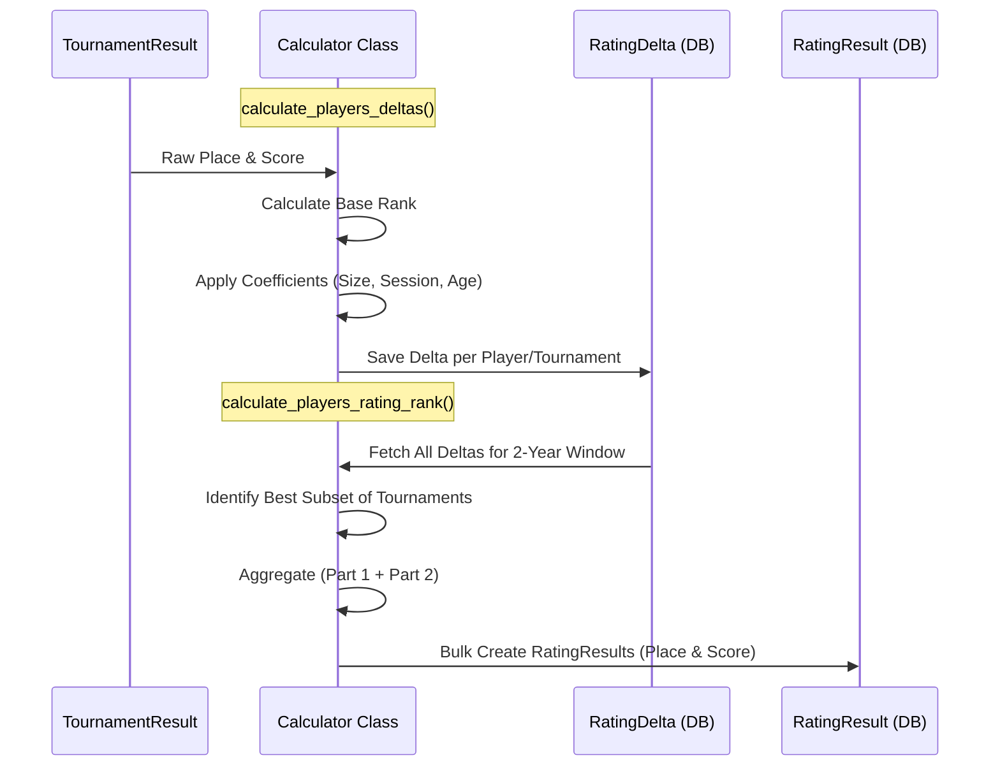

# Rating Calculation Algorithms (RR, EMA, CRR, Online)

<details>
<summary>Relevant source files</summary>

The following files were used as context for generating this wiki page:

- [server/rating/calculation/common.py](server/rating/calculation/common.py)
- [server/rating/calculation/crr.py](server/rating/calculation/crr.py)
- [server/rating/calculation/ema.py](server/rating/calculation/ema.py)
- [server/rating/calculation/hardcoded_coefficients.py](server/rating/calculation/hardcoded_coefficients.py)
- [server/rating/calculation/online.py](server/rating/calculation/online.py)
- [server/rating/calculation/rr.py](server/rating/calculation/rr.py)
- [server/rating/management/commands/download_ema_results.py](server/rating/management/commands/download_ema_results.py)
- [server/rating/management/commands/rating_calculate.py](server/rating/management/commands/rating_calculate.py)
- [server/rating/management/commands/reset_tournament_dates.py](server/rating/management/commands/reset_tournament_dates.py)
- [server/rating/management/commands/validate_ema_rating.py](server/rating/management/commands/validate_ema_rating.py)
- [server/rating/migrations/0006_ratingresult_tournament_numbers.py](server/rating/migrations/0006_ratingresult_tournament_numbers.py)
- [server/rating/tests/tests_ema.py](server/rating/tests/tests_ema.py)
- [server/rating/tests/tests_inner.py](server/rating/tests/tests_inner.py)

</details>


This page provides detailed technical documentation for the rating calculation engine. The system supports multiple rating types (RR, EMA, CRR, Online), each sharing a common calculation infrastructure while implementing specific formulas for player deltas and final rank aggregation.

## Calculation Pipeline Overview

The calculation process is triggered by the `rating_calculate` management command [server/rating/management/commands/rating_calculate.py:21-21](). It orchestrates the flow from identifying dates that require recalculation to executing the specific logic defined in the calculator classes.

### Process Flow

1.  **Date Identification**: The system finds dates where tournament results changed or where "important dates" (e.g., qualification milestones) occur [server/rating/management/commands/rating_calculate.py:81-98]().
2.  **Tournament Filtering**: For each target date, it selects all public tournaments that ended on or before that date [server/rating/management/commands/rating_calculate.py:160-161]().
3.  **Delta Calculation**: The `calculate_players_deltas` method is called for each tournament to determine individual player performance relative to that specific event [server/rating/management/commands/rating_calculate.py:164-164]().
4.  **Rank Aggregation**: The `calculate_players_rating_rank` method aggregates the best deltas for each player to produce a final score and leaderboard position [server/rating/management/commands/rating_calculate.py:168-168]().

### Code Entity Mapping

The following diagram bridges the command-line interface to the internal calculation classes.

**Rating Calculation Class Hierarchy**
```mermaid
graph TD
    subgraph "Management Command"
        Command["rating_calculate Command"]
    end

    subgraph "Calculation Classes"
        Base["RatingRRCalculation"]
        EMA["RatingEMACalculation"]
        CRR["RatingCRRCalculation"]
        Online["RatingOnlineCalculation"]
    end

    Command -->|"instantiates"| EMA
    Command -->|"instantiates"| CRR
    Command -->|"instantiates"| Online
    Command -->|"instantiates"| Base

    EMA --|> Base
    CRR --|> Base
    Online --|> Base
    
    Base -->|"uses"| Hardcoded["HARDCODED_COEFFICIENTS"]
    Base -->|"uses"| Mixin["RatingDatesMixin"]
```
Sources: [server/rating/management/commands/rating_calculate.py:37-51](), [server/rating/calculation/rr.py:19-19](), [server/rating/calculation/ema.py:15-15](), [server/rating/calculation/crr.py:8-8](), [server/rating/calculation/online.py:9-9]()

---

## Core Algorithm Components

### 1. Base Rank Formula
The foundation of most ratings is the "Base Rank" calculated for a player in a tournament. In `RatingRRCalculation` (and inherited by others), this is determined by the player's place relative to the total number of participants.

*   **Calculation**: `(total_players - place) / (total_players - 1) * 1000` [server/rating/calculation/rr.py:204-204]().
*   **Result**: 1000 for 1st place, 0 for last place [server/rating/tests/tests_inner.py:100-104]().

### 2. Tournament Age & Decay
Ratings implement a 2-year sliding window. The "age" of a tournament reduces its weight in the calculation.

*   **Window**: 2 years (730 days) [server/rating/calculation/rr.py:57-57]().
*   **Decay Logic**: 
    *   0-12 months: 100% weight [server/rating/calculation/common.py:21-22]().
    *   13-24 months: Weight decreases every 2 months by a factor of `1/7 * 100` [server/rating/calculation/common.py:19-25]().
    *   >24 months: 0% weight [server/rating/calculation/common.py:26-27]().

### 3. Coefficient Components
Final deltas are adjusted by coefficients based on tournament size and duration.

| Coefficient Type | Calculation Logic |
| :--- | :--- |
| **Players** | Non-linear scale based on participant count (e.g., 40 players = 1.0, 100 players = 2.0, max 2.4) [server/rating/tests/tests_inner.py:23-54](). |
| **Sessions** | Scale based on number of games/sessions (e.g., 5 sessions = 1.0, 20+ sessions = 2.8) [server/rating/tests/tests_inner.py:62-87](). |
| **EMA Specific** | Includes duration (days), number of countries represented, and qualification status [server/rating/tests/tests_ema.py:37-87](). |

Sources: [server/rating/calculation/rr.py:177-205](), [server/rating/calculation/common.py:8-28](), [server/rating/tests/tests_inner.py:17-89]()

---

## Class Specifics

### RatingRRCalculation (Base)
Used for the Russian Riichi (RR) rating.
*   **Aggregation**: Uses a two-part weighted sum (50% first part, 50% second part) [server/rating/calculation/rr.py:24-25]().
*   **Combinatorics**: It iterates through combinations of a player's tournaments to find the subset that yields the highest possible score [server/rating/calculation/rr.py:132-145]().
*   **Hardcoded Coefficients**: Specifically handles tournaments with "stages" (e.g., Agari, TNT) where different participants might have different coefficients within the same tournament ID [server/rating/calculation/rr.py:85-93](), [server/rating/calculation/hardcoded_coefficients.py:12-54]().

### RatingEMACalculation
Used for the European Mahjong Association rating.
*   **Player Scope**: Only includes players with an `ema_id` [server/rating/calculation/ema.py:24-25]().
*   **Aggregation Logic**: Unlike RR, it sorts deltas by base rank and end date to pick the best results directly, rather than exhaustive combinations [server/rating/calculation/ema.py:75-78]().
*   **Validation**: Supported by the `validate_ema_rating` command which scrapes the official EMA website to ensure portal calculations match [server/rating/management/commands/validate_ema_rating.py:22-40]().

### RatingCRRCalculation & RatingOnlineCalculation
*   **CRR**: Inherits RR logic but includes a broader set of tournament types (CRR, RR, EMA, Foreign EMA) [server/rating/calculation/crr.py:9-9]().
*   **Online**: Restricts calculation to `Tournament.ONLINE` types and uses a smaller minimum tournament count for the second part (3 instead of 4) [server/rating/calculation/online.py:10-11]().

---

## Data Flow: Result to Rating Result

The following diagram illustrates how raw tournament results are transformed into the final `RatingResult` stored in the database.

**Tournament Delta to Rating Result Flow**

Sources: [server/rating/calculation/rr.py:59-168](), [server/rating/calculation/rr.py:168-208](), [server/rating/management/commands/rating_calculate.py:153-169]()

## External Validation Scrapers

### validate_ema_rating
This command performs a comparison between the Portal's EMA rating and the official European Mahjong Association ranking [server/rating/management/commands/validate_ema_rating.py:14-14]().
*   **Scraper**: Uses `BeautifulSoup` to parse `http://mahjong-europe.org/ranking/rcr.html` [server/rating/management/commands/validate_ema_rating.py:22-30]().
*   **Validation**: Checks for mismatches in scores, places, tournament counts, and country codes [server/rating/management/commands/validate_ema_rating.py:121-147]().

### download_ema_results
A utility to bootstrap tournament data by scraping individual tournament result pages from the EMA website and generating a CSV compatible with the Portal's upload system [server/rating/management/commands/download_ema_results.py:15-15]().
*   **Target**: `http://mahjong-europe.org/ranking/Tournament/TR_RCR_{id}.html` [server/rating/management/commands/download_ema_results.py:28-28]().

Sources: [server/rating/management/commands/validate_ema_rating.py:1-165](), [server/rating/management/commands/download_ema_results.py:1-49]()