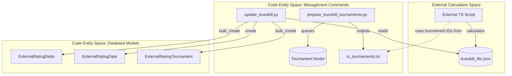
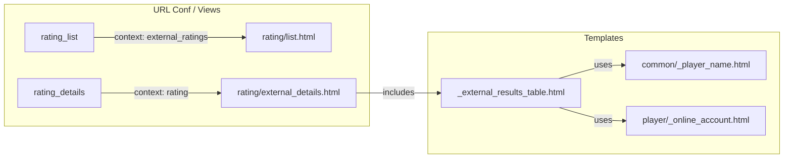

# TrueSkill & External Ratings

Relevant source files

The following files were used as context for generating this wiki page:

- [server/rating/admin.py](server/rating/admin.py)
- [server/rating/management/commands/prepare_trueskill_tournaments.py](server/rating/management/commands/prepare_trueskill_tournaments.py)
- [server/rating/management/commands/update_trueskill.py](server/rating/management/commands/update_trueskill.py)
- [server/rating/migrations/0008_externalrating_externalratingtournament.py](server/rating/migrations/0008_externalrating_externalratingtournament.py)
- [server/rating/migrations/0009_externalratingdelta.py](server/rating/migrations/0009_externalratingdelta.py)
- [server/rating/migrations/0010_externalratingdelta_base_rank.py](server/rating/migrations/0010_externalratingdelta_base_rank.py)
- [server/rating/migrations/0011_alter_externalratingdelta_rating_and_more.py](server/rating/migrations/0011_alter_externalratingdelta_rating_and_more.py)
- [server/rating/migrations/0012_externalratingdelta_place.py](server/rating/migrations/0012_externalratingdelta_place.py)
- [server/rating/migrations/0013_externalratingdate.py](server/rating/migrations/0013_externalratingdate.py)
- [server/rating/migrations/0014_externalrating_is_hidden.py](server/rating/migrations/0014_externalrating_is_hidden.py)
- [server/rating/migrations/0015_alter_externalrating_is_hidden.py](server/rating/migrations/0015_alter_externalrating_is_hidden.py)
- [server/rating/migrations/0020_rename_tournament_numbers_externalratingdelta_game_numbers.py](server/rating/migrations/0020_rename_tournament_numbers_externalratingdelta_game_numbers.py)
- [server/rating/templatetags/__init__.py](server/rating/templatetags/__init__.py)
- [server/rating/templatetags/utils.py](server/rating/templatetags/utils.py)
- [server/templates/rating/_external_results_table.html](server/templates/rating/_external_results_table.html)
- [server/templates/rating/external_details.html](server/templates/rating/external_details.html)
- [server/templates/rating/list.html](server/templates/rating/list.html)

The Mahjong Portal supports external rating systems, specifically the **TrueSkill** algorithm developed by Microsoft Research. Unlike the internal Rating Engine (RR, EMA, CRR), which is calculated daily within the Django environment, External Ratings are calculated by an external process and imported into the portal via JSON files. This system manages both live (offline) and online TrueSkill variations.

## System Architecture

The External Rating system consists of a set of models to store snapshots of ratings, a management command to ingest data, and specialized views to display historical and current standings.

### Data Flow: External to Internal

The following diagram illustrates how external TrueSkill data is prepared and ingested into the Portal's database entities.

**Diagram: TrueSkill Ingestion Flow**

**Sources:** [server/rating/management/commands/update_trueskill.py:71-151](), [server/rating/management/commands/prepare_trueskill_tournaments.py:18-41]()

## Data Models

External ratings are stored separately from the primary `Rating` model to avoid interference with the internal calculation logic.

| Model | Purpose | Key Fields |
| :--- | :--- | :--- |
| `ExternalRating` | Defines the type of external rating (e.g., "Trueskill", "Online Trueskill"). | `type`, `slug`, `is_hidden` |
| `ExternalRatingDelta` | Stores a specific player's rating at a specific point in time. | `player`, `base_rank`, `game_numbers`, `place`, `date` |
| `ExternalRatingDate` | Tracks the dates for which rating snapshots are available. | `rating`, `date` |
| `ExternalRatingTournament` | Maps which tournaments were included in a specific rating calculation. | `rating`, `tournament` |

**Sources:** [server/rating/models.py](), [server/rating/management/commands/update_trueskill.py:10-11](), [server/rating/migrations/0009_externalratingdelta.py:15-37]()

## Management Commands

### `update_trueskill`
This command is the primary entry point for updating TrueSkill data. It requires a JSON file containing the calculated ratings and a type specification (`trueskill` or `online-trueskill`).

**Key logic steps:**
1.  **Atomic Transaction**: The entire update process is wrapped in `transaction.atomic()` to ensure data integrity [server/rating/management/commands/update_trueskill.py:81]().
2.  **Cleanup**: It erases existing `ExternalRatingDelta` and `ExternalRatingDate` entries for the target date and rating type to allow for clean re-imports [server/rating/management/commands/update_trueskill.py:85-88]().
3.  **Smart Matching**: It uses `PlayerHelper.find_player_smart` to resolve player names from the JSON file to `Player` model instances [server/rating/management/commands/update_trueskill.py:95]().
4.  **Bulk Ingestion**: Rating deltas and tournament mappings are saved using `bulk_create` for performance [server/rating/management/commands/update_trueskill.py:122-142]().

### `prepare_trueskill_tournaments`
A utility command that exports a list of all tournaments with results to a file named `ts_tournaments.txt`. This file is used by the external calculation script to know which Pantheon IDs (old or new) should be processed [server/rating/management/commands/prepare_trueskill_tournaments.py:18-40]().

**Sources:** [server/rating/management/commands/update_trueskill.py:65-151](), [server/rating/management/commands/prepare_trueskill_tournaments.py:13-61]()

## Views and Templates

The portal provides dedicated views for viewing external ratings, supporting filtering and historical date navigation.

### External Results Table
The template `_external_results_table.html` is used to render the standings. It includes:
*   **Filters**: Allows filtering by "all results" or specific criteria like "at least 50 games and active in the last 2 years" [server/templates/rating/_external_results_table.html:3-19]().
*   **Online Integration**: If the rating type is `is_online`, it displays Tenhou/Mahjong Soul account information alongside the rating [server/templates/rating/_external_results_table.html:59-65]().
*   **Historical Links**: Provides a link to "All dates" to view previous snapshots [server/templates/rating/_external_results_table.html:25]().

### URL Routing and Logic
The system distinguishes between internal and external ratings in the list view.
*   **Rating List**: Displays both standard and external ratings as cards [server/templates/rating/list.html:12-29]().
*   **Detail View**: Shows the description (often containing links to the TrueSkill website) and the results table [server/templates/rating/external_details.html:9-26]().

**Diagram: Rating View to Template Mapping**

**Sources:** [server/templates/rating/list.html:21-29](), [server/templates/rating/external_details.html:25](), [server/templates/rating/_external_results_table.html:47-86]()

## Administration
External ratings and their deltas can be managed via the Django Admin interface.
*   **ExternalRatingAdmin**: Manages the rating definitions and display order [server/rating/admin.py:31-34]().
*   **ExternalRatingDeltaAdmin**: Allows manual correction or inspection of specific player rating snapshots [server/rating/admin.py:42-45]().

**Sources:** [server/rating/admin.py:47-50]()