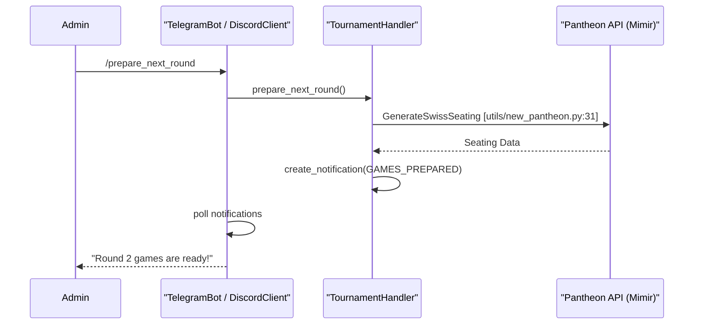

# Online Tournament Automation

<details>
<summary>Relevant source files</summary>

The following files were used as context for generating this wiki page:

- [server/mahjong_portal/urls.py](server/mahjong_portal/urls.py)
- [server/online/admin.py](server/online/admin.py)
- [server/online/handler.py](server/online/handler.py)
- [server/online/management/commands/ds_bot.py](server/online/management/commands/ds_bot.py)
- [server/online/management/commands/tg_bot.py](server/online/management/commands/tg_bot.py)
- [server/online/management/portal_autobot.py](server/online/management/portal_autobot.py)
- [server/online/models.py](server/online/models.py)
- [server/online/tests.py](server/online/tests.py)
- [server/online/urls.py](server/online/urls.py)
- [server/online/views.py](server/online/views.py)
- [server/utils/new_pantheon.py](server/utils/new_pantheon.py)

</details>


The Mahjong Portal provides a comprehensive system for automating online mahjong tournaments. This system acts as a bridge between player registrations on the portal and game execution on external platforms like **Tenhou** and **Mahjong Soul**. It manages the entire lifecycle of a tournament round, from player confirmation and seating generation to game monitoring and result ingestion.

### System Overview

The automation architecture is built around three main pillars:
1.  **TournamentHandler**: The core logic engine that manages state, seating, and integration with the Pantheon backend.
2.  **Notification Pipeline**: A message queue system using `TournamentNotification` to broadcast status updates to players via Telegram and Discord.
3.  **Autobot API**: A REST interface that allows external bots or management scripts to trigger tournament actions and poll for updates.

### Code-to-Entity Mapping

The following diagram illustrates how natural language concepts in tournament management map to specific classes and models within the `online` app.

**Tournament Automation Entities**
```mermaid
graph TD
    subgraph "Natural Language Space"
        A["Tournament Round"]
        B["Player Confirmation"]
        C["Game Results"]
        D["Notifications"]
    end

    subgraph "Code Entity Space"
        A --> "TournamentStatus [online/models.py:9-18]"
        B --> "TournamentPlayers [online/models.py:20-50]"
        C --> "TournamentGame [online/models.py:52-73]"
        D --> "TournamentNotification [online/models.py:85-139]"
        
        "TournamentHandler [online/handler.py:50]" --> A
        "TournamentHandler [online/handler.py:50]" --> B
        "PortalAutoBot [online/management/portal_autobot.py:17]" --> D
    end
```
Sources: [server/online/models.py:9-139](), [server/online/handler.py:50-70](), [server/online/management/portal_autobot.py:17-20]()

### Communication Flow

The system orchestrates interactions between the Portal, the Pantheon seating engine, and communication platforms (Telegram/Discord).

**Automation Sequence**

Sources: [server/online/management/commands/tg_bot.py:89-93](), [server/online/handler.py:744-750](), [server/utils/new_pantheon.py:22-37]()

### Key Components

#### 1. TournamentHandler & Round Lifecycle
The `TournamentHandler` class in `server/online/handler.py` is the central controller. It manages the `TournamentStatus` and handles the transition between tournament phases: registration, confirmation, game start, and game finish. It is responsible for calling the Pantheon API to generate seating and uploading game logs once games conclude.

For details, see [TournamentHandler & Round Lifecycle](#3.1).

#### 2. Telegram & Discord Bots
The portal includes built-in support for Telegram and Discord via management commands (`tg_bot` and `ds_bot`). These bots provide a user interface for players to confirm their participation (e.g., using `/me` or simply typing their nickname) and for administrators to control the tournament flow. They poll the `TournamentNotification` model to deliver real-time updates to specific channels.

For details, see [Telegram & Discord Bots](#3.2).

#### 3. Autobot API & PortalAutoBot
For scenarios where the portal needs to be controlled by an external process, the `Autobot API` provides a set of REST endpoints (e.g., `/api/v0/autobot/open_registration`). The `PortalAutoBot` class acts as a wrapper around `TournamentHandler` to facilitate these API calls, ensuring proper localization and token-based authentication.

For details, see [Autobot API & PortalAutoBot](#3.3).

### Database Models

| Model | Purpose | Key Fields |
| :--- | :--- | :--- |
| `TournamentStatus` | Tracks the global state of a tournament. | `current_round`, `registration_closed`, `end_break_time` |
| `TournamentPlayers` | Maps portal players to platform-specific nicknames and Pantheon IDs. | `tenhou_username`, `pantheon_id`, `is_replacement` |
| `TournamentGame` | Represents a single table/game in a specific round. | `status`, `log_id`, `tournament_round` |
| `TournamentNotification` | A queue of messages to be sent to external platforms. | `notification_type`, `destination`, `is_processed` |

Sources: [server/online/models.py:9-139]()