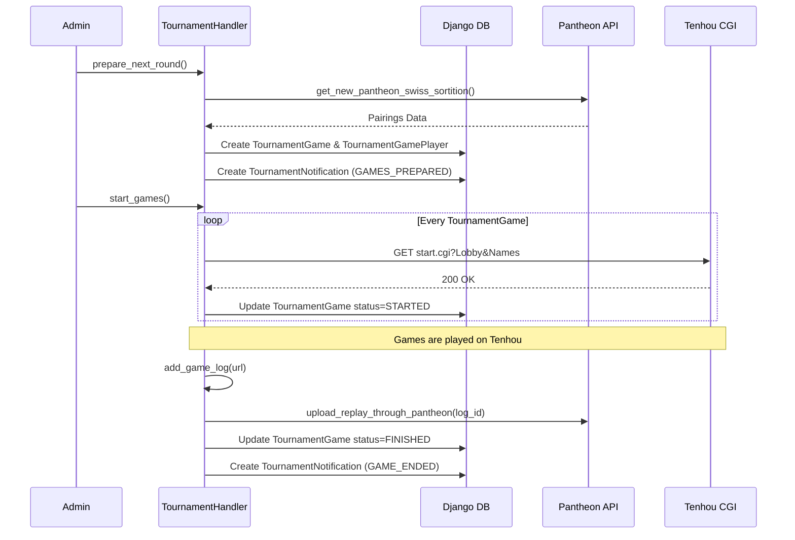
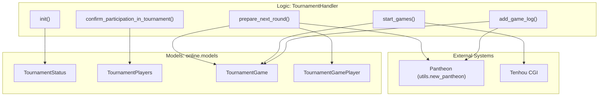

# TournamentHandler & Round Lifecycle

Relevant source files

The following files were used as context for generating this wiki page:

- [server/online/admin.py](server/online/admin.py)
- [server/online/handler.py](server/online/handler.py)
- [server/online/management/commands/ds_bot.py](server/online/management/commands/ds_bot.py)
- [server/online/management/commands/prepare_fixed_seating.py](server/online/management/commands/prepare_fixed_seating.py)
- [server/online/management/commands/tg_bot.py](server/online/management/commands/tg_bot.py)
- [server/online/management/commands/validate_teams.py](server/online/management/commands/validate_teams.py)
- [server/online/migrations/0027_tournamentnotification_lang.py](server/online/migrations/0027_tournamentnotification_lang.py)
- [server/online/models.py](server/online/models.py)
- [server/online/team_seating.py](server/online/team_seating.py)
- [server/online/tests.py](server/online/tests.py)
- [server/online/urls.py](server/online/urls.py)
- [server/player/tenhou/management/commands/update_tenhou_yakuman.py](server/player/tenhou/management/commands/update_tenhou_yakuman.py)
- [server/tournament/migrations/0045_onlinetournamentconfig_tournament_online_config.py](server/tournament/migrations/0045_onlinetournamentconfig_tournament_online_config.py)
- [server/tournament/migrations/0046_alter_tournament_online_config.py](server/tournament/migrations/0046_alter_tournament_online_config.py)
- [server/tournament/migrations/0047_tournament_is_command.py](server/tournament/migrations/0047_tournament_is_command.py)
- [server/tournament/online_tournament_config.py](server/tournament/online_tournament_config.py)
- [server/utils/tenhou/current_tenhou_games.py](server/utils/tenhou/current_tenhou_games.py)

The `TournamentHandler` is the central orchestrator for online tournament automation. it manages the transition between tournament phases, handles player confirmations, generates seatings (sortition), initiates games on Tenhou via CGI commands, and processes game results for integration with the Pantheon backend.

## Tournament Lifecycle Overview

The tournament lifecycle is managed through a series of states tracked in the `TournamentStatus` model and executed by `TournamentHandler`.

### 1. Initialization and Status
The handler is initialized with a specific tournament instance and lobby configuration [server/online/handler.py:63-70](). It provides real-time status updates including confirmed player counts and break timers [server/online/handler.py:74-154]().

### 2. Player Confirmation Phase
Before a tournament starts, players must confirm their participation.
- **Open Registration**: Sets `registration_closed` to `False` and triggers notifications [server/online/handler.py:193-214]().
- **Confirmation Logic**: Players provide their Tenhou/Mahjong Soul nicknames via Telegram or Discord bots. The handler validates the nickname against existing registrations and creates a `TournamentPlayers` record [server/online/handler.py:236-324]().
- **Close Registration**: Sets `registration_closed` to `True` and disables players who did not confirm [server/online/handler.py:216-234]().

### 3. Sortition and Round Preparation
The system supports different seating algorithms:
- **Swiss Sortition**: For standard tournaments, the handler fetches Swiss pairings from the Pantheon API [server/online/handler.py:463-483]().
- **Team/Fixed Seating**: Uses `TeamSeating` to load pre-calculated JSON seatings for team-based events [server/online/team_seating.py:14-34]().
- **Round Creation**: For each table in the sortition, a `TournamentGame` and associated `TournamentGamePlayer` records are created [server/online/handler.py:516-541]().

### 4. Game Execution (Tenhou CGI)
Games are started by sending requests to Tenhou's CGI endpoint.
- **URL Construction**: The handler generates a Tenhou-compatible URL containing the lobby, game type, and encoded nicknames [server/online/handler.py:623-640]().
- **CGI Request**: The system makes an HTTP request to `https://tenhou.net/cs/edit/start.cgi` to initiate the game [server/online/handler.py:646-651]().

### 5. Game Completion and Log Processing
- **Log Submission**: Players or bots submit Tenhou log URLs (e.g., `2023...`).
- **Verification**: The handler parses the log using `TenhouParser` to ensure the players and lobby match the expected `TournamentGame` [server/online/handler.py:734-800]().
- **Pantheon Upload**: Validated logs are uploaded to Pantheon via `upload_replay_through_pantheon` [server/online/handler.py:821-827]().

---

## Data Flow: Round Lifecycle

The following diagram illustrates the flow from preparing a round to finishing games and updating Pantheon.

**Round Execution Sequence**

**Sources:** [server/online/handler.py:456-541](), [server/online/handler.py:614-663](), [server/online/handler.py:721-830]()

---

## Core Models

The automation relies on four primary models in `online/models.py`:

| Model | Purpose | Key Fields |
| :--- | :--- | :--- |
| `TournamentStatus` | Tracks the global state of a single tournament. | `current_round`, `registration_closed`, `end_break_time` |
| `TournamentPlayers` | Represents a player who confirmed participation. | `tenhou_username`, `pantheon_id`, `is_replacement` |
| `TournamentGame` | Represents a single table in a specific round. | `tournament_round`, `log_id`, `status` (NEW, STARTED, FINISHED) |
| `TournamentGamePlayer` | Junction table linking players to specific games and winds. | `player`, `game`, `wind` |

**Sources:** [server/online/models.py:9-83]()

---

## Code Entity Map

This diagram bridges high-level lifecycle stages to specific class methods and database entities.

**Entity Mapping**

**Sources:** [server/online/handler.py:50-80](), [server/online/models.py:1-100](), [server/utils/new_pantheon.py:1-50]()

---

## Concurrency and Locking

To prevent race conditions during game starts or log processing, the `TournamentHandler` utilizes Django's `transaction.atomic` and `select_for_update()`.

- **Game Start Safety**: When starting games, the handler iterates through games and uses `select_for_update()` to ensure no two processes attempt to start the same game simultaneously [server/online/handler.py:614-620]().
- **Notification Processing**: Bots (Telegram/Discord) poll the `TournamentNotification` table. Notifications are marked `is_processed=True` within a transaction to prevent duplicate messages [server/online/management/commands/tg_bot.py:128-162]().

**Sources:** [server/online/handler.py:614-663](), [server/online/management/commands/tg_bot.py:128-162]()

---

## Seating Strategies (Swiss vs. Golf)

The handler supports two main sortition methods:

1.  **Swiss (Pantheon)**: pairings are calculated externally by Pantheon based on current scores. The handler calls `get_new_pantheon_swiss_sortition` which returns a JSON structure of player IDs [server/online/handler.py:463-483]().
2.  **Golf/Team (Fixed)**: pairings are loaded from a local JSON file (`team_seating.json`). This is used for tournaments with complex constraints where players from the same team must not meet. The `TeamSeating` class handles the mapping of team numbers to `pantheon_id` [server/online/team_seating.py:14-34]().

**Sources:** [server/online/handler.py:456-541](), [server/online/team_seating.py:14-123]()