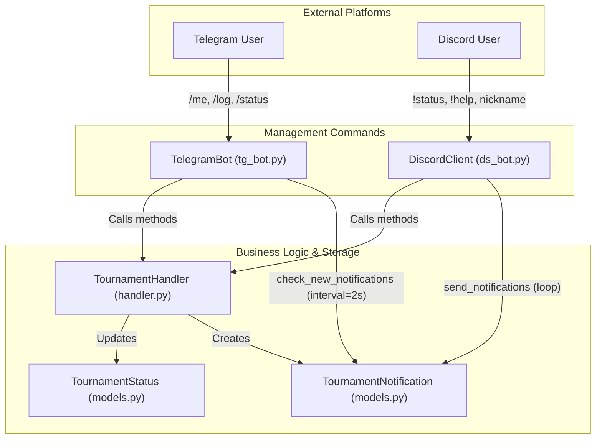
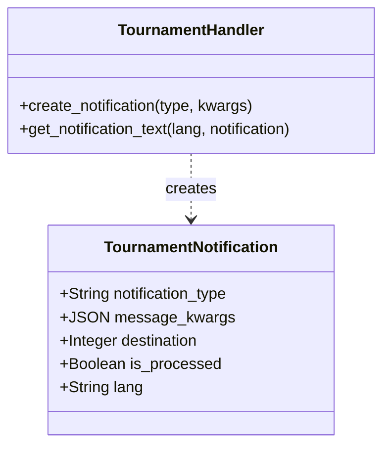

# Telegram & Discord Bots

Relevant source files

The following files were used as context for generating this wiki page:

- [server/online/__init__.py](server/online/__init__.py)
- [server/online/admin.py](server/online/admin.py)
- [server/online/apps.py](server/online/apps.py)
- [server/online/handler.py](server/online/handler.py)
- [server/online/management/__init__.py](server/online/management/__init__.py)
- [server/online/management/commands/__init__.py](server/online/management/commands/__init__.py)
- [server/online/management/commands/ds_bot.py](server/online/management/commands/ds_bot.py)
- [server/online/management/commands/tg_bot.py](server/online/management/commands/tg_bot.py)
- [server/online/migrations/__init__.py](server/online/migrations/__init__.py)
- [server/online/models.py](server/online/models.py)
- [server/online/tests.py](server/online/tests.py)
- [server/online/urls.py](server/online/urls.py)

The Mahjong Portal utilizes Telegram and Discord bots to manage online tournament lifecycles, facilitate player communication, and automate administrative tasks. These bots act as the interface between the `TournamentHandler` logic and the participants.

## System Overview

The bot subsystem consists of two primary management commands: `tg_bot` and `ds_bot`. Both bots interface with a shared `TournamentHandler` to process commands and poll for notifications from the `TournamentNotification` queue.

### Core Components

| Component | File Path | Role |
| :--- | :--- | :--- |
| **TelegramBot** | [server/online/management/commands/tg_bot.py:31-118]() | Manages Telegram long-polling, command routing, and notification delivery. |
| **DiscordClient** | [server/online/management/commands/ds_bot.py:44-200]() | Manages Discord websocket connection, channel-specific message handling, and notifications. |
| **TournamentHandler** | [server/online/handler.py:50-208]() | Central business logic for tournament state, registration toggles, and message formatting. |
| **TournamentNotification** | [server/online/models.py:85-139]() | Model representing a message queue for outgoing notifications to different platforms. |

### Data Flow: Command and Notification Pipeline

The following diagram illustrates how user commands are routed and how background tasks deliver system notifications.

**Bot Interaction and Notification Flow**

**Sources:** [server/online/management/commands/tg_bot.py:63-70](), [server/online/management/commands/ds_bot.py:70-115](), [server/online/handler.py:201-208]()

---

## Telegram Bot (`tg_bot.py`)

The Telegram bot uses the `python-telegram-bot` library. It initializes a `TournamentHandler` instance and sets up a `Dispatcher` to route commands.

### Command Routing
- `/me [nickname]`: Sets the player's Tenhou nickname [server/online/management/commands/tg_bot.py:63]().
- `/log [url]`: Submits a game log URL for processing [server/online/management/commands/tg_bot.py:64]().
- `/status`: Retrieves the current tournament status (e.g., current round, finished games) [server/online/management/commands/tg_bot.py:65]().
- `/prepare_next_round`: (Admin only) Triggers the sortition and preparation for the next round [server/online/management/commands/tg_bot.py:89-93]().

### Notification Polling
The bot runs a repeating job `check_new_notifications` every 2 seconds [server/online/management/commands/tg_bot.py:70](). It filters `TournamentNotification` objects where `destination=TELEGRAM` and `is_processed=False` [server/online/management/commands/tg_bot.py:129-131](). Certain notifications, such as `ROUND_FINISHED`, are automatically pinned in the channel [server/online/management/commands/tg_bot.py:141-151]().

**Sources:** [server/online/management/commands/tg_bot.py:31-162]()

---

## Discord Bot (`ds_bot.py`)

The Discord bot is implemented using `discord.py`. Unlike the Telegram bot, it maps specific tournament functions to dedicated channels.

### Channel Mapping
The bot requires specific channel names to exist in the Discord Guild:
- `confirmation_en` / `confirmation_ru`: For player registration/confirmation [server/online/management/commands/ds_bot.py:54-55]().
- `notifications_en` / `notifications_ru`: For system-wide announcements [server/online/management/commands/ds_bot.py:56-57]().
- `game_logs`: For submitting Tenhou/MS log links [server/online/management/commands/ds_bot.py:58]().

### Message Handling
The `on_message` event routes input based on the channel name [server/online/management/commands/ds_bot.py:94-115](). For example, any message in the confirmation channels is treated as a Tenhou nickname for `confirm_participation_in_tournament` [server/online/management/commands/ds_bot.py:144-153]().

**Sources:** [server/online/management/commands/ds_bot.py:44-115]()

---

## TournamentNotification Model

The `TournamentNotification` model serves as a persistent message queue, ensuring that messages are delivered even if a bot service is temporarily offline.

| Field | Description |
| :--- | :--- |
| `notification_type` | Slug identifying the event (e.g., `GAME_STARTED`, `ROUND_FINISHED`) [server/online/models.py:126](). |
| `message_kwargs` | JSON field containing dynamic data for the message template [server/online/models.py:127](). |
| `destination` | Integer choice: `0` (Telegram) or `1` (Discord) [server/online/models.py:129](). |
| `is_processed` | Boolean flag set to `True` after successful delivery [server/online/models.py:130](). |
| `lang` | Language of the notification (`RU` or `EN`) [server/online/models.py:132](). |

**Code Entity Association**

**Sources:** [server/online/models.py:85-139](), [server/online/handler.py:201-208]()

---

## Multi-Language Delivery

The system supports English (`en`) and Russian (`ru`) delivery.
1. **Telegram**: The bot currently defaults to Russian for most commands but can handle localized strings via `get_notification_text` [server/online/management/commands/tg_bot.py:137]().
2. **Discord**: Delivery is split by channel suffix. The `send_notifications` loop sends the same notification to both `_en` and `_ru` notification channels by iterating through the `channels_dict` [server/online/management/commands/ds_bot.py:171-179]().

**Sources:** [server/online/management/commands/ds_bot.py:195-200](), [server/online/handler.py:132-154]()