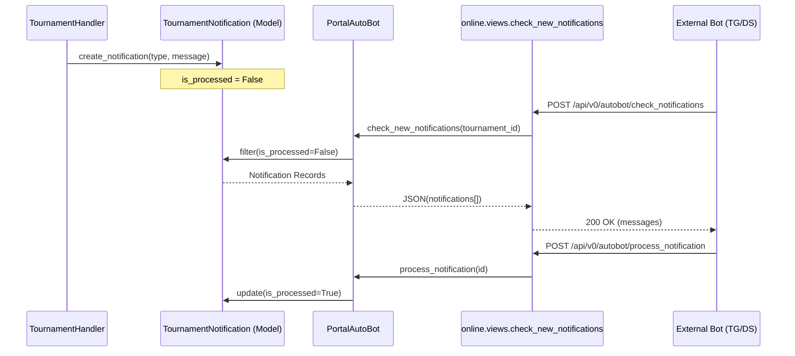

# Autobot API & PortalAutoBot

<details>
<summary>Relevant source files</summary>

The following files were used as context for generating this wiki page:

- [server/account/migrations/0005_django_abstract_user_last_name.py](server/account/migrations/0005_django_abstract_user_last_name.py)
- [server/mahjong_portal/urls.py](server/mahjong_portal/urls.py)
- [server/online/management/portal_autobot.py](server/online/management/portal_autobot.py)
- [server/online/views.py](server/online/views.py)
- [server/system/decorators.py](server/system/decorators.py)
- [server/utils/new_pantheon.py](server/utils/new_pantheon.py)

</details>


The Autobot system provides a RESTful interface (`/api/v0/autobot/`) that allows external bots (Telegram, Discord) to interact with the portal's tournament management logic. It acts as a bridge between the real-time communication platforms and the `TournamentHandler`, enabling automated player confirmation, round preparation, and game result processing.

## PortalAutoBot Class

The `PortalAutoBot` class serves as the primary service layer for the Autobot API. It encapsulates the `TournamentHandler` and translates API requests into domain-specific actions.

### Key Responsibilities
- **Initialization**: Configures the underlying `TournamentHandler` with specific tournament and lobby context [server/online/management/portal_autobot.py:18-20]().
- **Notification Management**: Polls the `TournamentNotification` model for unprocessed messages destined for Telegram or Discord [server/online/management/portal_autobot.py:35-81]().
- **Player Interaction**: Handles nickname-based confirmation and verification codes [server/online/management/portal_autobot.py:129-142]().
- **Game Lifecycle**: Forwards game start notifications and finish signals to the handler [server/online/management/portal_autobot.py:145-154]().

### Notification Pipeline
The bot uses a "pull" mechanism where external clients request new notifications. The pipeline follows a Check-Process-Create flow:

1.  **Check**: `check_new_notifications` queries `TournamentNotification` for records where `is_processed=False` [server/online/management/portal_autobot.py:36-60]().
2.  **Process**: Once a bot delivers a message, it calls `process_notification` to set `is_processed=True` [server/online/management/portal_autobot.py:104-121]().
3.  **Create**: Events like round starts trigger `create_start_game_notification` to queue new messages [server/online/management/portal_autobot.py:145-149]().

**Sources:** [server/online/management/portal_autobot.py:1-186]()

---

## API Endpoints & Routing

The Autobot API is located under `server/online/views.py`. Most endpoints are protected by the `autobot_token_require` decorator, which validates the `AUTO_BOT_TOKEN` from settings [server/online/views.py:126-136]().

### Endpoint Summary

| Endpoint | Method | Function | Description |
| :--- | :--- | :--- | :--- |
| `/api/v0/autobot/open_registration` | POST | `open_registration` | Opens the confirmation stage for a tournament [server/online/views.py:161-163](). |
| `/api/v0/autobot/check_notifications`| POST | `check_new_notifications`| Returns a list of pending messages for bots [server/online/views.py:179-186](). |
| `/api/v0/autobot/process_notification`| POST | `process_notification` | Marks a notification as delivered [server/online/views.py:192-201](). |
| `/api/v0/autobot/prepare_next_round` | POST | `prepare_next_round` | Triggers sortition and seating for the next round [server/online/views.py:208-210](). |
| `/api/v0/autobot/confirm_player` | POST | `confirm_player` | Validates and confirms a player's participation [server/online/views.py:217-236](). |
| `/api/v0/autobot/game_finish` | POST | `game_finish` | Submits game results (log ID, players, content) [server/online/views.py:269-281](). |
| `/api/v0/autobot/add_penalty_game` | POST | `add_penalty_game` | Manually adds a penalty game to Pantheon [server/online/views.py:318-321](). |

**Sources:** [server/mahjong_portal/urls.py:64-78](), [server/online/views.py:157-321]()

---

## Data Flow: Notification Delivery

This diagram illustrates how a notification generated in the `TournamentHandler` reaches an external bot via the `PortalAutoBot` API.

**Notification Delivery Flow**

**Sources:** [server/online/management/portal_autobot.py:35-121](), [server/online/views.py:179-201]()

---

## Administrative Actions

The API supports administrative overrides and direct Pantheon integrations.

### Player Confirmation
- **`confirm_player`**: Used by players to confirm themselves via bot commands [server/online/views.py:217-236]().
- **`admin_confirm_player`**: Allows tournament administrators to bypass standard checks to confirm a player [server/online/views.py:241-252]().

### Pantheon Synchronization
- **`add_penalty_game`**: Calls `tournament_handler.add_penalty_game`, which interfaces with `MimirClient.AddPenaltyGame` in the Pantheon V2 API [server/online/management/portal_autobot.py:173-175](), [server/utils/new_pantheon.py:180-195]().
- **`send_team_names_to_pantheon`**: Synchronizes team metadata for team-based tournaments [server/online/views.py:326-328]().

### Implementation Mapping

**Natural Language to Code Entity Space**
```mermaid
classDiagram
    class "Autobot API View" {
        +confirm_player()
        +prepare_next_round()
        +add_penalty_game()
    }
    class "PortalAutoBot (Service)" {
        +init(tournamentId, lobbyId)
        +check_new_notifications()
        +process_notification()
    }
    class "TournamentHandler (Core)" {
        +confirm_participation_in_tournament()
        +prepare_next_round()
        +add_penalty_game()
    }
    class "Pantheon Utility" {
        +add_penalty_game()
        +MimirClient
    }

    "Autobot API View" ..> "PortalAutoBot (Service)" : uses
    "PortalAutoBot (Service)" ..> "TournamentHandler (Core)" : delegates to
    "TournamentHandler (Core)" ..> "Pantheon Utility" : calls for sync
```
**Sources:** [server/online/views.py:15-22](), [server/online/management/portal_autobot.py:14-20](), [server/utils/new_pantheon.py:180-181]()

---

## Decorators and Security

The API uses specific decorators to ensure data integrity and security:

1.  **`autobot_token_require`**: 
    - Extracts `api_token` from the JSON request body [server/online/views.py:129-130]().
    - Compares it against `settings.AUTO_BOT_TOKEN` [server/online/views.py:131-132]().
2.  **`tournament_data_require`**:
    - Ensures `tournament_id` and `lobby_id` are present in the request [server/online/views.py:142-149]().
    - Automatically initializes the global `bot` instance with these IDs [server/online/views.py:151-152]().

**Sources:** [server/online/views.py:126-154]()