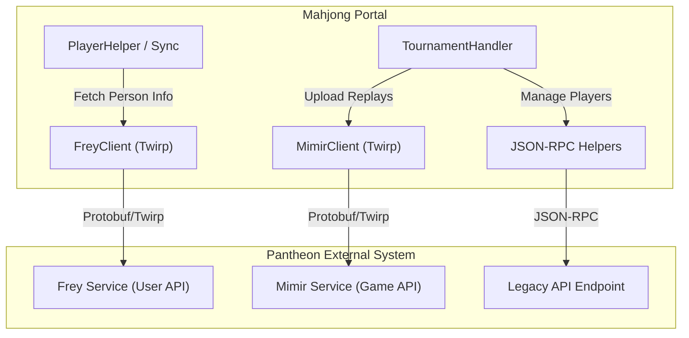

# Pantheon Integration

<details>
<summary>Relevant source files</summary>

The following files were used as context for generating this wiki page:

- [.envs/.production.env.example](.envs/.production.env.example)
- [server/mahjong_portal/settings.py](server/mahjong_portal/settings.py)
- [server/mahjong_portal/urls.py](server/mahjong_portal/urls.py)
- [server/online/management/portal_autobot.py](server/online/management/portal_autobot.py)
- [server/online/views.py](server/online/views.py)
- [server/pantheon_api/atoms.proto](server/pantheon_api/atoms.proto)
- [server/pantheon_api/atoms_pb2.py](server/pantheon_api/atoms_pb2.py)
- [server/pantheon_api/atoms_twirp.py](server/pantheon_api/atoms_twirp.py)
- [server/pantheon_api/frey.proto](server/pantheon_api/frey.proto)
- [server/pantheon_api/frey_pb2.py](server/pantheon_api/frey_pb2.py)
- [server/pantheon_api/frey_twirp.py](server/pantheon_api/frey_twirp.py)
- [server/pantheon_api/mimir.proto](server/pantheon_api/mimir.proto)
- [server/pantheon_api/mimir_pb2.py](server/pantheon_api/mimir_pb2.py)
- [server/pantheon_api/mimir_twirp.py](server/pantheon_api/mimir_twirp.py)
- [server/templates/base.html](server/templates/base.html)
- [server/utils/new_pantheon.py](server/utils/new_pantheon.py)
- [server/utils/pantheon.py](server/utils/pantheon.py)
- [server/website/context.py](server/website/context.py)

</details>


The Mahjong Portal integrates deeply with **Pantheon**, an external tournament management system. Pantheon serves as the primary source of truth for player identities, tournament registrations, and real-time game results for managed events. Communication between the Portal and Pantheon occurs via two distinct API architectures: an legacy JSON-RPC interface and a modern Protobuf/Twirp-based RPC system.

### System Overview

Pantheon is composed of two primary services that the Portal interacts with:
*   **Frey**: Responsible for user management, personal information, and authentication [server/utils/new_pantheon.py:19]().
*   **Mimir**: Responsible for game management, including sortition (seating), round management, and replay ingestion [server/utils/new_pantheon.py:18]().

The portal uses these services to synchronize player data, register participants for tournaments, and upload game logs automatically after online matches.

#### Pantheon Integration Architecture


Sources: [server/utils/new_pantheon.py:18-23](), [server/online/views.py:54-94](), [server/online/handler.py:7-14]()

### Communication Protocols

The integration is split across two versions of the Pantheon API, determined by the specific functionality required:

| Feature | Protocol | Service / Endpoint |
| :--- | :--- | :--- |
| **User Profiles** | Twirp / Protobuf | `FreyClient` [server/utils/new_pantheon.py:41]() |
| **Swiss Sortition** | Twirp / Protobuf | `MimirClient` [server/utils/new_pantheon.py:23]() |
| **Replay Upload** | Twirp / Protobuf | `MimirClient` [server/utils/new_pantheon.py:145]() |
| **Seating Flags** | JSON-RPC | `PANTHEON_OLD_API_URL` [server/online/views.py:54]() |
| **Player Updates** | JSON-RPC | `PANTHEON_OLD_API_URL` [server/online/views.py:94]() |

#### Authentication
Twirp requests require specific headers for authorization, typically using a `PANTHEON_ADMIN_COOKIE` or `EXTERNAL_QUERY_SECRET` [server/mahjong_portal/settings.py:217-219]().
*   `X-Auth-Token`: Administrative session token [server/utils/new_pantheon.py:27]().
*   `X-Current-Event-Id`: The specific Pantheon event being modified [server/utils/new_pantheon.py:28]().
*   `HTTP-X-EXTERNAL-QUERY-SECRET`: Used for server-to-server replay uploads [server/utils/new_pantheon.py:148]().

### Child Pages

#### [Pantheon API Clients (Frey & Mimir)](#4.1)
This page documents the technical implementation of the `pantheon_api` package. It covers the Protobuf definitions (`atoms.proto`, `frey.proto`, `mimir.proto`), the generated Python stubs, and how the `TwirpClient` is used to execute remote procedures.
*   **Key Entities**: `FreyClient`, `MimirClient`, `SeatingGenerateSwissSeatingPayload`.
*   **Location**: `server/pantheon_api/` and `server/utils/new_pantheon.py`.

#### [Player Synchronization with Pantheon](#4.2)
This page details the synchronization pipeline that keeps the Portal's `Player` models in sync with Pantheon's person records. It covers the management commands for bulk updates and the webhook that listens for changes from Pantheon.
*   **Key Entities**: `update_player_from_pantheon_feed`, `update_info_from_pantheon_api`, `PlayerHelper`.
*   **Location**: `server/website/views.py` [server/website/views.py:38]() and `server/player/`.

### Administrative Integration

The Portal provides administrative views to manipulate player status directly in Pantheon, such as disabling a player from seating or toggling replacement flags. These actions are performed via `requests` calls to the legacy JSON-RPC endpoint.

```python
# Example of legacy JSON-RPC call to Pantheon
data = {
    "jsonrpc": "2.0",
    "method": "updatePlayerSeatingFlagCP",
    "params": {
        "playerId": record.pantheon_id,
        "eventId": settings.PANTHEON_TOURNAMENT_EVENT_ID,
        "ignoreSeating": 1,
    },
    "id": make_random_letters_and_digit_string(),
}
response = requests.post(settings.PANTHEON_OLD_API_URL, json=data, headers=headers)
```
Sources: [server/online/views.py:43-54]()

### Database Routing
For club statistics and historical game data, the portal sometimes reads directly from a mirrored Pantheon database. This is handled by the `PantheonRouter`, which routes queries for specific models to the `pantheon` database connection defined in settings [server/mahjong_portal/settings.py:121-134]().

Sources: [server/mahjong_portal/settings.py:121-134](), [server/online/views.py:38-108](), [server/utils/new_pantheon.py:1-200]()