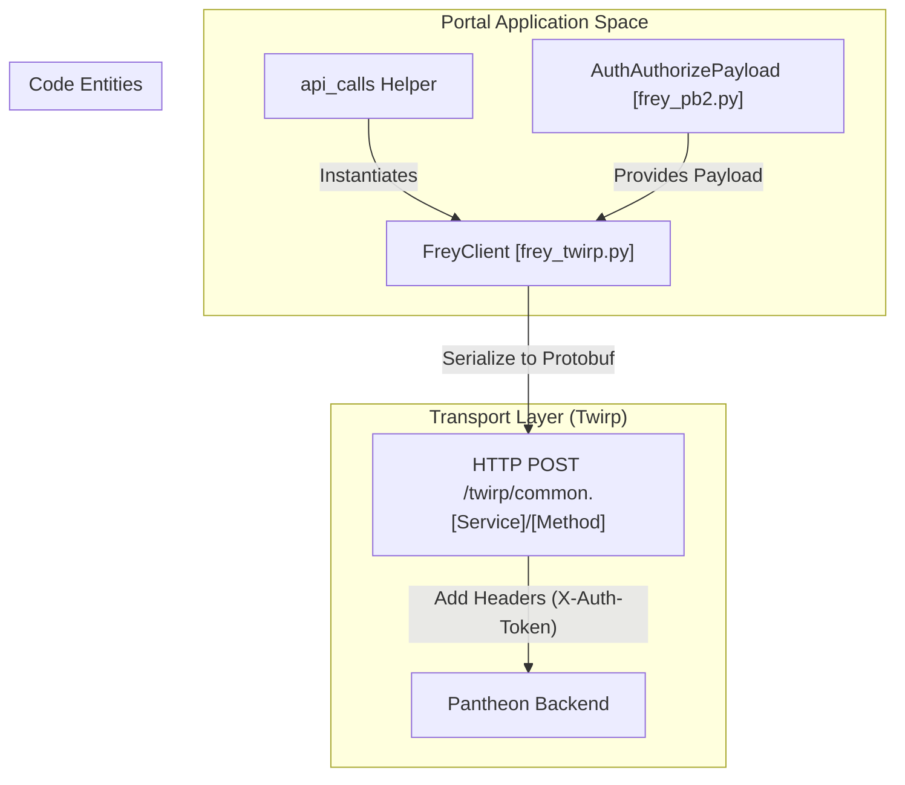
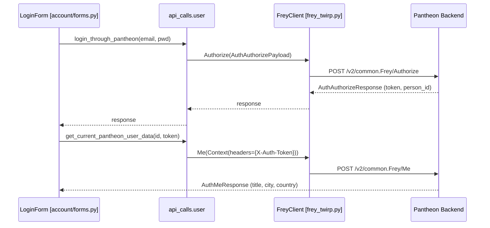

# Pantheon API Clients (Frey & Mimir)

Relevant source files

The following files were used as context for generating this wiki page:

- [server/account/forms.py](server/account/forms.py)
- [server/pantheon_api/api_calls/user.py](server/pantheon_api/api_calls/user.py)
- [server/pantheon_api/atoms.proto](server/pantheon_api/atoms.proto)
- [server/pantheon_api/atoms_pb2.py](server/pantheon_api/atoms_pb2.py)
- [server/pantheon_api/atoms_twirp.py](server/pantheon_api/atoms_twirp.py)
- [server/pantheon_api/frey.proto](server/pantheon_api/frey.proto)
- [server/pantheon_api/frey_pb2.py](server/pantheon_api/frey_pb2.py)
- [server/pantheon_api/frey_twirp.py](server/pantheon_api/frey_twirp.py)
- [server/pantheon_api/mimir.proto](server/pantheon_api/mimir.proto)
- [server/pantheon_api/mimir_pb2.py](server/pantheon_api/mimir_pb2.py)
- [server/pantheon_api/mimir_twirp.py](server/pantheon_api/mimir_twirp.py)

The `pantheon_api` package provides the communication layer between the Mahjong Portal and the external Pantheon system. It uses **Twirp**, a lightweight RPC framework built on **Protocol Buffers (Protobuf)**, to handle structured data exchange. The integration is divided into two primary services: **Frey** (Authentication and Identity) and **Mimir** (Tournament and Game Management).

## Protobuf Definitions and Generated Stubs

The core of the API is defined in `.proto` files, which are compiled into Python stubs for serialization and transport.

### Core Definitions
*   **atoms.proto**: Contains shared message definitions used by both services, such as `Person`, `Event`, `GameConfig`, and `Round` results [server/pantheon_api/atoms.proto:25-300]().
*   **frey.proto**: Defines the `Frey` service interface, covering authentication, registration, and personal information management [server/pantheon_api/frey.proto:25-76]().
*   **mimir.proto**: Defines the `Mimir` service interface, covering tournament logistics, seating, scoring, and real-time game state [server/pantheon_api/mimir.proto:25-170]().

### Generated Stubs
The project includes generated Python files that implement the Protobuf messages and Twirp clients:
*   `atoms_pb2.py`, `frey_pb2.py`, `mimir_pb2.py`: Contain the message classes [server/pantheon_api/frey_pb2.py:1-10]().
*   `frey_twirp.py`, `mimir_twirp.py`: Contain the `FreyClient` and `MimirClient` classes which handle the HTTP transport logic [server/pantheon_api/frey_twirp.py:13-150]().

### Data Flow: From Proto to RPC
The following diagram illustrates how a request moves from the Portal's Python code through the Twirp transport to the Pantheon backend.

**Pantheon RPC Request Pipeline**

Sources: [server/pantheon_api/frey_twirp.py:13-17](), [server/pantheon_api/api_calls/user.py:10-17]().

---

## Service Clients

### FreyClient (Identity Service)
`FreyClient` is primarily used for user lifecycle management. Key operations include:
*   **Authorize**: Exchanges email/password for a `person_id` and `auth_token` [server/pantheon_api/frey.proto:30-31]().
*   **Me**: Retrieves detailed profile information for the currently authenticated user [server/pantheon_api/frey.proto:34-35]().
*   **GetPersonalInfo**: Fetches public profile data for specific player IDs [server/pantheon_api/frey.proto:46-47]().

### MimirClient (Game Service)
`MimirClient` handles the complex logic of mahjong tournaments:
*   **GetRatingTable**: Retrieves current tournament standings [server/pantheon_api/mimir.proto:40-41]().
*   **AddRound**: Submits individual hand results to a game session [server/pantheon_api/mimir.proto:58-59]().
*   **Seating Logic**: Methods like `MakeSwissSeating` or `MakeShuffledSeating` are used to organize tournament rounds [server/pantheon_api/mimir.proto:126-132]().

---

## Authentication and Headers

Authentication with Pantheon relies on specific HTTP headers passed via the Twirp `Context`.

| Header | Description | Source |
| :--- | :--- | :--- |
| `X-Auth-Token` | The session token obtained via `Authorize`. | [server/pantheon_api/api_calls/user.py:24]() |
| `X-Current-Person-Id` | The Pantheon ID of the user making the request. | [server/pantheon_api/api_calls/user.py:24]() |
| `X-Current-Event-Id` | Used in Mimir calls to scope the request to a specific tournament. | [server/pantheon_api/mimir_pb2.py:100]() |

### Implementation in `api_calls`
The `api_calls` module abstracts the complexity of header management and client instantiation.

**Example: `get_current_pantheon_user_data`**
This function initializes a `FreyClient` using `settings.PANTHEON_AUTH_API_URL` and passes the required auth headers through a `twirp.context.Context` object [server/pantheon_api/api_calls/user.py:20-27]().

---

## Implementation Details

### Login Workflow
The `LoginForm` in the `account` app demonstrates the practical usage of these clients. When a user submits credentials, the form calls `login_through_pantheon` [server/account/forms.py:39](). If successful, it immediately uses the returned token to fetch the full user profile via `get_current_pantheon_user_data` [server/account/forms.py:40]().

**Authentication Sequence**

Sources: [server/account/forms.py:32-45](), [server/pantheon_api/api_calls/user.py:10-37]().

### Error Handling
Twirp errors are encapsulated in `TwirpServerException`. The Portal catches these exceptions during login to provide user-friendly "invalid login" messages [server/account/forms.py:41-43]().

### Transport Configuration
All Pantheon clients are configured to use the `/v2` server path prefix for compatibility with the current Pantheon API version [server/pantheon_api/api_calls/user.py:16,26,46]().

Sources:
- [server/pantheon_api/atoms.proto:1-300]()
- [server/pantheon_api/frey.proto:1-266]()
- [server/pantheon_api/mimir.proto:1-170]()
- [server/pantheon_api/frey_twirp.py:1-150]()
- [server/pantheon_api/api_calls/user.py:1-57]()
- [server/account/forms.py:32-54]()