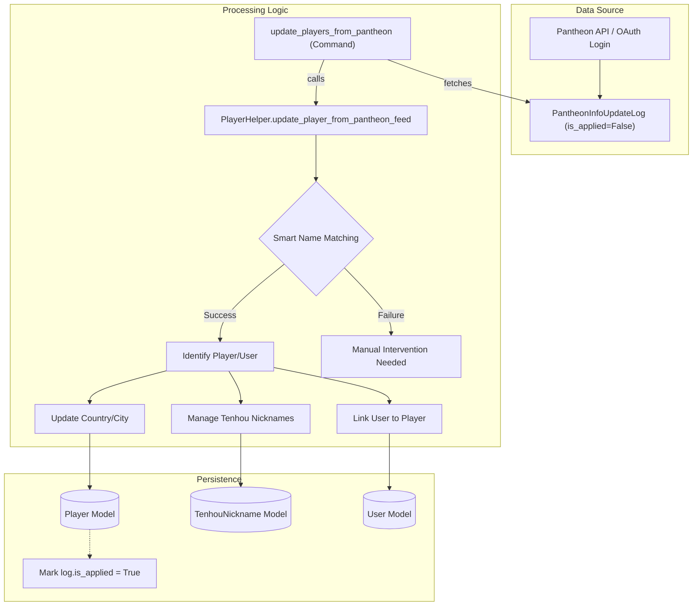
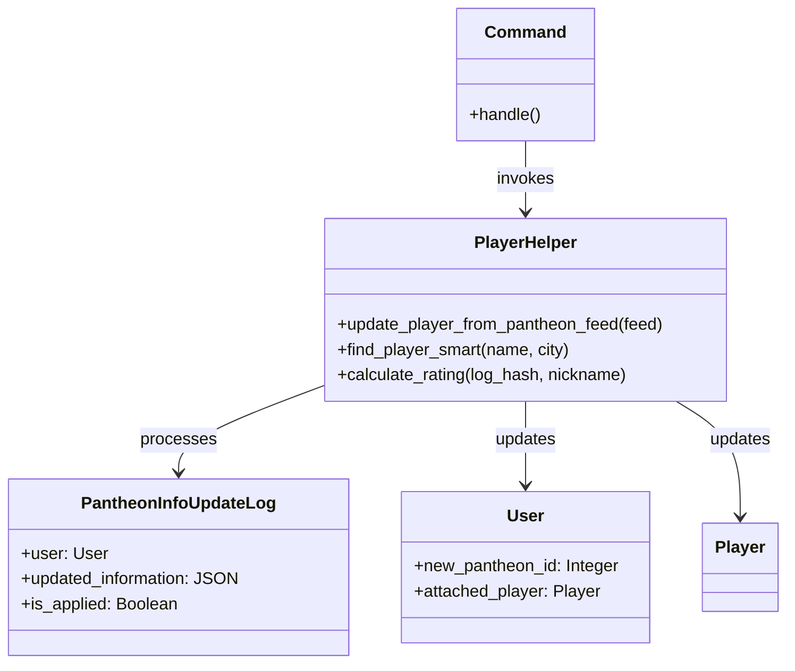

# Player Synchronization with Pantheon

Relevant source files

The following files were used as context for generating this wiki page:

- [server/account/views.py](server/account/views.py)
- [server/online/parser.py](server/online/parser.py)
- [server/player/management/commands/__init__.py](server/player/management/commands/__init__.py)
- [server/player/management/commands/update_players_from_pantheon.py](server/player/management/commands/update_players_from_pantheon.py)
- [server/player/player_helper.py](server/player/player_helper.py)
- [server/player/tenhou/tenhou_helper.py](server/player/tenhou/tenhou_helper.py)
- [server/rating/mixins.py](server/rating/mixins.py)
- [server/templates/account/settings.html](server/templates/account/settings.html)
- [server/tournament/admin.py](server/tournament/admin.py)
- [server/website/urls.py](server/website/urls.py)
- [server/website/views.py](server/website/views.py)

This page documents the synchronization pipeline between the Mahjong Portal and Pantheon. The system ensures that player profiles, geographic data, and Tenhou account associations remain consistent with the data provided by Pantheon's identity and tournament services.

## Overview

The synchronization logic is primarily encapsulated in the `PlayerHelper` class, which processes data feeds from Pantheon to update local `Player` and `User` records. Data flows into the system through two main entry points:
1.  **Manual/Scheduled Command**: The `update_players_from_pantheon` management command.
2.  **Webhooks/Login**: Real-time updates triggered during the OAuth login process or via API calls.

### Key Components

| Component | Responsibility |
| :--- | :--- |
| `PantheonInfoUpdateLog` | A model that stores raw data received from Pantheon before it is applied to the database. |
| `PlayerHelper` | The core service class containing the business logic for matching players and updating attributes. |
| `update_players_from_pantheon` | Management command that iterates over unapplied logs and executes the sync. |
| `update_player_from_pantheon_feed` | The primary function that maps Pantheon JSON data to Django model fields. |

---

## Data Flow: From Feed to Profile

The following diagram illustrates how data from a Pantheon feed (represented by `PantheonInfoUpdateLog`) is processed by `PlayerHelper` to update the portal's state.

**Pantheon Synchronization Pipeline**

**Sources:** [server/account/models.py:24-37](), [server/player/player_helper.py:104-160](), [server/player/management/commands/update_players_from_pantheon.py:15-37]()

---

## Implementation Details

### Smart Name Matching
When a feed is processed, the system may not have a direct `pantheon_id` link yet. `PlayerHelper.find_player_smart` is used to resolve identities using the `title` (full name) and `city` provided in the feed [server/player/player_helper.py:130-143]().

### Tenhou Account Management
The synchronization pipeline handles Tenhou nicknames with specific logic to prevent duplicate or conflicting accounts:
1.  **Resolution**: `__resolve_tenhou_nickname` checks if the `tenhou_id` from the feed already exists in the `TenhouNickname` table [server/player/player_helper.py:77-87]().
2.  **Update/Add**: If the account belongs to the player, it is updated. If it's a new association, a new `TenhouNickname` object is created and marked as `is_main=True` [server/player/player_helper.py:89-101]().
3.  **Disabling Old Accounts**: If a player changes their Tenhou ID in Pantheon, the old local record is marked as `is_main=False` [server/player/player_helper.py:37-38]().

### Account Update Logs
Every update performed by `PlayerHelper` returns a list of `AccountUpdates` objects. These contain a code and a human-readable message to track exactly what changed (e.g., `playerCountryUpdate`, `newTenhouAccountUpdate`) [server/player/player_helper.py:23-38]().

---

## Key Functions and Classes

### PlayerHelper Class
Located in `server/player/player_helper.py`, this class contains static methods for synchronization.

| Function | Description |
| :--- | :--- |
| `update_player_from_pantheon_feed` | Main entry point for applying a `PantheonInfoUpdateLog` [server/player/player_helper.py:104](). |
| `calculate_rating` | Used in account settings to manually update Tenhou rates using a game log hash and `TenhouParser` [server/player/player_helper.py:50-74](). |
| `safe_strip` | Utility to clean string data from the feed [server/player/player_helper.py:230-234](). |

**Code Entity Relationship: Sync Execution**

**Sources:** [server/player/management/commands/update_players_from_pantheon.py:15-37](), [server/player/player_helper.py:20-40](), [server/account/models.py:24-37]()

---

## Management Command: update_players_from_pantheon

This command is the primary way to batch-process updates. It wraps each player update in a `transaction.atomic()` block to ensure data integrity. If an error occurs during one player's sync, it rolls back that specific transaction and raises an exception [server/player/management/commands/update_players_from_pantheon.py:23-36]().

**Execution Logic:**
1.  Filter `PantheonInfoUpdateLog` where `is_applied=False` [server/player/management/commands/update_players_from_pantheon.py:19]().
2.  Iterate and call `PlayerHelper.update_player_from_pantheon_feed(feed)` [server/player/management/commands/update_players_from_pantheon.py:25]().
3.  On success, set `feed.is_applied = True` [server/player/management/commands/update_players_from_pantheon.py:26]().

---

## Webhook and Login Integration

Synchronization also occurs during user interaction:
-   **Login**: When a user logs in via Pantheon OAuth, a `PantheonInfoUpdateLog` is created immediately with the fresh data returned from the OAuth provider [server/account/views.py:37]().
-   **Manual Tenhou Update**: In `account_settings`, players can provide a Tenhou log URL. The portal uses `PlayerHelper.calculate_rating` to parse the log via `TenhouParser` and update the player's local rating [server/account/views.py:60-85]().

**Sources:** [server/account/views.py:20-43](), [server/account/views.py:60-95](), [server/player/player_helper.py:50-74]()