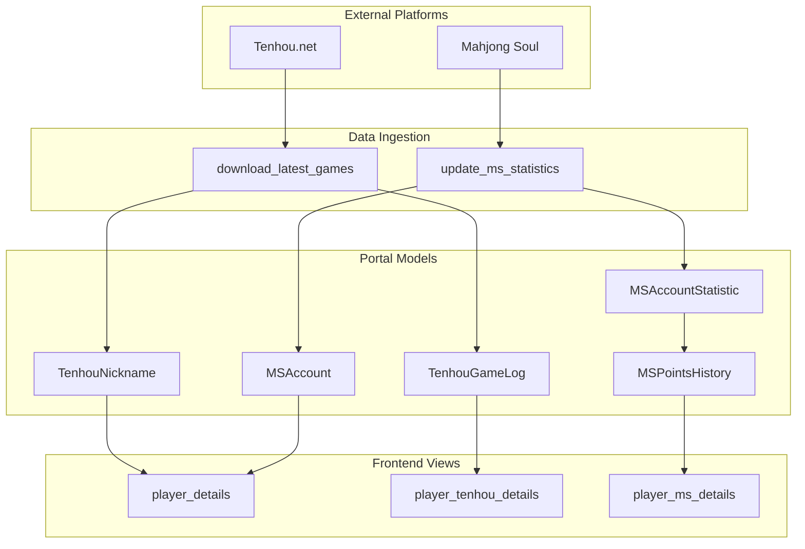
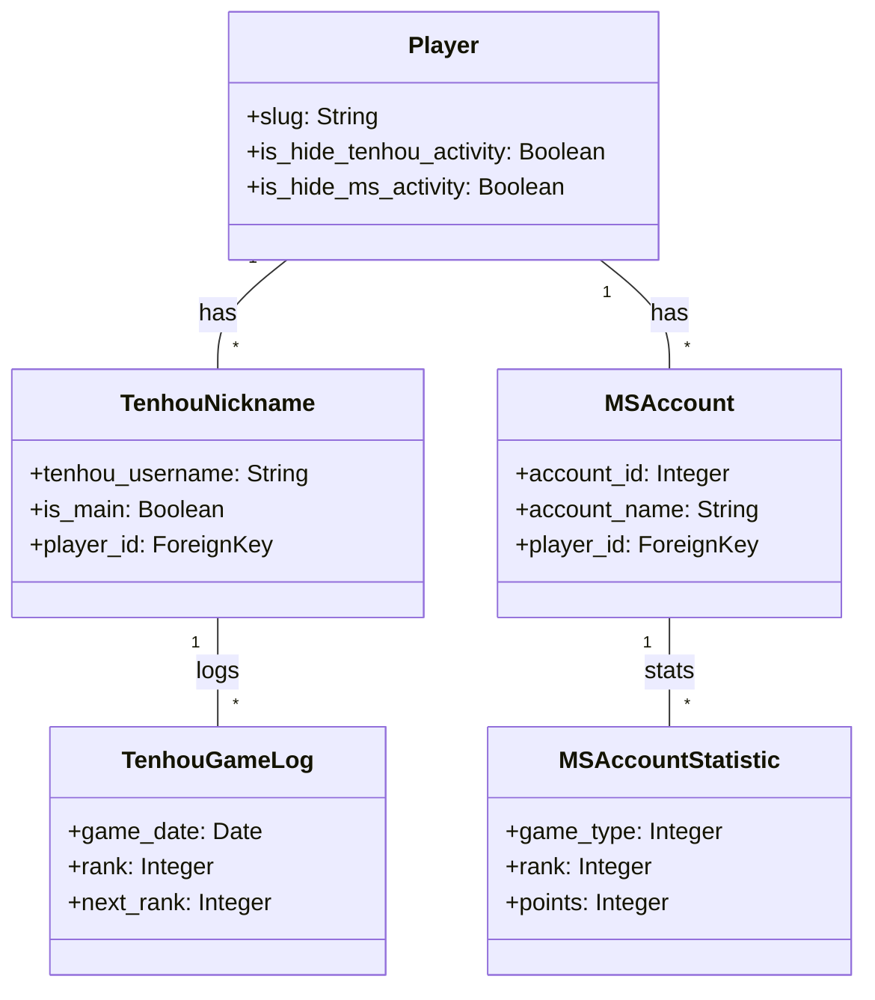

# Platform Integrations (Tenhou & Mahjong Soul)

Relevant source files

The following files were used as context for generating this wiki page:

- [server/mahjong_portal/templatetags/tenhou_helper.py](server/mahjong_portal/templatetags/tenhou_helper.py)
- [server/player/mahjong_soul/admin.py](server/player/mahjong_soul/admin.py)
- [server/player/mahjong_soul/management/commands/update_ms_statistics.py](server/player/mahjong_soul/management/commands/update_ms_statistics.py)
- [server/player/mahjong_soul/migrations/0003_mspointshistory.py](server/player/mahjong_soul/migrations/0003_mspointshistory.py)
- [server/player/mahjong_soul/migrations/0009_alter_msaccount_last_update.py](server/player/mahjong_soul/migrations/0009_alter_msaccount_last_update.py)
- [server/player/mahjong_soul/models.py](server/player/mahjong_soul/models.py)
- [server/player/mahjong_soul/views.py](server/player/mahjong_soul/views.py)
- [server/player/migrations/0018_player_is_hide_ms_activity_and_more.py](server/player/migrations/0018_player_is_hide_ms_activity_and_more.py)
- [server/player/tenhou/models.py](server/player/tenhou/models.py)
- [server/player/urls.py](server/player/urls.py)
- [server/player/views.py](server/player/views.py)
- [server/templates/access_denied.html](server/templates/access_denied.html)
- [server/templates/player/_changes_table.html](server/templates/player/_changes_table.html)
- [server/templates/player/tenhou.html](server/templates/player/tenhou.html)

The Mahjong Portal integrates with the two primary online Riichi Mahjong platforms: **Tenhou.net** and **Mahjong Soul**. These integrations allow the portal to track player progress, synchronize ranks and rates, and visualize performance over time. This data is used both for informational purposes on player profiles and as input for online rating systems.

## System Overview

The portal maintains local mirrors of player statistics which are updated via background tasks. While both integrations serve similar purposes, they utilize different data acquisition methods: Tenhou data is primarily parsed from game logs and external archives, whereas Mahjong Soul data is fetched directly via a custom RPC framework.

### Integration Architecture

The following diagram illustrates how external platform data flows into the portal's models and is surfaced in the UI.

**Platform Data Flow Architecture**

**Sources:** [server/player/views.py:68-69](), [server/player/mahjong_soul/management/commands/update_ms_statistics.py:13-65](), [server/player/tenhou/models.py:26-40]()

---

## Tenhou.net Integration

The Tenhou integration is designed to track a player's rank (Dan), rate, and game history across different lobbies (Ippan, Joukyuu, Tokujou, Houou). It stores detailed game logs to generate performance charts and track "Yakuman" achievements.

### Key Components
- **Data Models**: `TenhouNickname` acts as the primary link to a `Player` [server/player/tenhou/models.py:31](). Statistics are aggregated in `TenhouAggregatedStatistics` [server/player/tenhou/models.py:102]() and `TenhouStatistics` [server/player/tenhou/models.py:153]().
- **Visualization**: The portal uses **Chart.js** to render rank and PT (Points) changes over time [server/templates/player/tenhou.html:9-12]().
- **Privacy**: Players can opt to hide their Tenhou activity via the `is_hide_tenhou_activity` flag [server/player/migrations/0018_player_is_hide_ms_activity_and_more.py:20-22]().

For deep technical details on log parsing, lobby categories, and management commands, see **[Tenhou.net Integration](#5.1)**.

**Sources:** [server/player/tenhou/models.py:1-100](), [server/templates/player/tenhou.html:1-162]()

---

## Mahjong Soul Integration

The Mahjong Soul integration tracks player levels and points for both 4-player and 3-player modes. Unlike Tenhou, it relies on a custom RPC client to communicate with Mahjong Soul servers across different regions.

### Key Components
- **Data Models**: `MSAccount` stores the unique `account_id` [server/player/mahjong_soul/models.py:11](). `MSAccountStatistic` tracks current rank and points [server/player/mahjong_soul/models.py:40-48](), while `MSPointsHistory` records snapshots of progress for trend analysis [server/player/mahjong_soul/models.py:110-118]().
- **Data Ingestion**: The `update_ms_statistics` management command iterates through accounts and fetches `ReqAccountInfo` and `ReqAccountStatisticInfo` via the Mahjong Soul lobby RPC [server/player/mahjong_soul/management/commands/update_ms_statistics.py:22-46]().
- **Leaderboards**: The `ms_accounts` view provides a ranked list of players active within the last 180 days [server/player/mahjong_soul/views.py:13-41]().

For details on the RPC framework, regional clients, and the authentication flow, see **[Mahjong Soul Integration](#5.2)**.

**Sources:** [server/player/mahjong_soul/models.py:10-118](), [server/player/mahjong_soul/management/commands/update_ms_statistics.py:13-65](), [server/player/mahjong_soul/views.py:13-43]()

---

## Common Integration Features

Both platforms share common infrastructure within the portal to ensure a unified player experience.

### Statistics & Display
The `player_details` view aggregates data from both platforms to show a summary on the main profile page [server/player/views.py:68-69](). Custom template tags in `tenhou_helper.py` provide filters for formatting ranks and rates for display [server/mahjong_portal/templatetags/tenhou_helper.py:14-71]().

### Data Association Logic
The following diagram shows how the portal maps platform-specific entities to the core `Player` model.

**Entity Mapping Diagram**

**Sources:** [server/player/models.py](), [server/player/tenhou/models.py:26-31](), [server/player/mahjong_soul/models.py:10-15]()

| Feature | Tenhou.net | Mahjong Soul |
| :--- | :--- | :--- |
| **Primary Identifier** | `tenhou_username` [server/player/tenhou/models.py:33]() | `account_id` [server/player/mahjong_soul/models.py:11]() |
| **Update Frequency** | Every 3-10 minutes (via cron) | Hourly (via cron) |
| **Historical Tracking** | `TenhouGameLog` [server/player/tenhou/models.py:207]() | `MSPointsHistory` [server/player/mahjong_soul/models.py:110]() |
| **Privacy Control** | `is_hide_tenhou_activity` [server/player/migrations/0018_...:20]() | `is_hide_ms_activity` [server/player/migrations/0018_...:15]() |

**Sources:** [server/player/tenhou/models.py:26-210](), [server/player/mahjong_soul/models.py:10-118](), [server/player/urls.py:21-22]()