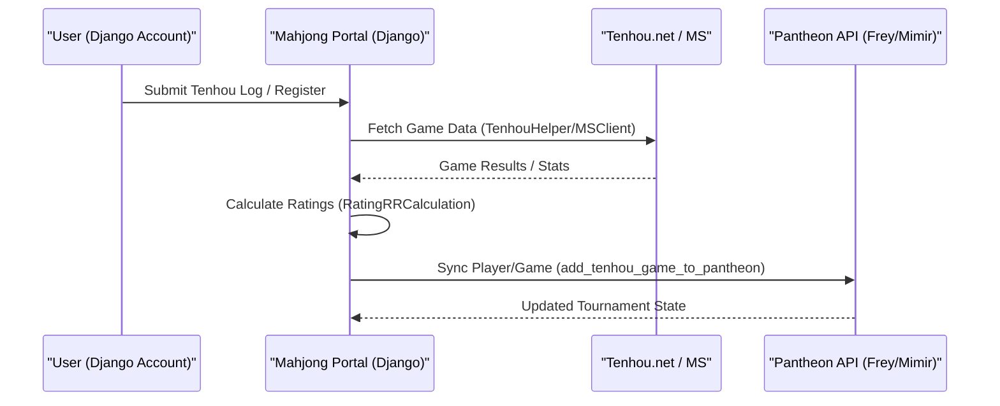

# Mahjong Portal — Project Overview

<details>
<summary>Relevant source files</summary>

The following files were used as context for generating this wiki page:

- [.envs/.production.env.example](.envs/.production.env.example)
- [.github/workflows/app.yml](.github/workflows/app.yml)
- [Makefile](Makefile)
- [README.md](README.md)
- [docker/django/Dockerfile](docker/django/Dockerfile)
- [server/mahjong_portal/settings.py](server/mahjong_portal/settings.py)
- [server/requirements/base.txt](server/requirements/base.txt)
- [server/requirements/dev.txt](server/requirements/dev.txt)
- [server/templates/base.html](server/templates/base.html)
- [server/tournament/migrations/0032_alter_onlinetournamentregistration_notes.py](server/tournament/migrations/0032_alter_onlinetournamentregistration_notes.py)
- [server/utils/pantheon.py](server/utils/pantheon.py)
- [server/website/context.py](server/website/context.py)

</details>


The Mahjong Portal is a specialized web application designed to aggregate, calculate, and display Russian riichi-mahjong tournament results and player ratings. It serves as a central hub for the competitive mahjong community, bridging offline tournament management with online platforms like Tenhou and Mahjong Soul.

The system acts as a sophisticated ETL (Extract, Transform, Load) and automation engine, pulling data from various mahjong clients, calculating complex rating systems (RR, EMA, CRR), and providing automation for online tournaments via bots and API integrations.

### System Architecture Overview

The portal is built on **Django 5.2** [server/requirements/base.txt:5-5]() and utilizes a multi-database setup to integrate with external systems like Pantheon.

#### Code Entity to System Mapping

The following diagram illustrates how high-level system components map to specific code entities within the repository.

**Diagram: System Component Mapping**
```mermaid
graph TD
    subgraph "Natural Language Space"
        A["Rating Engine"]
        B["Online Automation"]
        C["External Platforms"]
        D["Tournament Management"]
    end

    subgraph "Code Entity Space"
        A --> "rating"["Django App: rating"]
        B --> "online"["Django App: online"]
        B --> "autobot"["PortalAutoBot Class"]
        C --> "tenhou"["Django App: player.tenhou"]
        C --> "ms"["Django App: player.mahjong_soul"]
        D --> "t_admin"["Django App: system.tournament_admin"]
        D --> "t_core"["Django App: tournament"]
    end

    "rating" --> "RatingDelta"["Model: RatingDelta"]
    "online" --> "TournamentHandler"["Logic: TournamentHandler"]
    "tenhou" --> "TenhouHelper"["Utility: TenhouHelper"]
```
*Sources: [server/mahjong_portal/settings.py:49-80](), [server/requirements/base.txt:1-42]()*

### Major Subsystems

#### 1. Player & Tournament Management
The core of the application revolves around the `player` and `tournament` apps. It tracks player profiles, their titles, and historical tournament performance. The system supports both physical offline tournaments and complex online registrations.
*   **Key Entities:** `Player`, `Tournament`, `TournamentRegistration`.
*   **For details, see [Player Data Model & Profile System](#2.1) and [Tournament Models & Registration](#2.2.1).**

#### 2. Rating Calculation Engine
The portal calculates multiple rating types, including the Russian Riichi (RR) rating and European Mahjong Association (EMA) ratings. It uses `RatingDelta` to track changes over time based on tournament results.
*   **Key Entities:** `RatingDelta`, `RatingResult`, `RatingRRCalculation`.
*   **For details, see [Rating Calculation Engine](#2.3) and [Rating Calculation Algorithms (RR, EMA, CRR, Online)](#2.3.1).**

#### 3. Platform Integrations (Tenhou & Mahjong Soul)
The portal synchronizes with major online mahjong platforms. It parses Tenhou logs and fetches Mahjong Soul statistics via RPC clients to maintain up-to-date player metrics.
*   **Key Entities:** `TenhouHelper`, `MSAccount`, `MSBaseCommand`.
*   **For details, see [Tenhou.net Integration](#5.1) and [Mahjong Soul Integration](#5.2).**

#### 4. Pantheon & Online Automation
For online tournaments, the portal integrates with "Pantheon" (an external tournament management service) via Twirp/Protobuf. It automates game creation on Tenhou and Mahjong Soul and manages the round lifecycle through a specialized `TournamentHandler`.
*   **Key Entities:** `FreyClient`, `MimirClient`, `TournamentHandler`, `PortalAutoBot`.
*   **For details, see [Online Tournament Automation](#3) and [Pantheon API Clients (Frey & Mimir)](#4.1).**

### High-Level Data Flow

The portal coordinates data between users, external mahjong servers, and the Pantheon management system.

**Diagram: High-Level Data Flow**

*Sources: [server/utils/pantheon.py:103-111](), [server/mahjong_portal/settings.py:200-202]()*

### Technical Stack Summary

| Component | Technology | File Reference |
| :--- | :--- | :--- |
| **Framework** | Django 5.2 | [server/requirements/base.txt:5-5]() |
| **Database** | PostgreSQL (psycopg3) | [server/requirements/base.txt:7-7]() |
| **Task Scheduling** | Cron (via management commands) | [docker/django/crontab:1-1]() |
| **Frontend** | Bootstrap 5, Dark/Light Theme | [server/templates/base.html:21-31]() |
| **Search Engine** | Haystack + Whoosh | [server/mahjong_portal/settings.py:193-198]() |
| **Integrations** | Twirp (Protobuf), Discord.py, Telegram Bot | [server/requirements/base.txt:20-25]() |

### Child Pages
For deeper technical dives into specific areas of the codebase, refer to the following sections:

*   **[Getting Started — Local Development & Deployment](#1.1)**: Environment setup using Docker and the `Makefile`.
*   **[Application Configuration & Settings](#1.2)**: Detailed breakdown of `settings.py`, environment variables, and the `PantheonRouter`.

---
*Sources: [README.md:1-43](), [server/mahjong_portal/settings.py:1-220](), [server/templates/base.html:1-115](), [Makefile:1-68]()*