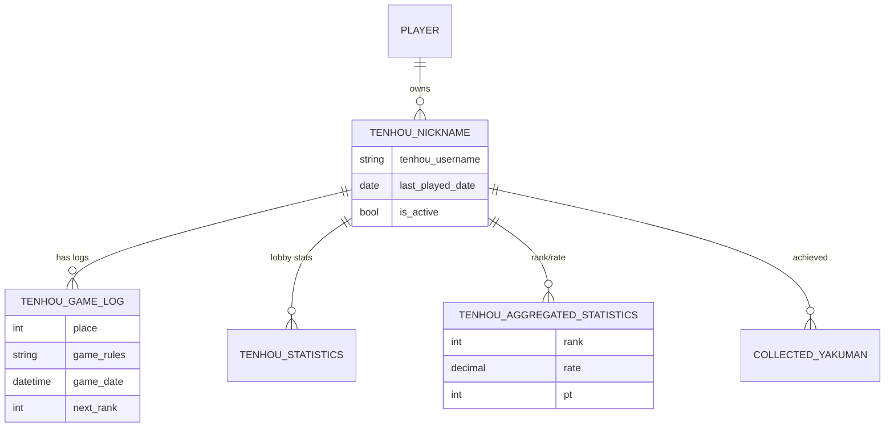
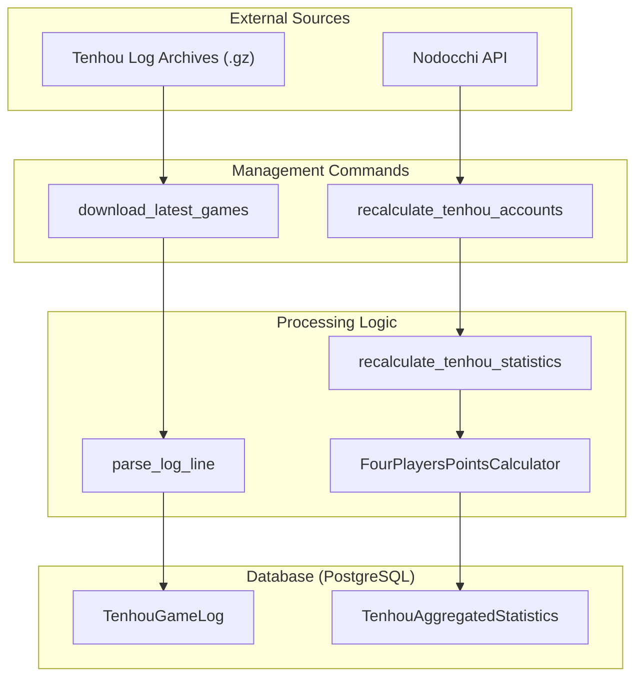

# Tenhou.net Integration

Relevant source files

The following files were used as context for generating this wiki page:

- [server/mahjong_portal/templatetags/tenhou_helper.py](server/mahjong_portal/templatetags/tenhou_helper.py)
- [server/online/management/commands/prepare_fixed_seating.py](server/online/management/commands/prepare_fixed_seating.py)
- [server/online/management/commands/print_team_seating.py](server/online/management/commands/print_team_seating.py)
- [server/online/team_seating.py](server/online/team_seating.py)
- [server/player/tenhou/admin.py](server/player/tenhou/admin.py)
- [server/player/tenhou/management/commands/add_tenhou_account.py](server/player/tenhou/management/commands/add_tenhou_account.py)
- [server/player/tenhou/management/commands/download_latest_games.py](server/player/tenhou/management/commands/download_latest_games.py)
- [server/player/tenhou/management/commands/mark_not_active_tenhou_accounts.py](server/player/tenhou/management/commands/mark_not_active_tenhou_accounts.py)
- [server/player/tenhou/management/commands/recalculate_tenhou_accounts.py](server/player/tenhou/management/commands/recalculate_tenhou_accounts.py)
- [server/player/tenhou/management/commands/update_tenhou_rate.py](server/player/tenhou/management/commands/update_tenhou_rate.py)
- [server/player/tenhou/management/commands/update_tenhou_yakuman.py](server/player/tenhou/management/commands/update_tenhou_yakuman.py)
- [server/player/tenhou/management/commands/year_statistics.py](server/player/tenhou/management/commands/year_statistics.py)
- [server/player/tenhou/migrations/0011_tenhounickname_last_recalculated_date.py](server/player/tenhou/migrations/0011_tenhounickname_last_recalculated_date.py)
- [server/player/tenhou/models.py](server/player/tenhou/models.py)
- [server/player/tenhou/tests.py](server/player/tenhou/tests.py)
- [server/player/tenhou/urls.py](server/player/tenhou/urls.py)
- [server/player/tenhou/views.py](server/player/tenhou/views.py)
- [server/player/urls.py](server/player/urls.py)
- [server/player/views.py](server/player/views.py)
- [server/templates/common/_player_name.html](server/templates/common/_player_name.html)
- [server/templates/ms/ms_accounts.html](server/templates/ms/ms_accounts.html)
- [server/templates/player/_changes_table.html](server/templates/player/_changes_table.html)
- [server/templates/player/tenhou.html](server/templates/player/tenhou.html)
- [server/templates/tenhou/_tenhou_player.html](server/templates/tenhou/_tenhou_player.html)
- [server/templates/tenhou/games_history.html](server/templates/tenhou/games_history.html)
- [server/templates/tenhou/tenhou_accounts.html](server/templates/tenhou/tenhou_accounts.html)
- [server/templates/tenhou/tenhou_games.html](server/templates/tenhou/tenhou_games.html)
- [server/templates/tenhou/tenhou_games_async.html](server/templates/tenhou/tenhou_games_async.html)
- [server/utils/tenhou/current_tenhou_games.py](server/utils/tenhou/current_tenhou_games.py)
- [server/utils/tenhou/helper.py](server/utils/tenhou/helper.py)
- [server/utils/tenhou/points_calculator.py](server/utils/tenhou/points_calculator.py)

The Tenhou.net integration provides a comprehensive system for tracking, analyzing, and displaying player performance on the Tenhou mahjong platform. It automates the collection of game logs, recalculates player ranks and ratings, and visualizes historical progress using Chart.js.

## Data Models

The core of the integration resides in `server/player/tenhou/models.py`. The system uses a hierarchical structure to store account information and statistics.

| Model | Description |
| :--- | :--- |
| `TenhouNickname` | Represents a specific Tenhou account associated with a `Player`. Tracks activity status and main account flags. [server/player/tenhou/models.py:26-40]() |
| `TenhouGameLog` | Stores individual game results including place, rules, lobby, and rank changes. [server/player/tenhou/models.py:207-208]() |
| `TenhouAggregatedStatistics` | Stores high-level metrics like current Rank (Dan), Rate (R), and Points (PT) for 4-player or 3-player modes. [server/player/tenhou/models.py:102-135]() |
| `TenhouStatistics` | Breakdown of performance (average place, percentages) per lobby (Ippan, Joukyuu, Tokujou, Houou). [server/player/tenhou/models.py:153-181]() |
| `CollectedYakuman` | Records rare "Yakuman" hands with links to the original Tenhou logs. [server/player/tenhou/models.py:187-195]() |

### Data Relationship Diagram

Title: Tenhou Integration Entity Relationship

Sources: [server/player/tenhou/models.py:26-208]()

## TenhouHelper and Processing Pipeline

The `TenhouHelper` and associated utilities handle the ingestion and parsing of external data.

### 1. Log Parsing
The `parse_log_line` function transforms raw Tenhou log strings into structured dictionaries. It extracts game time, length, rules, and player names/placements.
Sources: [server/utils/tenhou/helper.py:19-49]()

### 2. Statistics Recalculation
`recalculate_tenhou_statistics_for_four_players` performs the following:
- Filters games by lobby type using `lobbies_dict`. [server/utils/tenhou/helper.py:75-76]()
- Aggregates placement counts for "All Time" and "Current Month" stats. [server/utils/tenhou/helper.py:102-143]()
- Calculates the player's Rank and PT using the `FourPlayersPointsCalculator`. [server/utils/tenhou/helper.py:159-160]()
- Updates the `TenhouAggregatedStatistics` and `TenhouNickname` records. [server/utils/tenhou/helper.py:169-185]()

## Management Commands

The system relies on several cron-scheduled commands to keep data synchronized.

*   **`download_latest_games`**: Downloads GZIP archives from Tenhou's public log servers (e.g., `scb` files for the 0000 lobby), parses them, and saves new logs for watched nicknames. [server/player/tenhou/management/commands/download_latest_games.py:24-88]()
*   **`recalculate_tenhou_accounts`**: Iterates through active accounts to refresh statistics, often fetching data from the Nodocchi API to ensure completeness. [server/player/tenhou/management/commands/recalculate_tenhou_accounts.py:28-51]()
*   **`update_tenhou_rate`**: A high-frequency task (every 10 min) to specifically update player Rate (R) and Rank. [server/player/tenhou/management/commands/update_tenhou_rate.py]()
*   **`mark_not_active`**: Deactivates accounts that haven't played ranking or custom games in 181 days, effectively identifying deleted or abandoned accounts. [server/player/tenhou/management/commands/mark_not_active_tenhou_accounts.py:24-59]()
*   **`add_tenhou_account`**: A manual command to link a Tenhou nickname to a Portal player and perform initial data seeding. [server/player/tenhou/management/commands/add_tenhou_account.py:19-49]()

### Integration Data Flow

Title: Tenhou Data Ingestion Pipeline

Sources: [server/player/tenhou/management/commands/download_latest_games.py:41-88](), [server/utils/tenhou/helper.py:52-185]()

## Frontend and Visualizations

The player details view (`player_tenhou_details`) provides deep insights into performance.

### Rank and PT Charts
The `tenhou.html` template uses **Chart.js** to render:
1.  **Rank Changes**: A stepped line chart showing progress through Dan ranks over time or game count. [server/templates/player/tenhou.html:12-162]()
2.  **PT Progress**: Tracks point fluctuations within the current rank. [server/templates/player/tenhou.html:179-180]()

### Views and Metrics
*   **`tenhou_accounts`**: A global leaderboard of portal players on Tenhou, sortable by Rate or PT. [server/player/tenhou/views.py:73-94]()
*   **`games_history`**: A daily breakdown of all games played by portal users, including total time spent and rank changes. [server/player/tenhou/views.py:97-132]()
*   **Lobby Categories**: Statistics are categorized into `Ippan` (Kyu), `Joukyuu` (Dan), `Tokujou` (Upper Dan), and `Houou` (Phoenix). [server/player/tenhou/models.py:159-164]()

Sources: [server/player/tenhou/views.py:15-132](), [server/templates/player/tenhou.html:1-172]()