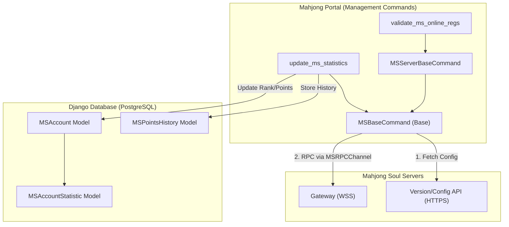
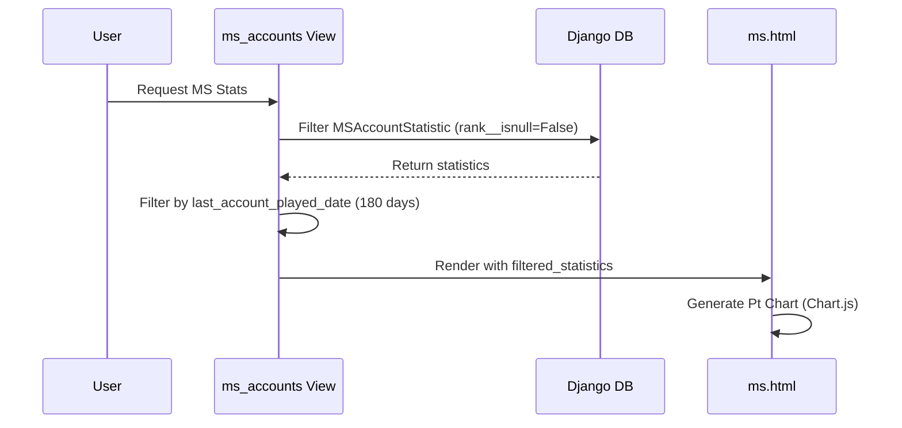

# Mahjong Soul Integration

Relevant source files

The following files were used as context for generating this wiki page:

- [server/player/mahjong_soul/admin.py](server/player/mahjong_soul/admin.py)
- [server/player/mahjong_soul/constants.py](server/player/mahjong_soul/constants.py)
- [server/player/mahjong_soul/management/commands/add_new_ms_accounts.py](server/player/mahjong_soul/management/commands/add_new_ms_accounts.py)
- [server/player/mahjong_soul/management/commands/ms_base.py](server/player/mahjong_soul/management/commands/ms_base.py)
- [server/player/mahjong_soul/management/commands/ms_servers_base.py](server/player/mahjong_soul/management/commands/ms_servers_base.py)
- [server/player/mahjong_soul/management/commands/search_ms_account.py](server/player/mahjong_soul/management/commands/search_ms_account.py)
- [server/player/mahjong_soul/management/commands/update_ms_statistics.py](server/player/mahjong_soul/management/commands/update_ms_statistics.py)
- [server/player/mahjong_soul/management/commands/validate_ms_online_regs.py](server/player/mahjong_soul/management/commands/validate_ms_online_regs.py)
- [server/player/mahjong_soul/management/ms_cn_client.py](server/player/mahjong_soul/management/ms_cn_client.py)
- [server/player/mahjong_soul/management/ms_global_client.py](server/player/mahjong_soul/management/ms_global_client.py)
- [server/player/mahjong_soul/management/ms_jp_client.py](server/player/mahjong_soul/management/ms_jp_client.py)
- [server/player/mahjong_soul/migrations/0003_mspointshistory.py](server/player/mahjong_soul/migrations/0003_mspointshistory.py)
- [server/player/mahjong_soul/migrations/0009_alter_msaccount_last_update.py](server/player/mahjong_soul/migrations/0009_alter_msaccount_last_update.py)
- [server/player/mahjong_soul/models.py](server/player/mahjong_soul/models.py)
- [server/player/mahjong_soul/views.py](server/player/mahjong_soul/views.py)
- [server/player/migrations/0018_player_is_hide_ms_activity_and_more.py](server/player/migrations/0018_player_is_hide_ms_activity_and_more.py)
- [server/templates/access_denied.html](server/templates/access_denied.html)
- [server/templates/player/ms.html](server/templates/player/ms.html)
- [server/templates/player/rating_changes.html](server/templates/player/rating_changes.html)
- [server/templates/player/rating_details.html](server/templates/player/rating_details.html)

This page documents the integration between the Mahjong Portal and the Mahjong Soul (Maj-Soul) game servers. The system provides automated statistics tracking, player profile visualization, and account validation for online tournaments across regional clients (CN, JP, and Global).

## Architecture Overview

The integration is built on an asynchronous RPC framework that communicates with Mahjong Soul's gateway servers using Protobuf messages over WebSockets.

### Core Components Diagram

The following diagram illustrates how the management commands interact with the Mahjong Soul servers and the local database.

**Mahjong Soul System Architecture**

**Sources:** [server/player/mahjong_soul/management/commands/ms_base.py:24-81](), [server/player/mahjong_soul/management/commands/update_ms_statistics.py:13-65](), [server/player/mahjong_soul/models.py:10-45]()

---

## Data Models

The system tracks player progression through three primary models located in `player.mahjong_soul.models`.

| Model | Purpose | Key Fields |
| :--- | :--- | :--- |
| `MSAccount` | Links a Portal `Player` to a Mahjong Soul account. | `account_id`, `account_name`, `player` |
| `MSAccountStatistic` | Stores current rank, points, and game counts (4-player and 3-player). | `game_type`, `rank`, `points`, `tonpusen_games`, `hanchan_games` |
| `MSPointsHistory` | Tracks point changes over time to generate progression charts. | `rank_index`, `points`, `created_on` |

**Sources:** [server/player/mahjong_soul/models.py:10-118]()

---

## RPC Framework & Regional Clients

The integration uses a custom RPC layer based on `ms.protocol_pb2` and `ms.base.MSRPCChannel`.

### MSBaseCommand
The `MSBaseCommand` class handles the low-level connection logic, including:
1.  **Version Discovery:** Fetching `version.json` and `config.json` to determine the current client version and gateway URLs [server/player/mahjong_soul/management/commands/ms_base.py:45-73]().
2.  **Authentication:** Supports both username/password login (with HMAC-SHA256 hashing) and token-based login [server/player/mahjong_soul/management/commands/ms_base.py:83-185]().
3.  **Token Management:** Persists access tokens in a `.ms` file to avoid repeated full logins [server/player/mahjong_soul/management/commands/ms_base.py:146-149]().

### Regional Clients
To support different regions, the system implements specialized clients that point to specific hosts:
*   **China (CN):** `MSChinaLobbyClient` using `https://game.maj-soul.com` [server/player/mahjong_soul/management/ms_cn_client.py:4-11]().
*   **Japan (JP):** `MSJapanLobbyClient` using `https://game.mahjongsoul.com` [server/player/mahjong_soul/management/ms_jp_client.py:4-11]().
*   **Global (EN):** `MSGlobalLobbyClient` [server/player/mahjong_soul/management/ms_global_client.py]().

---

## Statistics Management

The `update_ms_statistics` command is the primary background task for data ingestion.

### Update Workflow
1.  **Selection:** Selects `MSAccount` objects that haven't been updated today [server/player/mahjong_soul/management/commands/update_ms_statistics.py:16-17]().
2.  **Account Info:** Calls `fetch_account_info` to get the latest nickname and level [server/player/mahjong_soul/management/commands/update_ms_statistics.py:22-42]().
3.  **Game Statistics:** Calls `fetch_account_statistic_info` and parses the `detailData` to extract average places and game counts for Tonpusen and Hanchan [server/player/mahjong_soul/management/commands/update_ms_statistics.py:44-56]().
4.  **History Tracking:** The `calculate_and_save_points_diff` method detects if points or rank have changed and creates a new `MSPointsHistory` entry if necessary [server/player/mahjong_soul/management/commands/update_ms_statistics.py:69-97]().

**Sources:** [server/player/mahjong_soul/management/commands/update_ms_statistics.py:13-97]()

---

## Tournament Integration

The system provides tools to validate that players registering for online tournaments actually own the accounts they claim.

### Account Search and Validation
*   **`search_ms_account`**: Uses `ReqSearchAccountByPattern` to find an internal `account_id` based on a public `friend_id` [server/player/mahjong_soul/management/commands/search_ms_account.py:14-39]().
*   **`validate_ms_online_regs`**: Iterates through `MsOnlineTournamentRegistration` objects. It searches for the `ms_friend_id` on the server and compares the returned nickname with the registration data. If they match, it marks the registration as `is_validated` [server/player/mahjong_soul/management/commands/validate_ms_online_regs.py:10-68]().

**Sources:** [server/player/mahjong_soul/management/commands/search_ms_account.py:8-55](), [server/player/mahjong_soul/management/commands/validate_ms_online_regs.py:9-85]()

---

## Player Profile & Frontend

Mahjong Soul data is displayed on the player profile page using Chart.js for progression visualization.

### Data Flow to View

### Profile View Features
*   **Rank Display:** Shows the player's current rank (e.g., Expert, Master) using `RANK_LABELS` [server/player/mahjong_soul/models.py:85-86]().
*   **Point Charts:** Generates a line chart of points for the current rank using `MSPointsHistory` [server/templates/player/ms.html:15-49]().
*   **Detailed Stats:** Tables showing game counts and percentage distributions for 1st, 2nd, 3rd, and 4th places [server/templates/player/ms.html:116-162]().
*   **Privacy:** Accounts are hidden from public lists if `is_hide_ms_activity` is set on the `Player` model [server/player/mahjong_soul/views.py:28]().

**Sources:** [server/player/mahjong_soul/views.py:13-43](), [server/templates/player/ms.html:1-170](), [server/player/mahjong_soul/models.py:98-107]()