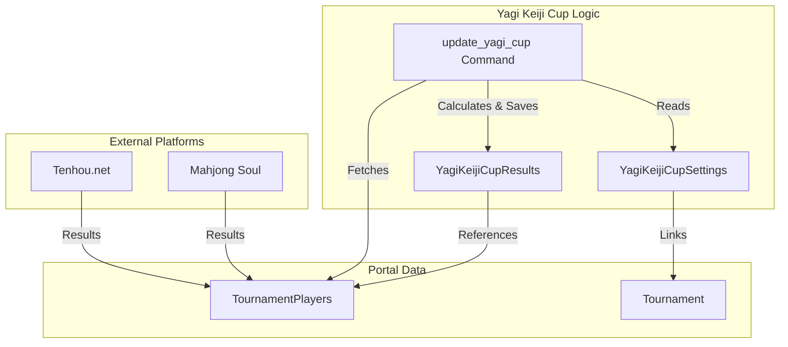

# Clubs, Leagues & Special Events

<details>
<summary>Relevant source files</summary>

The following files were used as context for generating this wiki page:

- [server/club/admin.py](server/club/admin.py)
- [server/club/models.py](server/club/models.py)
- [server/club/pantheon_games/management/commands/associate_players_with_club.py](server/club/pantheon_games/management/commands/associate_players_with_club.py)
- [server/club/pantheon_games/management/commands/load_pantheon_data.py](server/club/pantheon_games/management/commands/load_pantheon_data.py)
- [server/club/translation.py](server/club/translation.py)
- [server/club/views.py](server/club/views.py)
- [server/league/admin.py](server/league/admin.py)
- [server/league/management/commands/import_league_seating.py](server/league/management/commands/import_league_seating.py)
- [server/league/management/commands/import_league_teams.py](server/league/management/commands/import_league_teams.py)
- [server/league/migrations/0005_auto_20220203_0245.py](server/league/migrations/0005_auto_20220203_0245.py)
- [server/league/models.py](server/league/models.py)
- [server/league/urls.py](server/league/urls.py)
- [server/league/views.py](server/league/views.py)
- [server/rating/management/commands/export_players.py](server/rating/management/commands/export_players.py)
- [server/templates/club/details.html](server/templates/club/details.html)
- [server/templates/league/schedule.html](server/templates/league/schedule.html)
- [server/templates/league/teams.html](server/templates/league/teams.html)
- [server/templates/league/view.html](server/templates/league/view.html)
- [server/templates/tournament/_tournament_registration_status.html](server/templates/tournament/_tournament_registration_status.html)
- [server/templates/yagi_keiji_cup/yagi_keiji_cup.html](server/templates/yagi_keiji_cup/yagi_keiji_cup.html)
- [server/yagi_keiji_cup/admin.py](server/yagi_keiji_cup/admin.py)
- [server/yagi_keiji_cup/management/commands/update_yagi_cup.py](server/yagi_keiji_cup/management/commands/update_yagi_cup.py)
- [server/yagi_keiji_cup/migrations/0003_yagikeijicupresults.py](server/yagi_keiji_cup/migrations/0003_yagikeijicupresults.py)
- [server/yagi_keiji_cup/migrations/0008_alter_yagikeijicupresults_majsoul_player_and_more.py](server/yagi_keiji_cup/migrations/0008_alter_yagikeijicupresults_majsoul_player_and_more.py)
- [server/yagi_keiji_cup/migrations/0009_yagikeijicupresults_majsoul_player_avg_place_and_more.py](server/yagi_keiji_cup/migrations/0009_yagikeijicupresults_majsoul_player_avg_place_and_more.py)
- [server/yagi_keiji_cup/models.py](server/yagi_keiji_cup/models.py)
- [server/yagi_keiji_cup/views.py](server/yagi_keiji_cup/views.py)

</details>


This section provides an overview of the Mahjong Portal's subsystems for managing organized groups, long-term team competitions, and unique cross-platform events. These systems bridge local club activities and large-scale online leagues with the portal's core player and tournament data.

## Club Management & Pantheon Game Sync

The Club subsystem manages local mahjong clubs, their member lists, and their historical game data. It relies heavily on an ETL (Extract, Transform, Load) pipeline that pulls session data from the Pantheon external system.

*   **Data Synchronization**: The `load_pantheon_data` command [server/club/pantheon_games/management/commands/load_pantheon_data.py:21-54]() iterates through clubs and fetches game results for all associated Pantheon event IDs [server/club/pantheon_games/management/commands/load_pantheon_data.py:40]().
*   **Identity Resolution**: The `associate_players_with_club` command attempts to match Pantheon player profiles with Portal `Player` records using `pantheon_id` or name-matching heuristics [server/club/pantheon_games/management/commands/associate_players_with_club.py:64-98]().
*   **Club Ratings**: Statistics such as average place and win rates are calculated for players with at least 10 games in the last 360 days [server/club/pantheon_games/management/commands/load_pantheon_data.py:168-192]().
*   **User Interface**: The `club_details` view provides a comprehensive dashboard including the latest tournaments, club sessions, and a filterable rating table [server/club/views.py:21-67]().

For technical details on the multi-database setup and ETL pipeline, see [Club Management & Pantheon Game Sync](#6.1).

### Club System Mapping
The following diagram maps the logical club concepts to the specific code entities that implement them.

```mermaid
graph TD
    subgraph "Natural Language Space"
        A["Local Club"]
        B["Club Session"]
        C["Club Leaderboard"]
    end

    subgraph "Code Entity Space"
        A1["Club Model"]
        B1["ClubSession Model"]
        B2["ClubSessionResult Model"]
        C1["ClubRating Model"]
        D1["load_pantheon_data Command"]
        D2["associate_players_with_club Command"]
    end

    A --> A1
    B --> B1
    B --> B2
    C --> C1
    D1 -- "Populates" --> B1
    D1 -- "Populates" --> B2
    D2 -- "Links Pantheon IDs to" --> A1
    A1 -- "Has many" --> B1
    A1 -- "Has many" --> C1
    [server/club/models.py:1-20]
    [server/club/pantheon_games/management/commands/load_pantheon_data.py:10-12]
```
**Sources:** [server/club/models.py](), [server/club/pantheon_games/management/commands/load_pantheon_data.py:10-12](), [server/club/pantheon_games/management/commands/associate_players_with_club.py:6-8]()

---

## League System

The League system supports structured team-based competitions (e.g., "Yoroshiku League"). It includes features for scheduling, team management, and automated game initiation on Tenhou.

*   **Structure**: Leagues are composed of `LeagueTeam` objects [server/league/models.py:23-26](), which contain `LeaguePlayer` members [server/league/models.py:35-40]().
*   **Scheduling**: Competitions are divided into `LeagueSession` [server/league/models.py:49-61]() and individual `LeagueGame` instances. Seating can be imported via management commands using hardcoded patterns or CSVs [server/league/management/commands/import_league_seating.py:10-18]().
*   **Workflow**: Players confirm their participation in a `LeagueGameSlot` [server/league/views.py:95-103](). Once all slots are filled, authorized users can trigger `start_game`, which sends a CGI request to Tenhou to initiate a private lobby game with the assigned nicknames [server/league/views.py:112-141]().

For details on the slot confirmation workflow and Tenhou CGI integration, see [League System](#6.2).

**Sources:** [server/league/models.py:8-103](), [server/league/views.py:95-143](), [server/league/management/commands/import_league_seating.py:21-62]()

---

## Yagi Keiji Cup & Special Competitions

The Yagi Keiji Cup is a specialized multi-platform tournament format where teams compete across both Tenhou and Mahjong Soul.

*   **Cross-Platform Aggregation**: The `update_yagi_cup` command [server/yagi_keiji_cup/management/commands/update_yagi_cup.py:16-21]() fetches results from two separate tournaments (one Tenhou, one Mahjong Soul) via the Pantheon API [server/yagi_keiji_cup/management/commands/update_yagi_cup.py:61-64]().
*   **Scoring Logic**: It maps players to teams [server/yagi_keiji_cup/management/commands/update_yagi_cup.py:43-57]() and calculates a unified team score based on the relative performance of the players on both platforms [server/yagi_keiji_cup/management/commands/update_yagi_cup.py:143-145]().
*   **Tie-Breaking**: The system uses a specific hierarchy for rankings: team scores, total games played, and finally the best average place within the team [server/yagi_keiji_cup/views.py:22-29]().

For details on the scoring formula and the update management command, see [Yagi Keiji Cup & Special Competitions](#6.3).

### Yagi Keiji Cup Integration
This diagram illustrates how the Yagi Keiji Cup subsystem aggregates data from external platforms via the Portal's internal models.


**Sources:** [server/yagi_keiji_cup/models.py:16-48](), [server/yagi_keiji_cup/management/commands/update_yagi_cup.py:30-84]()