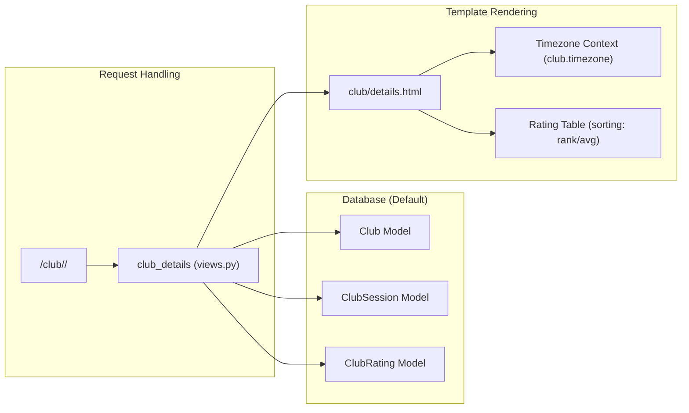

# Club Management & Pantheon Game Sync

<details>
<summary>Relevant source files</summary>

The following files were used as context for generating this wiki page:

- [server/club/admin.py](server/club/admin.py)
- [server/club/club_games/__init__.py](server/club/club_games/__init__.py)
- [server/club/club_games/apps.py](server/club/club_games/apps.py)
- [server/club/club_games/migrations/0001_initial.py](server/club/club_games/migrations/0001_initial.py)
- [server/club/club_games/migrations/__init__.py](server/club/club_games/migrations/__init__.py)
- [server/club/migrations/0002_club_timezone.py](server/club/migrations/0002_club_timezone.py)
- [server/club/migrations/0009_club_new_pantheon_ids.py](server/club/migrations/0009_club_new_pantheon_ids.py)
- [server/club/models.py](server/club/models.py)
- [server/club/pantheon_games/__init__.py](server/club/pantheon_games/__init__.py)
- [server/club/pantheon_games/apps.py](server/club/pantheon_games/apps.py)
- [server/club/pantheon_games/db_router.py](server/club/pantheon_games/db_router.py)
- [server/club/pantheon_games/management/commands/associate_players_with_club.py](server/club/pantheon_games/management/commands/associate_players_with_club.py)
- [server/club/pantheon_games/management/commands/load_pantheon_data.py](server/club/pantheon_games/management/commands/load_pantheon_data.py)
- [server/club/translation.py](server/club/translation.py)
- [server/club/views.py](server/club/views.py)
- [server/rating/management/commands/export_players.py](server/rating/management/commands/export_players.py)
- [server/system/tournament_admin/apps.py](server/system/tournament_admin/apps.py)
- [server/templates/club/details.html](server/templates/club/details.html)
- [server/tournament/migrations/0044_alter_tournamentapplication_tournament_type.py](server/tournament/migrations/0044_alter_tournamentapplication_tournament_type.py)

</details>


The Club Management system provides a framework for tracking physical mahjong clubs, their associated players, and their gaming activity. A central feature of this subsystem is the integration with **Pantheon**, an external game management service. The portal synchronizes session data from Pantheon to calculate local club statistics and maintain a history of club activities.

## Data Models

### Club Model
The `Club` model represents a physical or organized mahjong group. It contains geographic data, contact information, and configuration for Pantheon synchronization.

- **Geographic Data**: Linked to `Country` and `City` models [server/club/models.py:20-21](). It also stores coordinates (`lat`, `lng`) for map displays [server/club/models.py:23-24]().
- **Pantheon Configuration**: Stores IDs for the current and historical Pantheon events used to aggregate game data [server/club/models.py:26-28]().
- **Timezone**: A `timezone` field [server/club/models.py:14]() ensures that game dates are displayed correctly according to the club's local time [server/templates/club/details.html:130-133]().

### Club Statistics & Sessions
Activity is tracked through two primary models in the `club_games` app:
- **ClubSession**: Represents a single table/game session imported from Pantheon [server/club/club_games/models.py]().
- **ClubRating**: Stores aggregated statistics for players within a specific club, such as average place and win rates [server/club/club_games/models.py]().

Sources: [server/club/models.py:10-57](), [server/club/club_games/models.py:10-12]()

## Pantheon Integration & ETL Pipeline

The portal uses a multi-database setup to read directly from Pantheon's data structures while maintaining its own records.

### PantheonRouter (Multi-DB)
The `PantheonRouter` directs read queries for the `pantheon_games` app to a specific `pantheon` database while keeping all writes and other app reads on the `default` database [server/club/pantheon_games/db_router.py:4-18]().

### Data Flow: load_pantheon_data
The `load_pantheon_data` management command serves as the ETL (Extract, Transform, Load) pipeline [server/club/pantheon_games/management/commands/load_pantheon_data.py:21]().

1.  **Download**: It fetches `PantheonSession` and `PantheonSessionResult` records from the `pantheon` database for all IDs listed in `Club.get_all_pantheon_ids()` [server/club/pantheon_games/management/commands/load_pantheon_data.py:40-49]().
2.  **Transformation**: It converts Pantheon's internal UTC timestamps to the club's local timezone (defaulting to "CET" during import) and maps Pantheon player IDs to Portal `Player` models [server/club/pantheon_games/management/commands/load_pantheon_data.py:104-113]().
3.  **Persistence**: Data is saved into local `ClubSession` and `ClubSessionResult` models [server/club/pantheon_games/management/commands/load_pantheon_data.py:105-126]().
4.  **Aggregation**: The `calculate_club_rating` method iterates through the last 360 days of games to compute `average_place` and percentage distributions for 1st-4th places [server/club/pantheon_games/management/commands/load_pantheon_data.py:137-192]().

### Identity Resolution: associate_players_with_club
The `associate_players_with_club` command resolves the identity of players found in Pantheon sessions [server/club/pantheon_games/management/commands/associate_players_with_club.py:15]().

- **Direct Match**: Matches by `pantheon_id` [server/club/pantheon_games/management/commands/associate_players_with_club.py:75]().
- **Name Match**: Attempts to match by Russian first/last names [server/club/pantheon_games/management/commands/associate_players_with_club.py:82]().
- **Ambiguity Resolution**: If multiple players share a name, it uses the `club.city` to narrow the search [server/club/pantheon_games/management/commands/associate_players_with_club.py:91]().

**Identity Resolution Logic**
```mermaid
graph TD
    A["PantheonPlayer (External)"] --> B{Check pantheon_id}
    B -- "Match Found" --> C["Link to Player Model"]
    B -- "No Match" --> D{Match Name (RU)}
    D -- "Single Match" --> C
    D -- "Multiple Matches" --> E{Filter by Club City}
    E -- "Success" --> C
    E -- "Failure" --> F["Log as Missed Player"]
    D -- "No Match" --> F
```
Sources: [server/club/pantheon_games/db_router.py:4-18](), [server/club/pantheon_games/management/commands/load_pantheon_data.py:21-192](), [server/club/pantheon_games/management/commands/associate_players_with_club.py:46-117]()

## Views and Display

### Club List and Details
- **club_list**: Displays all clubs, ordered by city name. It passes a `map_language` to the template based on the user's current locale [server/club/views.py:11-18]().
- **club_details**: Retrieves the club by slug and fetches the latest 5 tournaments and 10 club sessions [server/club/views.py:21-33]().
- **Sorting**: The club rating table supports sorting by `average_place` (asc/desc) and `rank` (Tenhou status) [server/club/views.py:35-51]().

### Timezone-Aware Rendering
The `details.html` template uses the `` tag with the `club.timezone` field to ensure that game timestamps are localized for the specific club [server/templates/club/details.html:130-133]().

**Club View Data Flow**


Sources: [server/club/views.py:11-79](), [server/templates/club/details.html:1-152]()

## Administrative Interface

The `ClubAdmin` class organizes fields into logical sections:
1.  **General**: Multilingual names and descriptions [server/club/admin.py:29-34]().
2.  **Contacts**: Website URL [server/club/admin.py:37]().
3.  **Location**: Country, City, Coordinates, and Timezone [server/club/admin.py:38]().
4.  **System**: Pantheon Event IDs used for the ETL pipeline [server/club/admin.py:39]().

It utilizes `filter_horizontal` for managing the `players` ManyToMany relationship, allowing admins to manually override or supplement the automated association logic [server/club/admin.py:22]().

Sources: [server/club/admin.py:15-43]()