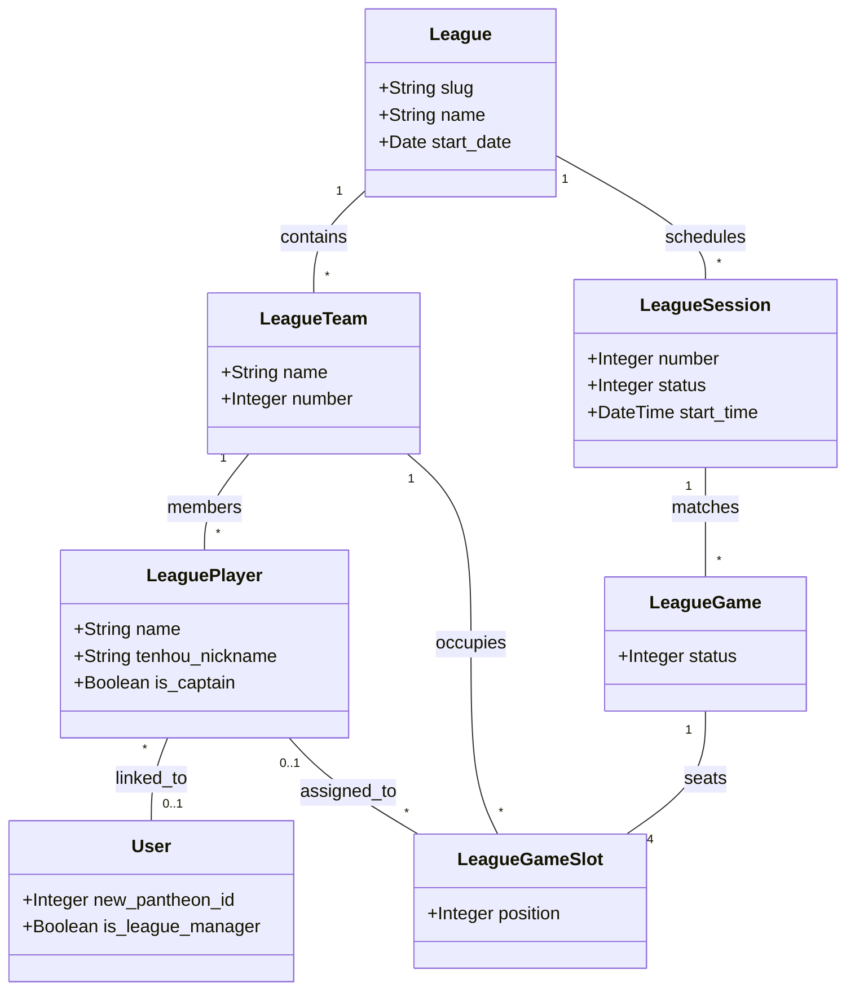
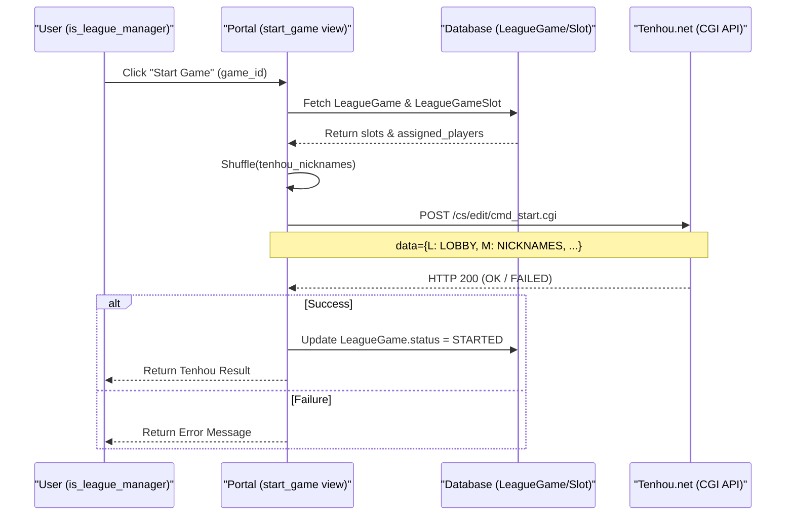

# League System

Relevant source files

The following files were used as context for generating this wiki page:

- [server/account/admin.py](server/account/admin.py)
- [server/account/migrations/0011_user_is_league_manager.py](server/account/migrations/0011_user_is_league_manager.py)
- [server/account/models.py](server/account/models.py)
- [server/account/urls.py](server/account/urls.py)
- [server/league/admin.py](server/league/admin.py)
- [server/league/management/commands/export_players_to_pantheon.py](server/league/management/commands/export_players_to_pantheon.py)
- [server/league/management/commands/import_league_seating.py](server/league/management/commands/import_league_seating.py)
- [server/league/management/commands/import_league_teams.py](server/league/management/commands/import_league_teams.py)
- [server/league/migrations/0005_auto_20220203_0245.py](server/league/migrations/0005_auto_20220203_0245.py)
- [server/league/migrations/0006_leaguegame_leaguegameplayer_leaguesession.py](server/league/migrations/0006_leaguegame_leaguegameplayer_leaguesession.py)
- [server/league/migrations/0007_auto_20220206_1426.py](server/league/migrations/0007_auto_20220206_1426.py)
- [server/league/migrations/0008_leaguesession_league.py](server/league/migrations/0008_leaguesession_league.py)
- [server/league/migrations/0009_auto_20220206_1433.py](server/league/migrations/0009_auto_20220206_1433.py)
- [server/league/migrations/0010_alter_leaguegameplayer_player_pantheon_id.py](server/league/migrations/0010_alter_leaguegameplayer_player_pantheon_id.py)
- [server/league/migrations/0011_alter_leaguegameplayer_game.py](server/league/migrations/0011_alter_leaguegameplayer_game.py)
- [server/league/models.py](server/league/models.py)
- [server/league/urls.py](server/league/urls.py)
- [server/league/views.py](server/league/views.py)
- [server/templates/league/_schedule_games_table.html](server/templates/league/_schedule_games_table.html)
- [server/templates/league/schedule.html](server/templates/league/schedule.html)
- [server/templates/league/teams.html](server/templates/league/teams.html)
- [server/templates/league/view.html](server/templates/league/view.html)

The League system provides a structured framework for managing multi-session team competitions. It handles team and player registration, session scheduling, game seating, and automated game initiation on the Tenhou.net platform.

## Data Models

The league architecture is hierarchical, moving from the global league configuration down to individual player slots within a specific game.

### Core Entities

| Model | Description |
| :--- | :--- |
| `League` | The top-level container for a competition, defining dates and slugs. [server/league/models.py:8-15]() |
| `LeagueTeam` | A group of players competing under a single name within a league. [server/league/models.py:23-26]() |
| `LeaguePlayer` | An individual linked to a team and optionally a Portal `User`. Stores Tenhou nicknames. [server/league/models.py:35-40]() |
| `LeagueSession` | A specific time-block (round) within a league containing multiple games. [server/league/models.py:49-61]() |
| `LeagueGame` | A single mahjong match (hanchan) belonging to a session. [server/league/models.py:75-85]() |
| `LeagueGameSlot` | A specific seat (position 0-3) in a game, assigned to a team and a specific player. [server/league/models.py:97-103]() |

### Entity Relationship Diagram

The following diagram illustrates the relationship between league management entities and the authentication system.

Sources: [server/league/models.py:8-103](), [server/account/models.py:11-16]()

## Workflow: Slot Confirmation

League games are scheduled by team, but specific players must be assigned to slots before a game can start.

1.  **View Schedule**: Users view upcoming sessions via `league_details` [server/league/views.py:28-67]() or `league_schedule` [server/league/views.py:81-91]().
2.  **Identification**: The system identifies the user's team by querying `LeaguePlayer` where `user=request.user` [server/league/views.py:42-43]().
3.  **Confirmation**: If a slot belongs to the user's team and is unassigned, a "I'm playing!" button is shown [server/templates/league/_schedule_games_table.html:33]().
4.  **Assignment**: The `league_confirm_slot` view assigns the `LeaguePlayer` to the `LeagueGameSlot` [server/league/views.py:95-103]().

## Tenhou Game Initiation

Games are started on Tenhou using a CGI-based command system. This requires the `league.start_league_game` permission [server/league/views.py:111]().

### `start_game` Logic
The function `start_game` in `server/league/views.py` performs the following:
1.  **Player Collection**: Retrieves all `assigned_player.tenhou_nickname` from the game's slots [server/league/views.py:114-116]().
2.  **Randomization**: Shuffles the player list to ensure fair seating [server/league/views.py:117]().
3.  **CGI Request**: Sends a POST request to `https://tenhou.net/cs/edit/cmd_start.cgi` [server/league/views.py:119]().
4.  **Payload**: Includes the lobby ID (`L`), game type (`R2`), and the newline-separated list of nicknames (`M`) [server/league/views.py:120-126]().
5.  **Status Update**: If the response does not indicate failure, the `LeagueGame` status is set to `STARTED` [server/league/views.py:140-141]().

Sources: [server/league/views.py:110-143]()

## Data Management & Import

### Seating Import
Seating arrangements are often imported via management commands. The `import_league_seating` command uses a hardcoded `SEATING` string format (e.g., `7-10-12-20` representing team numbers at a table) [server/league/management/commands/import_league_seating.py:10-18](). It creates `LeagueSession`, `LeagueGame`, and `LeagueGameSlot` objects programmatically [server/league/management/commands/import_league_seating.py:49-61]().

### Pantheon Export
To synchronize league players with the Pantheon system (for rating or external management), the `export_players_to_pantheon` command is used.

-   **Process**: It iterates through `LeaguePlayer` objects that have an attached `User` [server/league/management/commands/export_players_to_pantheon.py:16]().
-   **API Calls**: It uses JSON-RPC to call `registerPlayerCP` and `updatePlayersTeams` on the Pantheon API [server/league/management/commands/export_players_to_pantheon.py:29-38]().
-   **Authentication**: Uses `settings.PANTHEON_ADMIN_COOKIE` and `X-Auth-Token` headers [server/league/management/commands/export_players_to_pantheon.py:40-45]().

Sources: [server/league/management/commands/import_league_seating.py:21-62](), [server/league/management/commands/export_players_to_pantheon.py:13-62]()

## Interaction Diagram: Game Start Flow

This diagram shows the technical flow from the UI to the Tenhou CGI endpoint.

Sources: [server/league/views.py:110-143](), [server/templates/league/_schedule_games_table.html:48]()