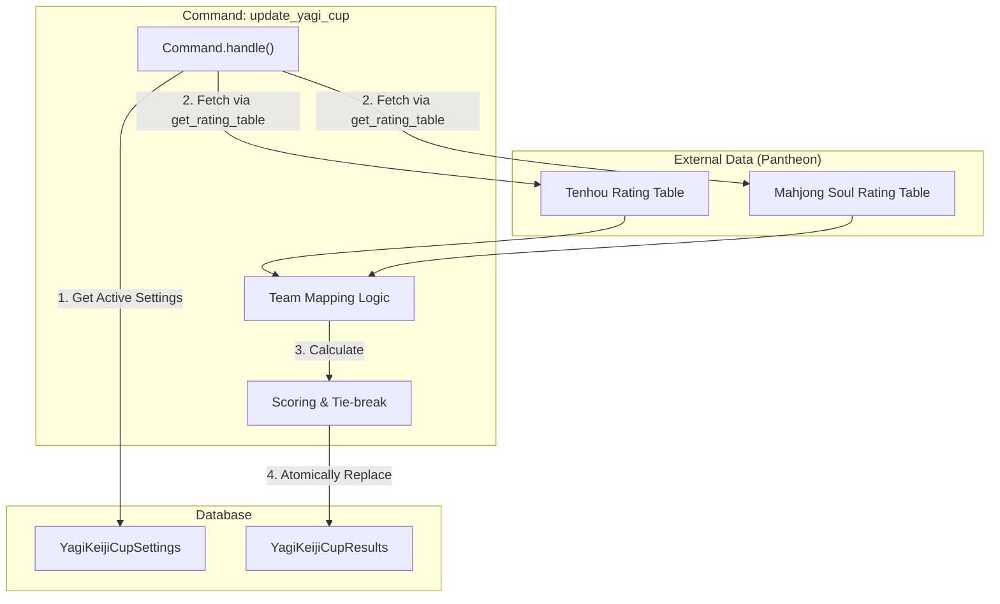
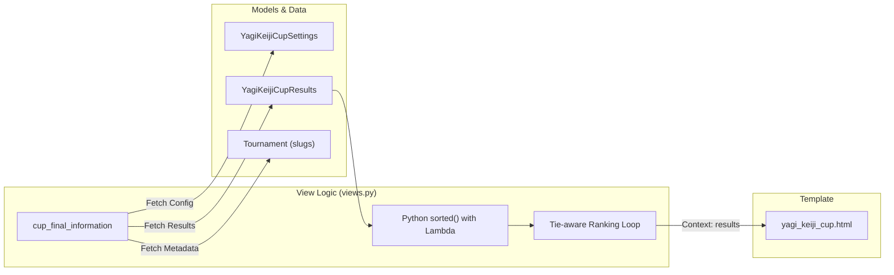

# Yagi Keiji Cup & Special Competitions

Relevant source files

The following files were used as context for generating this wiki page:

- [server/templates/tournament/_tournament_registration_status.html](server/templates/tournament/_tournament_registration_status.html)
- [server/templates/yagi_keiji_cup/yagi_keiji_cup.html](server/templates/yagi_keiji_cup/yagi_keiji_cup.html)
- [server/yagi_keiji_cup/__init__.py](server/yagi_keiji_cup/__init__.py)
- [server/yagi_keiji_cup/admin.py](server/yagi_keiji_cup/admin.py)
- [server/yagi_keiji_cup/management/__init__.py](server/yagi_keiji_cup/management/__init__.py)
- [server/yagi_keiji_cup/management/commands/__init__.py](server/yagi_keiji_cup/management/commands/__init__.py)
- [server/yagi_keiji_cup/management/commands/update_yagi_cup.py](server/yagi_keiji_cup/management/commands/update_yagi_cup.py)
- [server/yagi_keiji_cup/migrations/0003_yagikeijicupresults.py](server/yagi_keiji_cup/migrations/0003_yagikeijicupresults.py)
- [server/yagi_keiji_cup/migrations/0008_alter_yagikeijicupresults_majsoul_player_and_more.py](server/yagi_keiji_cup/migrations/0008_alter_yagikeijicupresults_majsoul_player_and_more.py)
- [server/yagi_keiji_cup/migrations/0009_yagikeijicupresults_majsoul_player_avg_place_and_more.py](server/yagi_keiji_cup/migrations/0009_yagikeijicupresults_majsoul_player_avg_place_and_more.py)
- [server/yagi_keiji_cup/migrations/__init__.py](server/yagi_keiji_cup/migrations/__init__.py)
- [server/yagi_keiji_cup/models.py](server/yagi_keiji_cup/models.py)
- [server/yagi_keiji_cup/urls.py](server/yagi_keiji_cup/urls.py)
- [server/yagi_keiji_cup/views.py](server/yagi_keiji_cup/views.py)

The Yagi Keiji Cup is a specialized team-based competition that bridges results across two different mahjong platforms: **Tenhou** and **Mahjong Soul**. The system aggregates individual player performances from separate online tournaments on these platforms and calculates a unified team score based on their relative rankings.

## Data Models

The system uses two primary models defined in `server/yagi_keiji_cup/models.py` to manage the event configuration and cached results.

### YagiKeijiCupSettings
This model stores the configuration for the event, linking the main competition to specific tournament instances for each platform.
*   `tenhou_tournament`: Link to the `Tournament` object representing the Tenhou leg [server/yagi_keiji_cup/models.py:18-18]().
*   `majsoul_tournament`: Link to the `Tournament` object representing the Mahjong Soul leg [server/yagi_keiji_cup/models.py:19-19]().
*   `is_main`: Boolean flag to identify the active configuration used by the management command and views [server/yagi_keiji_cup/models.py:20-20]().

### YagiKeijiCupResults
This model acts as a cache for the calculated team results. It stores the performance metrics for both players in a team.
*   `team_name`: The identifier for the two-person team [server/yagi_keiji_cup/models.py:27-27]().
*   `tenhou_player` / `majsoul_player`: Foreign keys to `TournamentPlayers` [server/yagi_keiji_cup/models.py:31-47]().
*   `tenhou_player_place` / `majsoul_player_place`: The final rank of the player within their respective platform's tournament [server/yagi_keiji_cup/models.py:28-38]().
*   `team_scores`: The aggregated score calculated by the scoring formula [server/yagi_keiji_cup/models.py:48-48]().

**Sources:** [server/yagi_keiji_cup/models.py:10-52]()

## Result Update Pipeline

The `update_yagi_cup` management command is responsible for fetching data from the Pantheon API and recalculating the standings.

### Data Flow Diagram: Result Aggregation
This diagram illustrates how the command fetches data from external tournament results and maps them to teams.

**Sources:** [server/yagi_keiji_cup/management/commands/update_yagi_cup.py:16-85]()

### Scoring Formula
The scoring logic is implemented in `calculate_team_scores`. It converts tournament ranks into a unified score:

$$Score = (TotalPlayers - TenhouRank + 1) + (TotalPlayers - MahjongSoulRank + 1)$$

If a player is missing from a platform's results, they are assigned a default rank of 20, a game count of 0, and an average place of 4.0 [server/yagi_keiji_cup/management/commands/update_yagi_cup.py:139-141]().

### Tie-break Logic
When teams have identical total scores, the system applies the following tie-break priority in `cup_final_information`:
1.  **Total Games**: Sum of games played by both players (higher is better) [server/yagi_keiji_cup/views.py:26-26]().
2.  **Best Average Place**: The minimum of the two players' average places (lower is better) [server/yagi_keiji_cup/views.py:27-27]().

**Sources:** [server/yagi_keiji_cup/management/commands/update_yagi_cup.py:143-156](), [server/yagi_keiji_cup/views.py:22-29]()

## Results View Implementation

The view `cup_final_information` processes the cached `YagiKeijiCupResults` to render the final leaderboard.

### Logic to Entity Mapping
The following diagram maps the logical steps of the results view to the specific code entities involved.

### Display Features
The template `yagi_keiji_cup.html` displays:
*   **Platform Links**: Direct links to the full results on Tenhou and Mahjong Soul platforms [server/templates/yagi_keiji_cup/yagi_keiji_cup.html:18-23]().
*   **Team Performance**: Shows the individual rank and game count for both the Tenhou and Mahjong Soul players [server/templates/yagi_keiji_cup/yagi_keiji_cup.html:44-47]().
*   **Visual Medals**: Uses the `place_medal` filter to display gold/silver/bronze icons for top teams [server/templates/yagi_keiji_cup/yagi_keiji_cup.html:42-42]().

**Sources:** [server/yagi_keiji_cup/views.py:9-60](), [server/templates/yagi_keiji_cup/yagi_keiji_cup.html:27-52]()

## Administrative Interface

The admin configuration in `server/yagi_keiji_cup/admin.py` allows tournament organizers to:
1.  Set the platform-specific tournament IDs via `YagiKeijiCupSettingsAdmin` using `raw_id_fields` for performance [server/yagi_keiji_cup/admin.py:8-10]().
2.  Manually inspect or adjust team scores and player assignments via `YagiKeijiCupResultsAdmin` [server/yagi_keiji_cup/admin.py:13-22]().

**Sources:** [server/yagi_keiji_cup/admin.py:1-27]()