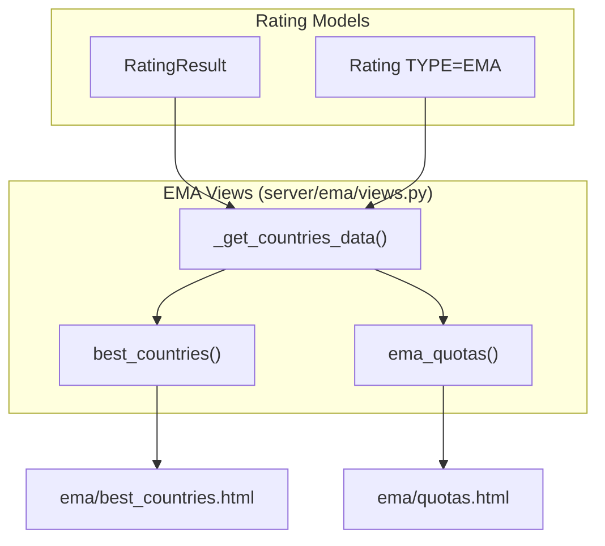
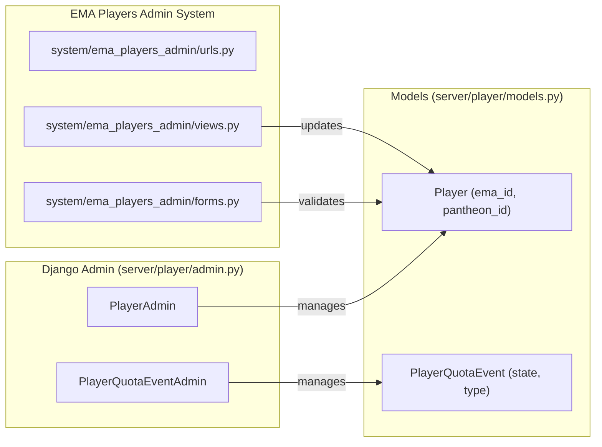

# EMA, WRC & International Qualification

Relevant source files

The following files were used as context for generating this wiki page:

- [server/account/migrations/0004_user_is_ema_players_manager.py](server/account/migrations/0004_user_is_ema_players_manager.py)
- [server/ema/__init__.py](server/ema/__init__.py)
- [server/ema/urls.py](server/ema/urls.py)
- [server/ema/views.py](server/ema/views.py)
- [server/mahjong_portal/templatetags/player_helper.py](server/mahjong_portal/templatetags/player_helper.py)
- [server/player/admin.py](server/player/admin.py)
- [server/player/migrations/0009_playerwrc.py](server/player/migrations/0009_playerwrc.py)
- [server/player/migrations/0010_playerquotaevent.py](server/player/migrations/0010_playerquotaevent.py)
- [server/player/migrations/0011_auto_20200222_1112.py](server/player/migrations/0011_auto_20200222_1112.py)
- [server/player/migrations/0016_alter_playerquotaevent_type.py](server/player/migrations/0016_alter_playerquotaevent_type.py)
- [server/player/models.py](server/player/models.py)
- [server/rating/management/commands/rating_future.py](server/rating/management/commands/rating_future.py)
- [server/rating/utils.py](server/rating/utils.py)
- [server/settings/admin.py](server/settings/admin.py)
- [server/settings/models.py](server/settings/models.py)
- [server/system/ema_players_admin/__init__.py](server/system/ema_players_admin/__init__.py)
- [server/system/ema_players_admin/apps.py](server/system/ema_players_admin/apps.py)
- [server/system/ema_players_admin/forms.py](server/system/ema_players_admin/forms.py)
- [server/system/ema_players_admin/migrations/__init__.py](server/system/ema_players_admin/migrations/__init__.py)
- [server/system/ema_players_admin/urls.py](server/system/ema_players_admin/urls.py)
- [server/system/ema_players_admin/views.py](server/system/ema_players_admin/views.py)
- [server/system/urls.py](server/system/urls.py)
- [server/templates/ema/best_countries.html](server/templates/ema/best_countries.html)
- [server/templates/ema/quotas.html](server/templates/ema/quotas.html)
- [server/templates/ema_players_admin/players_list.html](server/templates/ema_players_admin/players_list.html)
- [server/templates/tournament/_tournament_type.html](server/templates/tournament/_tournament_type.html)
- [server/templates/website/_qualification_2025_table.html](server/templates/website/_qualification_2025_table.html)
- [server/templates/website/_qualification_table.html](server/templates/website/_qualification_table.html)
- [server/templates/website/erc_2019.html](server/templates/website/erc_2019.html)
- [server/templates/website/iormc.html](server/templates/website/iormc.html)
- [server/templates/website/wrc_2020.html](server/templates/website/wrc_2020.html)
- [server/templates/website/wrc_2025.html](server/templates/website/wrc_2025.html)
- [server/tournament/translation.py](server/tournament/translation.py)

This page documents the subsystems responsible for managing European Mahjong Association (EMA) data, calculating country quotas for major championships (WRC/ERMC), and tracking player qualifications through specialized admin interfaces and public views.

## EMA Rating and Country Statistics

The EMA subsystem provides views to visualize the standing of different countries based on their top players' EMA ratings.

### Best Countries View
The `best_countries` view calculates a country's aggregate rating by taking the average score of its top 3 players [server/ema/views.py:11-18](). This data is retrieved from `RatingResult` objects where the rating type is `Rating.EMA` [server/ema/views.py:12-14]().

### EMA Quota Calculation
The `ema_quotas` function implements the official EMA quota distribution logic for major tournaments [server/ema/views.py:21-123](). It simulates the allocation of 70 seats (or other configurable totals) based on several criteria:
1.  **Base Seats**: 1 seat per country in descending order of ranking [server/ema/views.py:48-59]().
2.  **Performance Bonus**: 1 seat for countries with at least one player scoring >700 points [server/ema/views.py:63-69]().
3.  **Top 3 Bonus**: 1 additional seat for the top 3 ranked countries [server/ema/views.py:73-77]().
4.  **Part B Distribution**: Leftover seats are distributed using a coefficient based on total players and players over the 700-point threshold [server/ema/views.py:79-102]().

### Data Processing Flow
The internal helper `_get_countries_data` aggregates player-level EMA scores into country-level statistics [server/ema/views.py:126-149]().

**Sources:** [server/ema/views.py:11-149](), [server/rating/models.py:7-11]()

---

## International Qualification Tracking

Qualification for championships like the European Riichi Championship (ERMC) and World Riichi Championship (WRC) is managed via the `PlayerQuotaEvent` model.

### PlayerQuotaEvent Model
This model tracks a player's status for a specific international event [server/player/models.py:103-142]().
-   **Types**: Supports `ERMC_2019`, `WRC_2020`, and `WRC_2025` [server/player/models.py:131]().
-   **States**: Tracks player readiness using a color-coded system (e.g., `GREEN` for "definitely going", `GRAY` for "not going", `PINK` for "waiting for quota") [server/player/models.py:115-126]().
-   **Metrics**: Stores the player's `place` and `score` at the time the qualification snapshot was taken [server/player/models.py:134-135]().

### Qualification Templates
Public qualification pages (e.g., `erc_2019.html`, `wrc_2020.html`) use the `_qualification_table.html` template to display the list of eligible players and their current status [server/templates/website/erc_2019.html:73](), [server/templates/website/wrc_2020.html:78]().

The `player_helper` template tag `ermc_color` maps the state constants to hex codes for UI rendering [server/mahjong_portal/templatetags/player_helper.py:10-24]().

**Sources:** [server/player/models.py:103-165](), [server/templates/website/wrc_2020.html:48-72](), [server/mahjong_portal/templatetags/player_helper.py:10-24]()

---

## EMA Players Administration

The system includes a specialized management interface for EMA-registered players, separate from the standard Django admin.

### Administrative Entities
-   **Permissions**: Users can be designated as EMA managers via the `is_ema_players_manager` flag [server/account/migrations/0004_user_is_ema_players_manager.py]().
-   **EMA ID Management**: The `Player` model stores the `ema_id` [server/player/models.py:31](). The `ema_queryset` method filters for Russian players with valid EMA IDs [server/player/models.py:81-84]().

### System Architecture: Admin Space to Code Space

**Sources:** [server/player/admin.py:21-58](), [server/player/models.py:11-33](), [server/player/models.py:103-140]()

---

## Future Rating Projections
For qualification purposes, the system can simulate future rating snapshots using the `rating_future` management command [server/rating/management/commands/rating_future.py:19]().

### Implementation Details
-   **Simulation**: It creates temporary `TournamentResult` entries for a specific tournament and player to see how different placements would affect the overall RR rating [server/rating/management/commands/rating_future.py:40-50]().
-   **Calculation**: It invokes `RatingRRCalculation` to rebuild the rating for a specific historical or future date [server/rating/management/commands/rating_future.py:52-64]().
-   **Export**: Results are exported to `export.csv` for analysis by tournament organizers [server/rating/management/commands/rating_future.py:76-79]().

**Sources:** [server/rating/management/commands/rating_future.py:20-91]()

## Qualification Event Types and Statuses

| Event Type | Model Constant | Template Reference |
| :--- | :--- | :--- |
| ERMC 2019 | `ERMC_2019` | `website/erc_2019.html` |
| WRC 2020 | `WRC_2020` | `website/wrc_2020.html` |
| WRC 2025 | `WRC_2025` | `website/wrc_2025.html` |

### Color Mapping (PlayerQuotaEvent)
| State | Color Code | Description (RU) |
| :--- | :--- | :--- |
| `GREEN` | `#93C47D` | точно едет |
| `YELLOW` | `#FFE599` | скорее всего едет |
| `ORANGE` | `#F6B26B` | пока сомневается |
| `PINK` | `#D5A6BD` | готов ехать (в квоте) |
| `GRAY` | `#999999` | точно не едет |
| `DARK_GREEN`| `#45818E` | чемпион |

**Sources:** [server/player/models.py:115-164](), [server/player/models.py:128-131]()