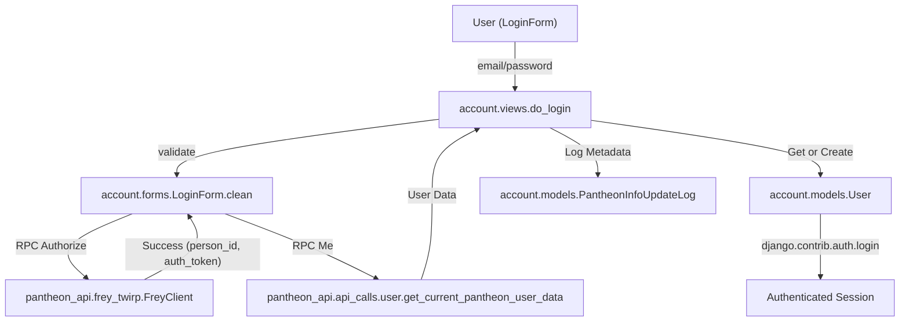
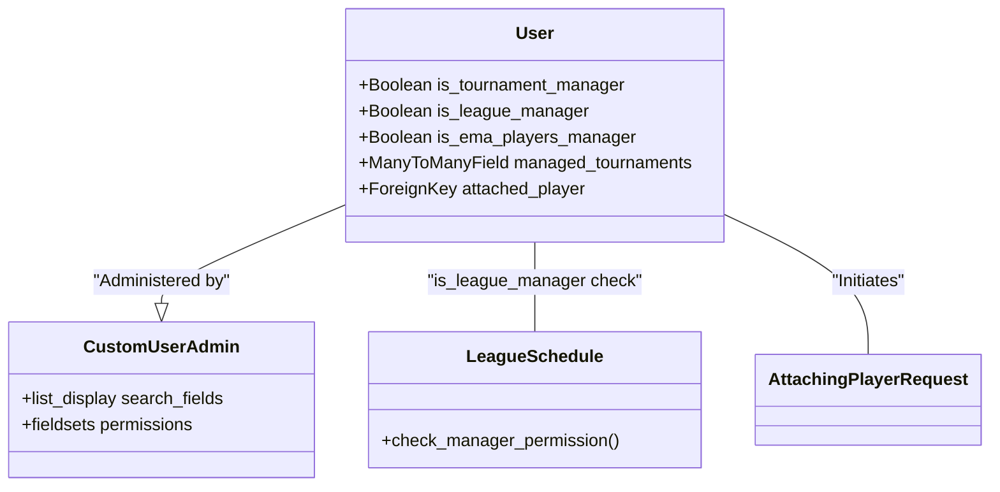

# User Accounts & Authentication

Relevant source files

The following files were used as context for generating this wiki page:

- [server/account/admin.py](server/account/admin.py)
- [server/account/forms.py](server/account/forms.py)
- [server/account/migrations/0005_django_abstract_user_last_name.py](server/account/migrations/0005_django_abstract_user_last_name.py)
- [server/account/migrations/0011_user_is_league_manager.py](server/account/migrations/0011_user_is_league_manager.py)
- [server/account/models.py](server/account/models.py)
- [server/account/urls.py](server/account/urls.py)
- [server/account/views.py](server/account/views.py)
- [server/league/management/commands/export_players_to_pantheon.py](server/league/management/commands/export_players_to_pantheon.py)
- [server/online/parser.py](server/online/parser.py)
- [server/pantheon_api/api_calls/user.py](server/pantheon_api/api_calls/user.py)
- [server/player/management/commands/__init__.py](server/player/management/commands/__init__.py)
- [server/player/management/commands/update_players_from_pantheon.py](server/player/management/commands/update_players_from_pantheon.py)
- [server/player/player_helper.py](server/player/player_helper.py)
- [server/player/tenhou/tenhou_helper.py](server/player/tenhou/tenhou_helper.py)
- [server/system/decorators.py](server/system/decorators.py)
- [server/templates/account/login.html](server/templates/account/login.html)
- [server/templates/account/settings.html](server/templates/account/settings.html)
- [server/templates/league/_schedule_games_table.html](server/templates/league/_schedule_games_table.html)

This section documents the user management and authentication system of the Mahjong Portal. The system relies on an external OAuth-like integration with the **Pantheon** platform while maintaining local user profiles, permissions, and links to the internal `Player` data model.

## Authentication Workflow

Authentication is handled via the `account.views.do_login` function. Instead of managing local passwords, the portal acts as a client to the Pantheon authentication service using Twirp RPC.

1.  **Form Submission**: The user provides an email and password in the `LoginForm` [server/account/forms.py:11-24]().
2.  **Pantheon Validation**: The `LoginForm.clean` method calls `login_through_pantheon` [server/pantheon_api/api_calls/user.py:10-17](), which uses `FreyClient` to communicate with the Pantheon API [server/account/forms.py:39-40]().
3.  **User Provisioning**:
    *   If a `User` with the returned `new_pantheon_id` exists, they are logged in [server/account/views.py:27-28]().
    *   If no user exists, a new `User` object is created using the email and Pantheon ID [server/account/views.py:29-35]().
4.  **Logging**: Every login event stores the raw user data from Pantheon in a `PantheonInfoUpdateLog` [server/account/views.py:37]().

### Authentication Data Flow
"Pantheon Auth Flow"

Sources: [server/account/views.py:20-43](), [server/account/forms.py:32-45](), [server/pantheon_api/api_calls/user.py:10-37]()

## User & Player Association

A distinction exists between a `User` (an account that can log in) and a `Player` (a record in the rating system).

### AttachingPlayerRequest Workflow
When a user wants to claim a `Player` profile as their own, they initiate an `AttachingPlayerRequest`.
1.  **Request**: The user submits a contact method via `request_player_and_user_connection` [server/account/views.py:129-137]().
2.  **Persistence**: A record is created in `AttachingPlayerRequest` with `is_processed=False` [server/account/models.py:21-25]().
3.  **Moderation**: Administrators review these requests in the Django Admin [server/account/admin.py:41-43](). Once verified, the `User.attached_player` field is updated to point to the correct `Player` [server/account/models.py:18]().

### Automated Pantheon Sync
The portal periodically synchronizes player information from the `PantheonInfoUpdateLog` using the `update_players_from_pantheon` management command [server/player/management/commands/update_players_from_pantheon.py:15-37]().
*   It processes unapplied logs via `PlayerHelper.update_player_from_pantheon_feed` [server/player/player_helper.py:104-162]().
*   It can automatically link `User` to `Player` if names or emails match [server/player/player_helper.py:152-162]().
*   It updates geographic data (City/Country) and Tenhou IDs based on Pantheon's state [server/player/player_helper.py:146-150]().

Sources: [server/account/models.py:11-38](), [server/account/views.py:129-137](), [server/player/player_helper.py:104-162](), [server/player/management/commands/update_players_from_pantheon.py:15-37]()

## Account Settings & Tenhou Integration

Authenticated users can manage specific settings, most notably their **Tenhou.net** rating.

### Manual Tenhou Rating Update
Users can submit a Tenhou log URL to update their internal portal rating manually [server/account/views.py:66-83]().
1.  **Validation**: `get_replay_hash` extracts the log ID from the URL [server/account/views.py:108-124]().
2.  **Parsing**: `TenhouParser.get_ratings` downloads and parses the log to find the user's nickname and final place [server/online/parser.py:12-61]().
3.  **Calculation**: `PlayerHelper.calculate_rating` uses the log data and the user's current game count to compute a new rating [server/player/player_helper.py:50-74]().
4.  **Update**: The new rating is saved to `TenhouAggregatedStatistics` [server/account/views.py:81-82]().

Sources: [server/account/views.py:47-105](), [server/player/player_helper.py:50-74](), [server/online/parser.py:12-61]()

## Permissions & Roles

The `User` model extends `AbstractUser` with specialized boolean flags and relations for administrative tasks [server/account/models.py:11-16]().

| Role | Field | Capabilities |
| :--- | :--- | :--- |
| **Tournament Manager** | `is_tournament_manager` | Manage specific tournaments assigned in `managed_tournaments`. |
| **League Manager** | `is_league_manager` | View assigned players in league schedules [server/templates/league/_schedule_games_table.html:19-23](). |
| **EMA Manager** | `is_ema_players_manager` | Manage European Mahjong Association player records. |
| **Superuser** | `is_superuser` | Full access to Django Admin and all system overrides. |

### Permissions Entity Mapping
"Permissions to Code Entities"

Sources: [server/account/models.py:11-19](), [server/account/admin.py:11-40](), [server/templates/league/_schedule_games_table.html:19-23]()

## Administrative Interface

The `account` app provides a robust admin interface defined in `server/account/admin.py`.

*   **CustomUserAdmin**: Includes search by `new_pantheon_id` and filters for the various manager roles [server/account/admin.py:11-40]().
*   **PantheonInfoUpdateLogAdmin**: Allows administrators to track which Pantheon updates have been applied to the local database [server/account/admin.py:52-62]().
*   **AttachingPlayerRequestAdmin**: Centralized queue for verifying player-to-user link requests [server/account/admin.py:41-43]().

Sources: [server/account/admin.py:1-67]()