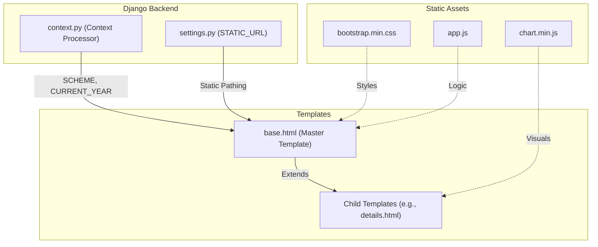
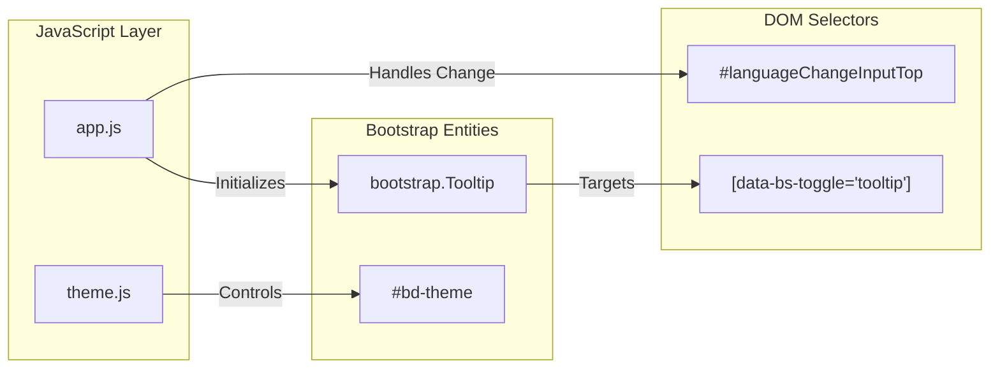

# Frontend & Templates

Relevant source files

The following files were used as context for generating this wiki page:

- [.envs/.production.env.example](.envs/.production.env.example)
- [server/mahjong_portal/settings.py](server/mahjong_portal/settings.py)
- [server/player/migrations/0013_playertitle_url.py](server/player/migrations/0013_playertitle_url.py)
- [server/settings/migrations/0002_auto_20180117_0643.py](server/settings/migrations/0002_auto_20180117_0643.py)
- [server/static/css/bootstrap.min.css](server/static/css/bootstrap.min.css)
- [server/static/css/bootstrap.min.css.map](server/static/css/bootstrap.min.css.map)
- [server/static/css/style.css](server/static/css/style.css)
- [server/static/js/app.js](server/static/js/app.js)
- [server/static/js/bootstrap.bundle.min.js](server/static/js/bootstrap.bundle.min.js)
- [server/static/js/bootstrap.bundle.min.js.map](server/static/js/bootstrap.bundle.min.js.map)
- [server/static/js/chart.min.js](server/static/js/chart.min.js)
- [server/static/js/chartjs-adapter-date-fns.bundle.min.js](server/static/js/chartjs-adapter-date-fns.bundle.min.js)
- [server/static/js/jquery.min.js](server/static/js/jquery.min.js)
- [server/static/js/theme.js](server/static/js/theme.js)
- [server/templates/base.html](server/templates/base.html)
- [server/templates/player/_player_header.html](server/templates/player/_player_header.html)
- [server/templates/player/_verified_player.html](server/templates/player/_verified_player.html)
- [server/utils/pantheon.py](server/utils/pantheon.py)
- [server/website/context.py](server/website/context.py)

The Mahjong Portal frontend is built using **Django Templates** and **Bootstrap 5**, providing a responsive interface for players to track ratings, tournament results, and online mahjong statistics. The architecture emphasizes a modular template system with a centralized base layout, support for internationalization (i18n), and dynamic theme switching.

## Core UI Architecture

The frontend follows a standard Django structure where a master `base.html` template defines the global layout, including the navigation bar, footer, and asset inclusion.

### Base Template & Layout
The `base.html` file serves as the skeleton for all pages. It includes:
*   **Bootstrap 5 Integration**: Uses `bootstrap.min.css` [server/templates/base.html:21]() and `bootstrap.bundle.min.js` [server/templates/base.html:115]() for layout and components.
*   **Navigation**: A responsive navbar [server/templates/base.html:33-113]() providing access to Ratings, Tournaments, Clubs, and Online platform data (Tenhou/Mahjong Soul).
*   **Global Context**: Custom context processors inject variables like `SCHEME`, `SHORT_DATE_FORMAT`, and `CURRENT_YEAR` into all templates [server/website/context.py:8-15]().

### Theme Switching (Dark/Light)
The portal supports light, dark, and auto (system-preferred) themes using Bootstrap 5's color modes.
*   **Persistence**: The selected theme is stored in `localStorage` [server/templates/base.html:29]().
*   **Implementation**: A script in the `<head>` applies the `data-bs-theme` attribute to the document element immediately to prevent flashing [server/templates/base.html:28-31]().
*   **Controls**: A dropdown in the navbar allows users to toggle between modes [server/templates/base.html:41-62]().

### Internationalization (i18n)
The portal is fully bilingual (English and Russian).
*   **Language Switcher**: Integrated into the footer, allowing users to switch between `en` and `ru` [server/templates/base.html:119-125]().
*   **Date Formatting**: Logic in `context.py` adjusts date formats based on the active language (e.g., `d.m.Y` for Russian vs `Y-m-d` for English) [server/website/context.py:13]().

### System Component Overview

The following diagram illustrates the relationship between the base template, static assets, and the context delivery.

**Template & Asset Flow**

Sources: [server/templates/base.html:1-115](), [server/website/context.py:8-15](), [server/mahjong_portal/settings.py:188-191]()

---

## Static Assets & Libraries

The portal relies on several key libraries to handle interactivity and data visualization.

| Library | Version | Purpose |
| :--- | :--- | :--- |
| **Bootstrap** | 5.3.0 | Core CSS framework and UI components [server/static/css/bootstrap.min.css:1](). |
| **jQuery** | 3.7.1 | DOM manipulation and event handling for legacy components [server/static/js/jquery.min.js:1](). |
| **Chart.js** | 3.9.1 | Rendering player rank history and PT charts [server/static/js/chart.min.js:2](). |
| **Custom CSS** | N/A | Project-specific overrides, such as `.bg-championship` and `.verified-player-badge` [server/static/css/style.css:82-91](). |

**Code Entity Association**

Sources: [server/static/js/app.js:1-14](), [server/templates/base.html:42](), [server/static/js/bootstrap.bundle.min.js:1]()

---

## Modular Template System

The frontend is divided into specialized sections to handle the complexity of player profiles and tournament data.

### Player Profile Templates (#9.1)
The player UI is highly modular, using partials like `_player_header.html` to display player names, titles, and geographic info across different views. It leverages custom template tags for complex logic, such as Russian word morphology for city names.

For details, see [Player Profile Templates](#9.1).

### Tournament & Rating Templates (#9.2)
This subsystem handles the display of tournament lists, result tables, and rating calculations. It includes specialized logic for highlighting upcoming tournaments, registration statuses, and detailed rating deltas.

For details, see [Tournament & Rating Templates](#9.2).

---

## Technical Implementation Details

### Custom Styles
Specific mahjong-related UI elements are defined in `style.css`:
*   **Verified Badges**: Styles for `.verified-player-badge` used to indicate authenticated players [server/static/css/style.css:87-91]().
*   **Rating UI**: Styles for `.ratingCalculationCollapse` which uses dashed borders to indicate expandable calculation details [server/static/css/style.css:70-76]().
*   **Print Support**: Media queries ensure that rating details remain legible when printed, removing background colors and cursor indicators [server/static/css/style.css:9-19]().

### JavaScript Initialization
General UI initialization occurs in `app.js`, which handles:
*   **Tooltips**: Global initialization of Bootstrap tooltips [server/static/js/app.js:2-5]().
*   **Language Switching**: Triggers form submission when the language dropdown is changed [server/static/js/app.js:7-13]().

Sources: [server/static/css/style.css:1-108](), [server/static/js/app.js:1-14]()