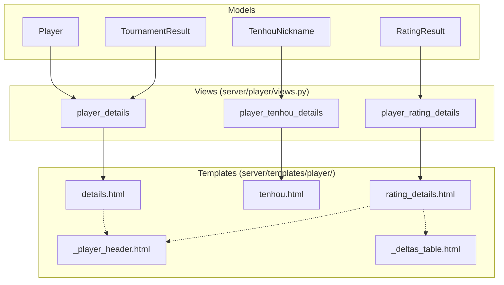
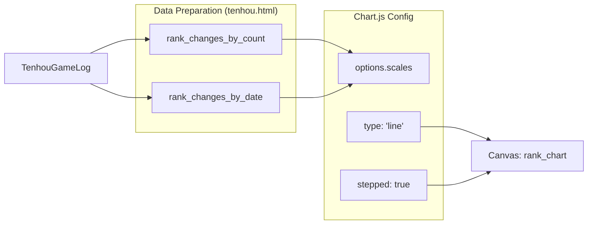

# Player Profile Templates

Relevant source files

The following files were used as context for generating this wiki page:

- [server/mahjong_portal/templatetags/tenhou_helper.py](server/mahjong_portal/templatetags/tenhou_helper.py)
- [server/player/tenhou/models.py](server/player/tenhou/models.py)
- [server/player/urls.py](server/player/urls.py)
- [server/player/views.py](server/player/views.py)
- [server/templates/player/_changes_table.html](server/templates/player/_changes_table.html)
- [server/templates/player/_deltas_table.html](server/templates/player/_deltas_table.html)
- [server/templates/player/details.html](server/templates/player/details.html)
- [server/templates/player/ms.html](server/templates/player/ms.html)
- [server/templates/player/rating_changes.html](server/templates/player/rating_changes.html)
- [server/templates/player/rating_details.html](server/templates/player/rating_details.html)
- [server/templates/player/tenhou.html](server/templates/player/tenhou.html)
- [server/templates/player/tournaments.html](server/templates/player/tournaments.html)
- [server/templates/tournament/_tournament_top_header.html](server/templates/tournament/_tournament_top_header.html)
- [server/templates/tournament/_tournaments_table.html](server/templates/tournament/_tournaments_table.html)

This page documents the frontend architecture and implementation details for player profiles within the Mahjong Portal. The system utilizes Django templates combined with Chart.js for data visualization, providing a comprehensive view of a player's tournament history, rating progression, and platform-specific statistics (Tenhou and Mahjong Soul).

## Overview

The player profile is divided into several specialized views and reusable partials. The primary entry point is the `details.html` template, which aggregates data from various subsystems.

### Data Flow and Rendering

The `player_details` view in `server/player/views.py` serves as the primary controller, gathering data from:
*   **Ratings:** `RatingResult` and `ExternalRatingDelta` [server/player/views.py:33-58]().
*   **Tournaments:** `TournamentResult` [server/player/views.py:60-67]().
*   **External Platforms:** `TenhouNickname` and `MSAccount` [server/player/views.py:68-69]().
*   **Clubs:** `ClubRating` [server/player/views.py:70-72]().

### Template Entity Relationship

The following diagram illustrates how Django views map to specific template files and the models they consume.

**View to Template Mapping**

Sources: [server/player/views.py:28-167](), [server/templates/player/details.html:16-16](), [server/templates/player/rating_details.html:109-109]()

---

## Core Profile Templates

### details.html
The main landing page for a player. It includes:
*   **Ratings Table:** Displays all active ratings (EMA, RR, etc.) and the player's current score/place [server/templates/player/details.html:18-69]().
*   **Tournament History:** Lists the 10 most recent tournaments using a color-coded "Base Rank" badge system (Green for >= 750, Red for < 250) [server/templates/player/details.html:93-102]().
*   **Platform Summaries:** High-level stats for Tenhou (Rank, PT, Rate) and Mahjong Soul [server/templates/player/details.html:129-150]().

### rating_details.html
Provides a deep dive into a specific rating for a player.
*   **Rating Chart:** Uses Chart.js to plot Rating Score and Place over time [server/templates/player/rating_details.html:12-96]().
*   **Calculation Breakdown:** Displays the `rating_calculation` text field (often containing the mathematical formula used for that specific player) in a collapsible Bootstrap card [server/templates/player/rating_details.html:124-133]().
*   **Tournament Deltas:** Includes `_deltas_table.html` to show exactly how each tournament contributed to the current rating [server/templates/player/rating_details.html:161-164]().

### _deltas_table.html
A reusable component that displays tournament results within the context of a rating calculation. It shows the "Power" (age decay) and "Coefficient" applied to the player's performance [server/templates/player/_deltas_table.html:43-48]().

Sources: [server/templates/player/details.html:1-127](), [server/templates/player/rating_details.html:1-166](), [server/templates/player/_deltas_table.html:1-66]()

---

## External Platform Templates

### tenhou.html
A data-heavy template dedicated to Tenhou.net statistics. It features advanced Chart.js integration to visualize a player's career.

*   **Rank Progression Chart:** Supports two modes: "By Game Count" and "By Date" [server/templates/player/tenhou.html:13-18](). It uses a `stepped: true` line chart to represent discrete rank changes [server/templates/player/tenhou.html:102-102]().
*   **PT Progression Chart:** Tracks Point (PT) fluctuations within the current rank [server/templates/player/tenhou.html:179-180]().
*   **Lobby Statistics:** Tables broken down by lobby type (Ippan, Joukyuu, Tokujou, Houou) showing placement percentages [server/player/tenhou/models.py:154-164]().

### ms.html
Documents Mahjong Soul (MS) performance.
*   **Points History:** Visualizes PT changes for the latest rank in both 4-player and 3-player modes [server/templates/player/ms.html:13-89]().
*   **Statistics Tables:** Displays placement distribution for Tonpusen and Hanchan games [server/templates/player/ms.html:116-171]().

**Platform Data Visualization Logic**

Sources: [server/templates/player/tenhou.html:12-162](), [server/templates/player/ms.html:13-114](), [server/player/tenhou/models.py:61-88]()

---

## Custom Template Tags

The portal relies on several custom tags to handle complex mahjong-specific logic and formatting.

| Tag/Filter | Location | Description |
| :--- | :--- | :--- |
| `display_dan` | `tenhou_helper.py` | Converts integer rank IDs to Japanese kanji (e.g., 10 -> 初段) [server/mahjong_portal/templatetags/tenhou_helper.py:15-16](). |
| `display_rate` | `tenhou_helper.py` | Formats Tenhou R-value as an integer [server/mahjong_portal/templatetags/tenhou_helper.py:33-41](). |
| `place_medal` | `player_helper.py` | Returns HTML for gold/silver/bronze medals based on tournament place [server/templates/player/details.html:104-104](). |
| `get_item` | `tenhou_helper.py` | Dictionary lookup helper for templates [server/mahjong_portal/templatetags/tenhou_helper.py:20-21](). |
| `percentage` | `tenhou_helper.py` | Calculates and formats percentages for placement tables [server/mahjong_portal/templatetags/tenhou_helper.py:25-29](). |

Sources: [server/mahjong_portal/templatetags/tenhou_helper.py:1-71](), [server/templates/player/details.html:2-2]()

## Template Localization (i18n)

The templates extensively use the `` and `` tags for multi-language support (primarily Russian and English).
*   **Date Formatting:** Uses `SHORT_DATE_FORMAT` and the `tz` tag for timezone-aware display [server/templates/player/details.html:107-107]().
*   **Grammar:** The `russian_words_morph` library is used to handle complex Russian noun declensions for words like "player" or "tournament" based on counts [server/templates/player/details.html:2-2]().

Sources: [server/templates/player/details.html:1-127](), [server/templates/player/tenhou.html:1-10]()