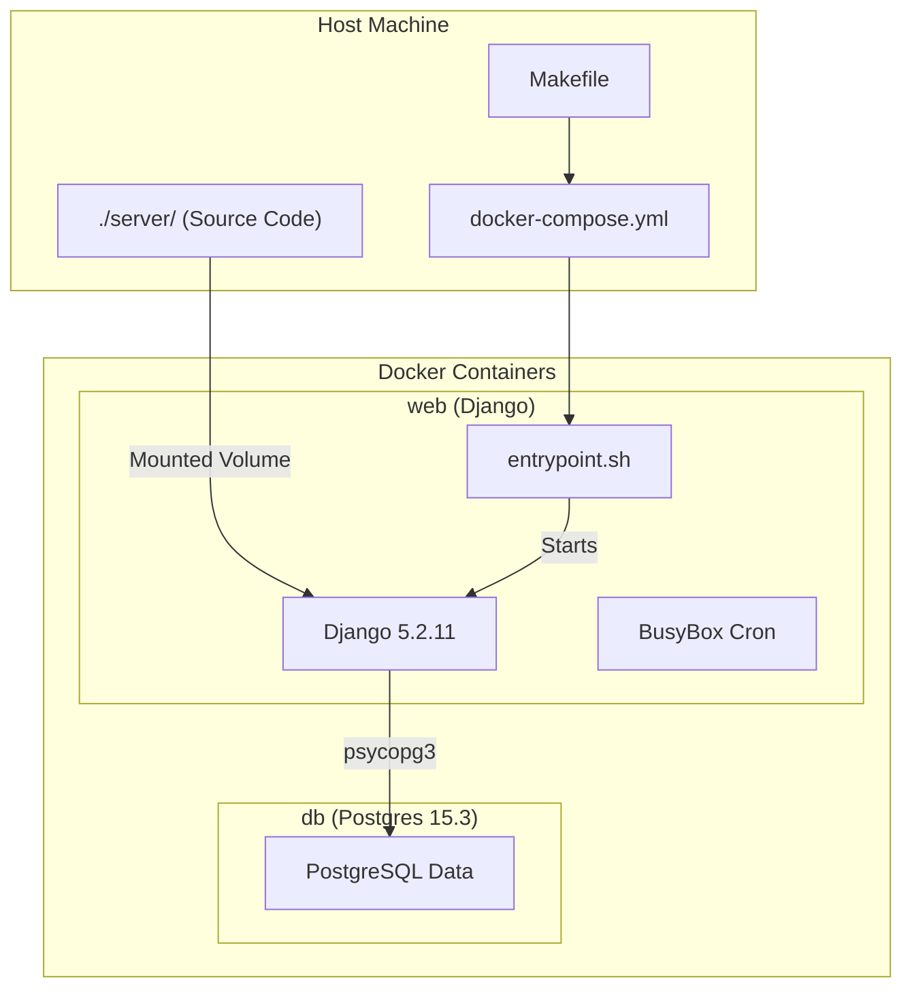
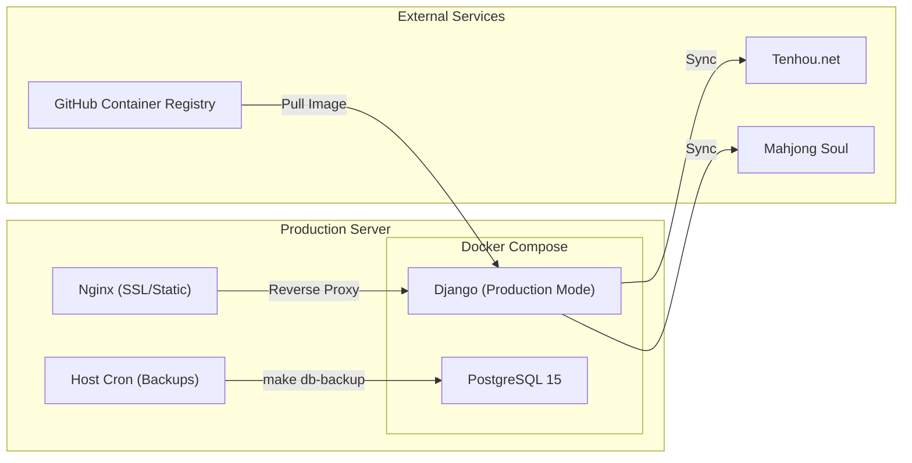

# Getting Started — Local Development & Deployment

Relevant source files

The following files were used as context for generating this wiki page:

- [.dockerignore](.dockerignore)
- [.github/workflows/app.yml](.github/workflows/app.yml)
- [.gitignore](.gitignore)
- [Makefile](Makefile)
- [README.md](README.md)
- [deploy/Makefile](deploy/Makefile)
- [deploy/backup.sh](deploy/backup.sh)
- [deploy/docker-compose.yml](deploy/docker-compose.yml)
- [docker-compose.yml](docker-compose.yml)
- [docker/django/Dockerfile](docker/django/Dockerfile)
- [docker/django/crontab](docker/django/crontab)
- [server/.flake8](server/.flake8)
- [server/club/club_games/migrations/0005_clubsession_pantheon_event_id.py](server/club/club_games/migrations/0005_clubsession_pantheon_event_id.py)
- [server/club/club_games/models.py](server/club/club_games/models.py)
- [server/club/migrations/0008_auto_20210416_0223.py](server/club/migrations/0008_auto_20210416_0223.py)
- [server/club/pantheon_games/models.py](server/club/pantheon_games/models.py)
- [server/league/management/commands/build_league_seating.py](server/league/management/commands/build_league_seating.py)
- [server/pantheon_api/.gitignore](server/pantheon_api/.gitignore)
- [server/pantheon_api/.tool-versions](server/pantheon_api/.tool-versions)
- [server/pantheon_api/README.md](server/pantheon_api/README.md)
- [server/pantheon_api/__init__.py](server/pantheon_api/__init__.py)
- [server/player/search_indexes.py](server/player/search_indexes.py)
- [server/pyproject.toml](server/pyproject.toml)
- [server/requirements/base.txt](server/requirements/base.txt)
- [server/requirements/dev.txt](server/requirements/dev.txt)
- [server/tournament/migrations/0032_alter_onlinetournamentregistration_notes.py](server/tournament/migrations/0032_alter_onlinetournamentregistration_notes.py)

This page provides a technical guide for setting up the Mahjong Portal codebase for local development, running quality assurance tools, and deploying to a production environment. The project uses Docker to standardize environments across development and production.

## 1. Local Environment Setup

The Mahjong Portal requires Python 3.9+ [README.md:1-1]() and relies on Docker and Docker Compose for its infrastructure, which includes a PostgreSQL database and the Django application.

### Prerequisites
- Docker
- Docker Compose
- Make (optional, but recommended for using the provided `Makefile`)

### Step-by-Step Installation
1.  **Build the Docker Image**: 
    Run `make build-docker` [Makefile:13-14](). This executes `docker compose build` [Makefile:14-14](), which uses the `docker/django/Dockerfile` [docker/django/Dockerfile:1-45]() to build the `mahjong-portal` image [docker-compose.yml:11-11]().
2.  **Initialize Data**:
    Run `make initial-data` [Makefile:16-19](). This target performs three critical operations:
    - Flushes the database (`manage.py flush`).
    - Runs migrations (`manage.py migrate`).
    - Populates the database with basic required records (`manage.py initial_data`).
3.  **Start Services**:
    Run `make up` [Makefile:1-2](). This starts the `web` and `db` services [docker-compose.yml:7-31](). The application becomes accessible at `http://0.0.0.0:8060/` [README.md:17-17]().

### Local Development Flow
The `docker-compose.yml` mounts the `./server/` directory to `/app` inside the container [docker-compose.yml:17-17](), allowing for live-reloading during development.

**Development Environment Architecture**

Sources: [Makefile:1-15](), [docker-compose.yml:1-31](), [docker/django/Dockerfile:1-45](), [server/requirements/base.txt:5-7]()

---

## 2. Makefile Targets & Tooling

The project uses a `Makefile` to encapsulate complex Docker commands for common development tasks.

| Target | Description | Code Reference |
| :--- | :--- | :--- |
| `up` | Starts the project in the foreground. | [Makefile:1-2]() |
| `down` | Stops the containers. | [Makefile:4-5]() |
| `shell` | Opens a root shell inside the `web` container. | [Makefile:10-11]() |
| `test` | Runs the Django test suite via `manage.py test`. | [Makefile:21-22]() |
| `lint` | Runs all linters (isort, black, flake8). | [Makefile:50-50]() |
| `format` | Automatically formats code using black and isort. | [Makefile:51-51]() |
| `db-restore` | Restores a database dump from a specified path. | [Makefile:25-39]() |

### Code Quality & Linting
The project enforces strict coding standards. The `lint` target [Makefile:50-50]() runs:
- **Black**: For PEP 8 compliant code formatting [Makefile:53-54]().
- **Isort**: To organize imports alphabetically and by section [Makefile:56-57]().
- **Flake8**: To check for syntax errors and stylistic inconsistencies [Makefile:59-60]().

Sources: [Makefile:1-67](), [server/requirements/dev.txt:8-14]()

---

## 3. Environment Variables

Configuration is managed via environment files located in the `.envs/` directory.

- **Local**: Uses `.envs/.local` [docker-compose.yml:13-13]().
- **Production**: Uses `.envs/.production.env` [README.md:25-25]().

Key variables required for the application to function include `POSTGRES_PASSWORD`, `POSTGRES_USER`, `POSTGRES_HOST`, and `POSTGRES_DB` [Makefile:29-30]().

---

## 4. CI/CD Pipeline

The project uses GitHub Actions for Continuous Integration. The workflow is defined in `.github/workflows/app.yml` [app.yml:1-24]().

**CI Flow**
1.  **Trigger**: Runs on every `push` [app.yml:2-2]().
2.  **Build**: Builds the Docker container using `make build-docker` [app.yml:11-11]().
3.  **Linting**: Executes `make lint-isort`, `make lint-python-code-style`, and `make lint-flake8` [app.yml:14-20]().
4.  **Testing**: Runs unit tests via `make test` [app.yml:23-23]().

Sources: [.github/workflows/app.yml:1-24]()

---

## 5. Production Deployment

### Docker Image Release
Production images are built using `docker buildx` and pushed to the GitHub Container Registry (`ghcr.io`).
- **Command**: `make release-docker-image` [Makefile:41-46]().
- **Build Argument**: Sets `mode=production` [Makefile:43-43](), which prevents the installation of development-only requirements like `ipython` or `black` [docker/django/Dockerfile:12-14]().

### Scheduled Tasks (Cron)
The production environment relies on a crontab within the Django container to handle background tasks such as rating calculations and data synchronization.

| Schedule | Command | Purpose |
| :--- | :--- | :--- |
| `*/3 * * * *` | `download_latest_games` | Syncs Tenhou logs [docker/django/crontab:18-18](). |
| `0 * * * *` | `update_ms_statistics` | Updates Mahjong Soul stats [docker/django/crontab:2-2](). |
| `10 1 * * *` | `rating_calculate rr` | Calculates Riichi Russian rating [docker/django/crontab:8-8](). |
| `20 1 * * *` | `rating_calculate crr` | Calculates Club Riichi rating [docker/django/crontab:9-9](). |

### Database Backups
On the host machine, cron jobs should be configured to run `make db-backup` [README.md:37-41](). The backup script logic is located in `deploy/backup.sh` [deploy/backup.sh]().

**Production Deployment Component Map**

Sources: [README.md:19-43](), [docker/django/crontab:1-25](), [Makefile:41-46](), [docker/django/Dockerfile:11-14]()