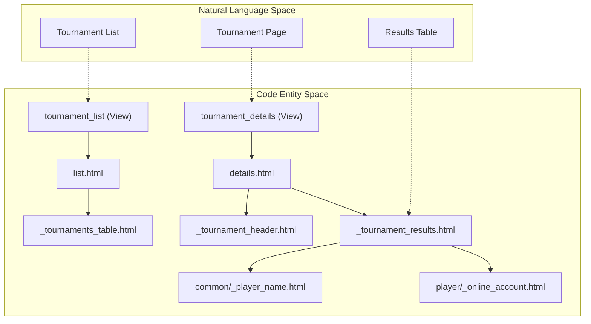
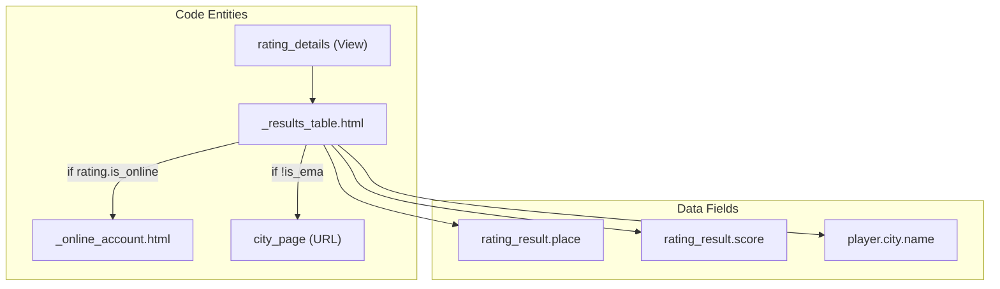

# Tournament & Rating Templates

Relevant source files

The following files were used as context for generating this wiki page:

- [server/mahjong_portal/templatetags/meta_tags_helper.py](server/mahjong_portal/templatetags/meta_tags_helper.py)
- [server/mahjong_portal/templatetags/russian_words_morph.py](server/mahjong_portal/templatetags/russian_words_morph.py)
- [server/templates/club/list.html](server/templates/club/list.html)
- [server/templates/player/_online_account.html](server/templates/player/_online_account.html)
- [server/templates/rating/_results_table.html](server/templates/rating/_results_table.html)
- [server/templates/rating/rating_tournaments.html](server/templates/rating/rating_tournaments.html)
- [server/templates/tournament/_current_tournaments_table.html](server/templates/tournament/_current_tournaments_table.html)
- [server/templates/tournament/_tournament_header.html](server/templates/tournament/_tournament_header.html)
- [server/templates/tournament/_tournament_results.html](server/templates/tournament/_tournament_results.html)
- [server/templates/tournament/details.html](server/templates/tournament/details.html)
- [server/templates/tournament/list.html](server/templates/tournament/list.html)
- [server/templates/website/city.html](server/templates/website/city.html)
- [server/templates/website/home.html](server/templates/website/home.html)
- [server/templates/website/search.html](server/templates/website/search.html)

This page documents the frontend templates responsible for displaying tournament information, rating tables, search results, and geographic-specific pages (cities and clubs). These templates utilize a modular architecture with shared partials to maintain consistency across the portal.

## Tournament Display System

The tournament system uses a hierarchy of templates to display lists of competitions, specific tournament details, and result tables.

### Tournament List and Tables
The main tournament list [server/templates/tournament/list.html:1-53]() organizes tournaments by year and status (Current, Upcoming, and Past). It utilizes two primary partials:
*   `_current_tournaments_table.html`: For ongoing events.
*   `_tournaments_table.html`: For upcoming and historical lists.

The list view supports filtering by year [server/templates/tournament/list.html:27-38]() and distinguishing between general tournaments and EMA-sanctioned events.

### Tournament Details
The `details.html` template [server/templates/tournament/details.html:1-54]() serves as the landing page for a specific event. It integrates:
1.  **Pantheon Integration**: Links to external statistics in the old Pantheon archive or the new rating system based on `old_pantheon_id` or `new_pantheon_id` [server/templates/tournament/details.html:18-30]().
2.  **Geographic Context**: Displays participating countries as badges if multiple countries are represented [server/templates/tournament/details.html:38-44]().
3.  **Results**: Includes the `_tournament_results.html` partial to render the final standings.

### Tournament Results Table
The `_tournament_results.html` [server/templates/tournament/_tournament_results.html:1-80]() partial renders the actual rankings. Key features include:
*   **Substitution Handling**: Logic to display "Substitution" instead of a player name for hidden or replacement players on mobile devices [server/templates/tournament/_tournament_results.html:26-32]().
*   **Platform Links**: If the tournament is marked as `is_online_rating`, it includes `_online_account.html` to show Tenhou/Mahjong Soul ranks [server/templates/tournament/_tournament_results.html:55-61]().
*   **Score Formatting**: Uses `intcomma` and `floatformat` for standardized score display [server/templates/tournament/_tournament_results.html:47]().

### Tournament Data Flow
The following diagram illustrates how tournament data is mapped to template entities.

**Tournament Entity Mapping**

**Sources:** [server/templates/tournament/list.html:1-22](), [server/templates/tournament/details.html:1-47](), [server/templates/tournament/_tournament_results.html:1-61]()

---

## Rating Templates

Rating templates focus on displaying calculated standings across different rating types (RR, EMA, Online, etc.).

### Rating Results Table
The `_results_table.html` [server/templates/rating/_results_table.html:1-67]() is the primary component for displaying leaderboard data. 
*   **Online Integration**: If `rating.is_online` is true, a "Tenhou" column is added, pulling data from the `player/_online_account.html` partial [server/templates/rating/_results_table.html:15-19]().
*   **Location Logic**: Displays the player's city with a link to the `city_page` unless it is an EMA rating, in which case it defaults to the country [server/templates/rating/_results_table.html:50-61]().
*   **Print Optimization**: Includes a `d-none d-print-block` span to ensure city names appear when the page is printed [server/templates/rating/_results_table.html:57-59]().

### Home Page Integration
The home page [server/templates/website/home.html:1-41]() aggregates these components, showing:
1.  Current/Upcoming tournaments via tournament table partials.
2.  The "Top 16 players" for the primary rating using `_results_table.html` [server/templates/website/home.html:31-33]().

**Rating Display Logic**

**Sources:** [server/templates/rating/_results_table.html:10-65](), [server/templates/website/home.html:8-35]()

---

## Geographic & Search Templates

### City and Club Pages
*   **City Page**: Displays clubs located in the city, a list of tournaments held there, and a local player leaderboard [server/templates/website/city.html:1-71]().
*   **Club List**: Features a Yandex Maps integration [server/templates/club/list.html:48-74](). It iterates through `clubs` to place geo-markers using `club.lat` and `club.lng` [server/templates/club/list.html:62-71]().

### Search Results
The `search.html` [server/templates/website/search.html:1-55]() template displays player matches. It specifically highlights the player's Tenhou rank and username using `player.tenhou_object.get_rank_display` [server/templates/website/search.html:29-33]().

---

## Meta Tags and Helpers

The portal uses `meta_tags_helper.py` to generate SEO-friendly descriptions dynamically.

| Helper Tag | Purpose | Implementation Detail |
| :--- | :--- | :--- |
| `tournaments_list_title` | Generates list headers | Uses `tournament_type` to toggle "EMA" prefix [server/mahjong_portal/templatetags/meta_tags_helper.py:13-17]() |
| `tournament_page_description` | Meta description for events | Includes tournament name, date, and inflected city/country [server/mahjong_portal/templatetags/meta_tags_helper.py:29-39]() |
| `player_page_description` | Meta description for players | Inflects city names into genitive case for Russian [server/mahjong_portal/templatetags/meta_tags_helper.py:53-60]() |

### Russian Word Morphing
For the Russian locale, the portal uses `pymorphy3` via the `russian_words_morph.py` filter to handle grammatical cases:
*   **Genitive**: Used for "Players from [City]" (`genitive` filter) [server/mahjong_portal/templatetags/russian_words_morph.py:11-23]().
*   **Prepositional**: Used for "Tournament held in [City]" (`prepositional` filter) [server/mahjong_portal/templatetags/russian_words_morph.py:27-39]().

**Sources:** [server/mahjong_portal/templatetags/meta_tags_helper.py:1-60](), [server/mahjong_portal/templatetags/russian_words_morph.py:1-40]()