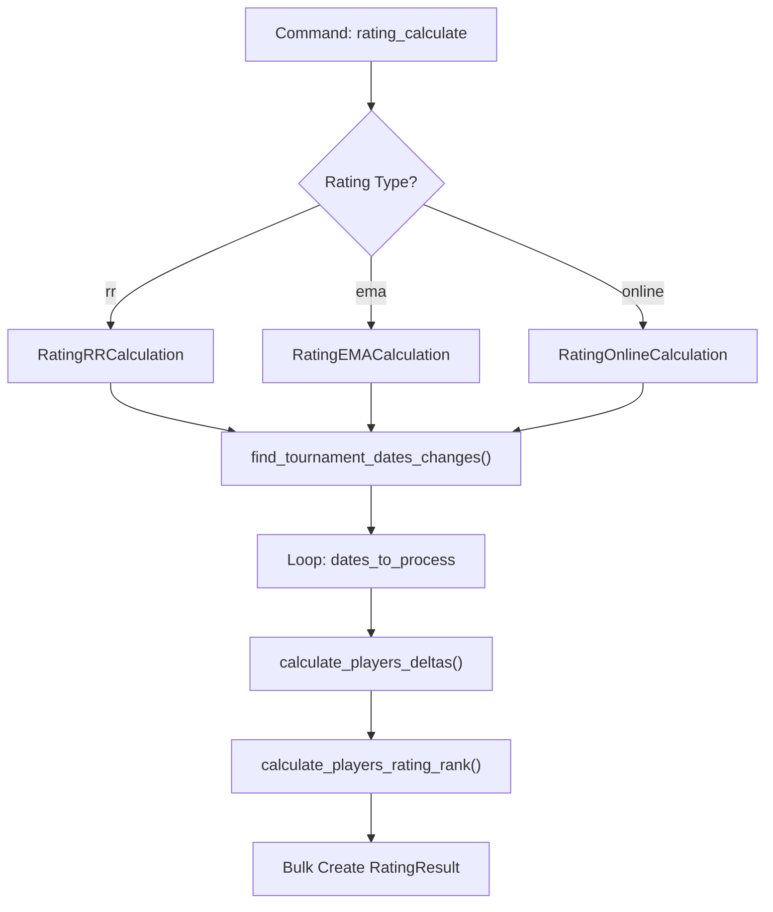
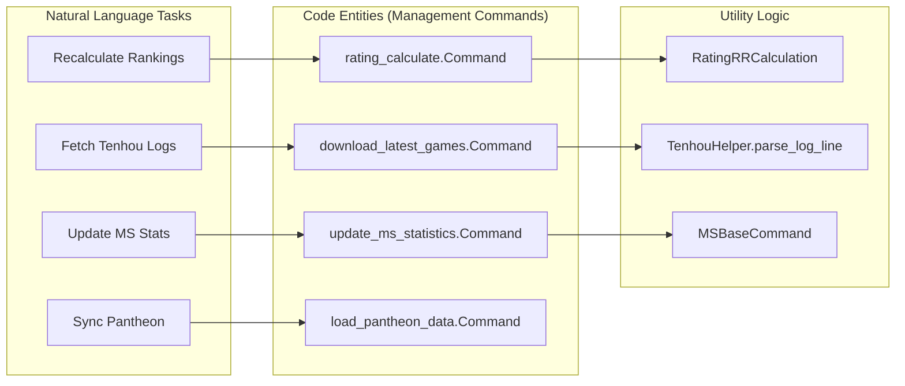

# Background Tasks & Scheduled Jobs

Relevant source files

The following files were used as context for generating this wiki page:

- [docker/django/crontab](docker/django/crontab)
- [server/club/club_games/migrations/0005_clubsession_pantheon_event_id.py](server/club/club_games/migrations/0005_clubsession_pantheon_event_id.py)
- [server/club/club_games/models.py](server/club/club_games/models.py)
- [server/club/migrations/0008_auto_20210416_0223.py](server/club/migrations/0008_auto_20210416_0223.py)
- [server/club/pantheon_games/models.py](server/club/pantheon_games/models.py)
- [server/online/management/commands/print_team_seating.py](server/online/management/commands/print_team_seating.py)
- [server/player/search_indexes.py](server/player/search_indexes.py)
- [server/player/tenhou/management/commands/add_tenhou_account.py](server/player/tenhou/management/commands/add_tenhou_account.py)
- [server/player/tenhou/management/commands/download_latest_games.py](server/player/tenhou/management/commands/download_latest_games.py)
- [server/player/tenhou/management/commands/mark_not_active_tenhou_accounts.py](server/player/tenhou/management/commands/mark_not_active_tenhou_accounts.py)
- [server/player/tenhou/management/commands/recalculate_tenhou_accounts.py](server/player/tenhou/management/commands/recalculate_tenhou_accounts.py)
- [server/player/tenhou/management/commands/year_statistics.py](server/player/tenhou/management/commands/year_statistics.py)
- [server/player/tenhou/migrations/0011_tenhounickname_last_recalculated_date.py](server/player/tenhou/migrations/0011_tenhounickname_last_recalculated_date.py)
- [server/rating/calculation/ema.py](server/rating/calculation/ema.py)
- [server/rating/calculation/online.py](server/rating/calculation/online.py)
- [server/rating/calculation/rr.py](server/rating/calculation/rr.py)
- [server/rating/management/commands/rating_calculate.py](server/rating/management/commands/rating_calculate.py)
- [server/rating/management/commands/reset_tournament_dates.py](server/rating/management/commands/reset_tournament_dates.py)
- [server/rating/management/commands/validate_ema_rating.py](server/rating/management/commands/validate_ema_rating.py)
- [server/rating/migrations/0006_ratingresult_tournament_numbers.py](server/rating/migrations/0006_ratingresult_tournament_numbers.py)
- [server/tournament/management/commands/__init__.py](server/tournament/management/commands/__init__.py)
- [server/tournament/management/commands/copy_registrations.py](server/tournament/management/commands/copy_registrations.py)
- [server/utils/general.py](server/utils/general.py)
- [server/utils/tenhou/helper.py](server/utils/tenhou/helper.py)

This page documents the automated maintenance tasks, data synchronization pipelines, and periodic calculations that keep the Mahjong Portal's data up to date. These tasks are primarily implemented as Django management commands and are orchestrated via a system crontab.

## Overview of Scheduled Jobs

The system relies on a central crontab configuration to manage various cadences of data ingestion and processing.

| Task / Command | Frequency | Purpose |
| :--- | :--- | :--- |
| `download_latest_games` | Every 3 min | Fetches recent Tenhou logs for active players. |
| `update_tenhou_rate` | Every 10 min | Updates player rates/ranks from Tenhou. |
| `update_ms_statistics` | Hourly | Synchronizes Mahjong Soul player statistics. |
| `rating_calculate` | Daily (01:10+) | Recalculates RR, CRR, and Online ratings. |
| `update_tenhou_yakuman` | Daily (14:55) | Updates player yakuman statistics. |
| `mark_not_active_tenhou_accounts` | Periodic | Deactivates inactive Tenhou nicknames. |

**Sources:** `[docker/django/crontab:1-25]()`

---

## Rating Calculation Pipeline

The `rating_calculate` command is the core of the portal's ranking system. It processes tournament results to generate `RatingResult` and `RatingDelta` records for specific rating types.

### Implementation Details
The command uses a strategy pattern where different calculator classes (e.g., `RatingRRCalculation`, `RatingEMACalculation`) handle specific logic for different rating types [server/rating/management/commands/rating_calculate.py:37-42]().

1.  **Date Discovery**: The system identifies dates where tournament results changed using `find_tournament_dates_changes` [server/rating/management/commands/rating_calculate.py:170-179]().
2.  **Atomic Calculation**: Within a transaction, it iterates through `dates_to_recalculate`.
3.  **Delta Generation**: For each date, it filters tournaments ending before that date and calls `calculator.calculate_players_deltas` [server/rating/management/commands/rating_calculate.py:160-167]().
4.  **Ranking**: Finally, it calls `calculator.calculate_players_rating_rank` to assign final places [server/rating/management/commands/rating_calculate.py:168-168]().

### Calculator Classes
*   **`RatingRRCalculation`**: Filters for Russian players and uses a two-part weighted formula (50/50) [server/rating/calculation/rr.py:22-44]().
*   **`RatingEMACalculation`**: Focuses on players with an `ema_id` and implements specific European Mahjong Association logic [server/rating/calculation/ema.py:15-30]().
*   **`RatingOnlineCalculation`**: Dedicated to online tournament results [server/rating/calculation/online.py:9-11]().

### Logic Flow: Rating Calculation

**Sources:** `[server/rating/management/commands/rating_calculate.py:21-169]()`, `[server/rating/calculation/rr.py:19-167]()`

---

## Tenhou Data Synchronization

Tenhou integration is split into high-frequency game fetching and deeper account maintenance.

### 1. `download_latest_games`
This command runs every 3 minutes to keep the portal's "Live" feel.
*   **Archive Ingestion**: It downloads `.gz` log archives from the Tenhou archive URL [server/player/tenhou/management/commands/download_latest_games.py:90-127]().
*   **Log Parsing**: Uses `parse_log_line` to extract player names, places, and rules [server/utils/tenhou/helper.py:19-49]().
*   **Filter & Save**: It only saves games for players already in the `TenhouNickname` watched list [server/player/tenhou/management/commands/download_latest_games.py:47-66]().
*   **Stat Update**: Triggers `recalculate_tenhou_statistics_for_four_players` immediately after import [server/player/tenhou/management/commands/download_latest_games.py:85-86]().

### 2. `recalculate_tenhou_accounts`
A more intensive task that rebuilds a player's entire history.
*   **External Dependency**: Fetches data from Nodocchi [server/player/tenhou/management/commands/recalculate_tenhou_accounts.py:44-47]().
*   **Rate Limiting**: Implements a 10-second sleep between players to avoid DDOSing external services [server/player/tenhou/management/commands/recalculate_tenhou_accounts.py:47-47]().

### 3. `mark_not_active_tenhou_accounts`
Maintains database hygiene by checking for account expiration.
*   **Logic**: If a player hasn't played a ranking game in 140 days, it checks for any custom lobby games [server/player/tenhou/management/commands/mark_not_active_tenhou_accounts.py:26-36]().
*   **Deactivation**: If no games are found for 181 days, `is_active` is set to `False` [server/player/tenhou/management/commands/mark_not_active_tenhou_accounts.py:42-45]().

**Sources:** `[server/player/tenhou/management/commands/download_latest_games.py:24-88]()`, `[server/player/tenhou/management/commands/mark_not_active_tenhou_accounts.py:16-65]()`, `[server/utils/tenhou/helper.py:52-171]()`

---

## Club & Pantheon Integration

These tasks manage the relationship between the portal and the Pantheon backend.

### `load_pantheon_data`
Synchronizes tournament and session data from Pantheon.
*   **Identity Resolution**: Resolves Pantheon player IDs to local `Player` models.
*   **Multi-DB**: Uses `PantheonRouter` to handle data across different database backends if configured.

### `associate_players_with_club`
A maintenance script that links players to clubs based on their participation in club-hosted Pantheon events.

### Shared Golf Sortition
For tournaments using the "Golf" sortition logic, the portal generates and consumes JSON files to manage player pairings. These are often processed via management commands during `TournamentHandler` round transitions.

---

## Entity Mapping: Tasks to Code

This diagram maps natural language system tasks to their corresponding management command classes and utility functions.

**Sources:** `[server/rating/management/commands/rating_calculate.py:21-21]()`, `[server/player/tenhou/management/commands/download_latest_games.py:24-24]()`, `[server/rating/calculation/rr.py:19-19]()`, `[server/utils/tenhou/helper.py:19-19]()`

---

## Validation & Consistency Checks

### `validate_ema_rating`
A specialized command that scrapes the official European Mahjong Association (EMA) website to ensure local calculations match official results.
*   **Scraper**: Uses `BeautifulSoup` to parse `http://mahjong-europe.org/ranking/rcr.html` [server/rating/management/commands/validate_ema_rating.py:22-43]().
*   **Comparison**: Compares local `RatingResult` scores, places, and tournament counts against the scraped data [server/rating/management/commands/validate_ema_rating.py:113-161]().
*   **Reporting**: Outputs discrepancies in scores, country codes, or missing players [server/rating/management/commands/validate_ema_rating.py:121-157]().

**Sources:** `[server/rating/management/commands/validate_ema_rating.py:14-161]()`