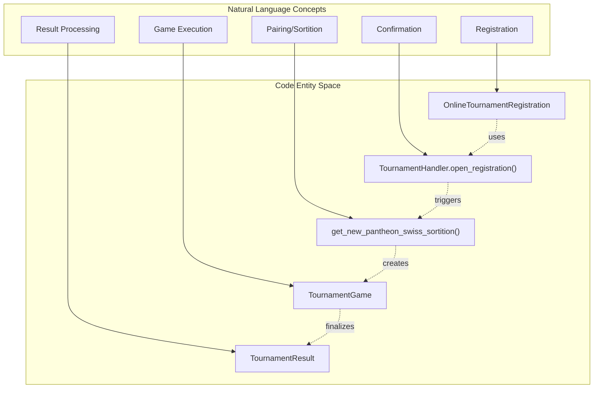
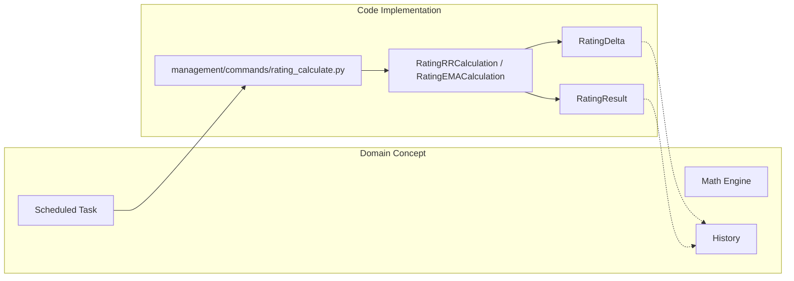

# Glossary

Relevant source files

The following files were used as context for generating this wiki page:

- [server/locale/ru/LC_MESSAGES/django.mo](server/locale/ru/LC_MESSAGES/django.mo)
- [server/locale/ru/LC_MESSAGES/django.po](server/locale/ru/LC_MESSAGES/django.po)
- [server/mahjong_portal/templatetags/player_helper.py](server/mahjong_portal/templatetags/player_helper.py)
- [server/mahjong_portal/templatetags/tenhou_helper.py](server/mahjong_portal/templatetags/tenhou_helper.py)
- [server/online/admin.py](server/online/admin.py)
- [server/online/handler.py](server/online/handler.py)
- [server/online/management/commands/ds_bot.py](server/online/management/commands/ds_bot.py)
- [server/online/management/commands/tg_bot.py](server/online/management/commands/tg_bot.py)
- [server/online/models.py](server/online/models.py)
- [server/online/tests.py](server/online/tests.py)
- [server/online/urls.py](server/online/urls.py)
- [server/pantheon_api/atoms.proto](server/pantheon_api/atoms.proto)
- [server/pantheon_api/atoms_pb2.py](server/pantheon_api/atoms_pb2.py)
- [server/pantheon_api/atoms_twirp.py](server/pantheon_api/atoms_twirp.py)
- [server/pantheon_api/frey.proto](server/pantheon_api/frey.proto)
- [server/pantheon_api/frey_pb2.py](server/pantheon_api/frey_pb2.py)
- [server/pantheon_api/frey_twirp.py](server/pantheon_api/frey_twirp.py)
- [server/pantheon_api/mimir.proto](server/pantheon_api/mimir.proto)
- [server/pantheon_api/mimir_pb2.py](server/pantheon_api/mimir_pb2.py)
- [server/pantheon_api/mimir_twirp.py](server/pantheon_api/mimir_twirp.py)
- [server/player/admin.py](server/player/admin.py)
- [server/player/mahjong_soul/management/commands/ms_base.py](server/player/mahjong_soul/management/commands/ms_base.py)
- [server/player/mahjong_soul/management/commands/ms_servers_base.py](server/player/mahjong_soul/management/commands/ms_servers_base.py)
- [server/player/mahjong_soul/management/commands/search_ms_account.py](server/player/mahjong_soul/management/commands/search_ms_account.py)
- [server/player/mahjong_soul/management/commands/validate_ms_online_regs.py](server/player/mahjong_soul/management/commands/validate_ms_online_regs.py)
- [server/player/mahjong_soul/management/ms_cn_client.py](server/player/mahjong_soul/management/ms_cn_client.py)
- [server/player/mahjong_soul/management/ms_global_client.py](server/player/mahjong_soul/management/ms_global_client.py)
- [server/player/mahjong_soul/management/ms_jp_client.py](server/player/mahjong_soul/management/ms_jp_client.py)
- [server/player/migrations/0011_auto_20200222_1112.py](server/player/migrations/0011_auto_20200222_1112.py)
- [server/player/models.py](server/player/models.py)
- [server/player/tenhou/models.py](server/player/tenhou/models.py)
- [server/player/urls.py](server/player/urls.py)
- [server/player/views.py](server/player/views.py)
- [server/rating/calculation/ema.py](server/rating/calculation/ema.py)
- [server/rating/calculation/online.py](server/rating/calculation/online.py)
- [server/rating/calculation/rr.py](server/rating/calculation/rr.py)
- [server/rating/management/commands/rating_calculate.py](server/rating/management/commands/rating_calculate.py)
- [server/rating/management/commands/reset_tournament_dates.py](server/rating/management/commands/reset_tournament_dates.py)
- [server/rating/management/commands/validate_ema_rating.py](server/rating/management/commands/validate_ema_rating.py)
- [server/rating/migrations/0006_ratingresult_tournament_numbers.py](server/rating/migrations/0006_ratingresult_tournament_numbers.py)
- [server/settings/admin.py](server/settings/admin.py)
- [server/settings/models.py](server/settings/models.py)
- [server/templates/player/_changes_table.html](server/templates/player/_changes_table.html)
- [server/templates/player/tenhou.html](server/templates/player/tenhou.html)
- [server/templates/tournament/announcement.html](server/templates/tournament/announcement.html)
- [server/templates/website/erc_2019.html](server/templates/website/erc_2019.html)
- [server/tournament/forms.py](server/tournament/forms.py)
- [server/tournament/models.py](server/tournament/models.py)
- [server/tournament/translation.py](server/tournament/translation.py)
- [server/tournament/views.py](server/tournament/views.py)

This page provides definitions for codebase-specific terms, domain concepts, and technical jargon used within the Mahjong Portal.

## Domain Concepts

### 1. Rating Types
The system calculates several types of ratings based on different tournament categories and rulesets.
*   **RR (Riichi Rating):** The primary rating for offline riichi mahjong tournaments [rating/models.py:58-58]().
*   **CRR (Club Riichi Rating):** Rating focused on club-level tournament performance [rating/models.py:59-59]().
*   **EMA (European Mahjong Association):** Ratings synchronized with or calculated based on EMA rules for European tournaments [rating/models.py:60-60]().
*   **Online:** Rating specifically for tournaments held on digital platforms like Tenhou or Mahjong Soul [rating/models.py:63-63]().

### 2. Pantheon
An external ecosystem (often referred to as "New Pantheon") providing identity management and tournament infrastructure. The portal integrates with Pantheon for:
*   **Authentication:** Users can login via Pantheon OAuth [templates/tournament/announcement.html:67-67]().
*   **Data Sync:** Synchronizing player profiles and Tenhou IDs [player/player_helper.py:1-20]().
*   **Twirp/Protobuf:** Communication occurs via Twirp RPC using `frey.proto` and `mimir.proto` [pantheon_api/frey.proto:1-10]().

### 3. Tenhou (天鳳)
A popular Japanese online mahjong platform. The portal tracks player statistics, ranks (Dan), and game logs.
*   **Dan (Rank):** Ranks ranging from "Newbie" (新人) to "Tenhou-i" (天鳳位) [player/tenhou/models.py:103-125]().
*   **PT (Points):** Progression points used within a specific rank to reach the next level [player/tenhou/models.py:143-143]().
*   **Rate (R):** An Elo-like skill rating [player/tenhou/models.py:134-134]().

### 4. Mahjong Soul (Majsoul / MS)
A mahjong platform with regional servers (CN, JP, Global). The portal integrates with MS to validate accounts and track tournament registrations [tournament/models.py:112-112]().

---

## Technical Jargon & Code Entities

### Tournament Handling
| Term | Description | Code Pointer |
| :--- | :--- | :--- |
| **TournamentHandler** | The central engine for managing online tournament lifecycles, including breaks and round transitions. | [online/handler.py:50-50]() |
| **Sortition** | The process of pairing players for a round (e.g., Swiss or Golf pairing). | [online/handler.py:37-41]() |
| **Confirmation Phase** | A period before an online tournament where registered players must confirm their presence. | [online/handler.py:193-195]() |
| **TournamentNotification** | A model representing messages queued for delivery to Telegram or Discord. | [online/models.py:29-29]() |

### Rating Calculation
| Term | Description | Code Pointer |
| :--- | :--- | :--- |
| **RatingDelta** | The change in a player's rating score resulting from a single tournament. | [rating/models.py:13-13]() |
| **RatingResult** | The aggregated rating score and rank of a player at a specific point in time. | [rating/models.py:13-13]() |
| **Coefficient** | Multipliers applied to tournament results based on tournament age, size, or importance. | [rating/models.py:13-13]() |

---

## System Relationships

### Natural Language to Code Space: Online Tournament Lifecycle
This diagram bridges the conceptual "Online Tournament" workflow with the specific classes and models that implement it.

**Sources:** [online/handler.py:50-200](), [tournament/models.py:22-63](), [online/models.py:26-32]()

### Natural Language to Code Space: Rating Calculation Pipeline
Mapping the concept of "Daily Rating Updates" to the execution flow in the codebase.

**Sources:** [rating/management/commands/rating_calculate.py:21-53](), [rating/models.py:13-13]()

---

## Technical Abbreviations

*   **EMA:** European Mahjong Association [rating/calculation/ema.py:10-10]().
*   **MCR:** Mahjong Competition Rules (Chinese Official Rules) [tournament/models.py:56-56]().
*   **Riichi:** Japanese Mahjong ruleset [tournament/models.py:55-55]().
*   **Slug:** A URL-friendly version of a name (e.g., for players or tournaments) [player/models.py:19-19]().
*   **Twirp:** A framework for service-to-service communication using Protobuf, used for Pantheon integration [pantheon_api/frey_twirp.py:1-10]().

**Sources:**
*   `server/online/handler.py`
*   `server/tournament/models.py`
*   `server/player/models.py`
*   `server/player/tenhou/models.py`
*   `server/rating/management/commands/rating_calculate.py`
*   `server/pantheon_api/frey.proto`