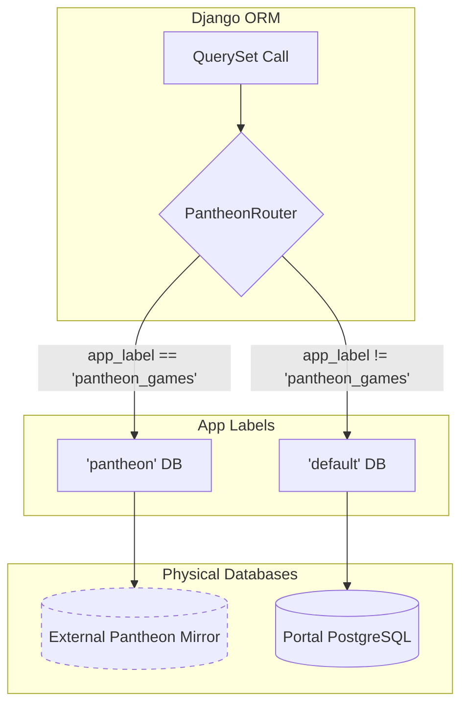
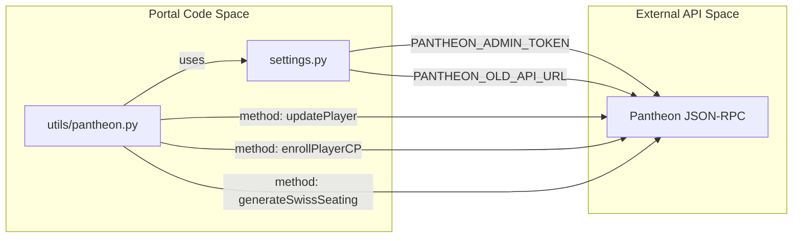

# Application Configuration & Settings

Relevant source files

The following files were used as context for generating this wiki page:

- [.envs/.production.env.example](.envs/.production.env.example)
- [server/club/pantheon_games/db_router.py](server/club/pantheon_games/db_router.py)
- [server/mahjong_portal/__init__.py](server/mahjong_portal/__init__.py)
- [server/mahjong_portal/models.py](server/mahjong_portal/models.py)
- [server/mahjong_portal/settings.py](server/mahjong_portal/settings.py)
- [server/mahjong_portal/wsgi.py](server/mahjong_portal/wsgi.py)
- [server/templates/base.html](server/templates/base.html)
- [server/utils/pantheon.py](server/utils/pantheon.py)
- [server/website/context.py](server/website/context.py)

This page documents the configuration layer of the Mahjong Portal, including environment variables, Django settings, the multi-database routing logic, and integration credentials for external mahjong platforms and services.

## Core Django Configuration

The application settings are managed in `server/mahjong_portal/settings.py` [server/mahjong_portal/settings.py:1-224](). The configuration supports both development and production environments, utilizing environment variables for sensitive data and environment-specific overrides.

### Installed Applications
The project follows a modular structure where domain-specific logic is partitioned into separate apps. Notable custom apps include:
*   `player`: Core player profiles and statistics [server/mahjong_portal/settings.py:68]().
*   `tournament`: Management of physical and online tournaments [server/mahjong_portal/settings.py:71]().
*   `rating`: Calculation engines for RR, CRR, and EMA ratings [server/mahjong_portal/settings.py:72]().
*   `online`: Automation for Tenhou and Mahjong Soul tournaments [server/mahjong_portal/settings.py:76]().
*   `club.pantheon_games`: Integration with the external Pantheon database [server/mahjong_portal/settings.py:65]().

### Middleware & Security
Standard Django middleware is utilized, with `LocaleMiddleware` positioned early to support multi-language requests [server/mahjong_portal/settings.py:85](). Security settings like `SECURE_PROXY_SSL_HEADER` are configured to handle SSL termination at the proxy level (e.g., Nginx) [server/mahjong_portal/settings.py:41]().

### Internationalization (i18n)
The portal supports English and Russian [server/mahjong_portal/settings.py:140]().
*   **Translation Engine**: Uses `modeltranslation` for database-level translations [server/mahjong_portal/settings.py:51]().
*   **Context Processor**: The `website.context.context` function provides `SHORT_DATE_FORMAT` and `CURRENT_YEAR` to templates based on the active language [server/website/context.py:8-15]().

Sources: [server/mahjong_portal/settings.py:49-91](), [server/website/context.py:1-16]()

---

## Database Architecture & Routing

The Mahjong Portal uses a multi-database setup to integrate with the **Pantheon** ecosystem. While the `default` database stores portal-specific data (players, tournaments, ratings), the `pantheon` database is a read-only mirror used for club game synchronization.

### Database Configuration
The `default` database is configured via `dj_database_url` using the `DATABASE_URL` environment variable [server/mahjong_portal/settings.py:117-119](). An optional `pantheon` database can be defined via `PANTHEON_DB_URL` [.envs/.production.env.example:17]().

### PantheonRouter
To ensure that models belonging to the `pantheon_games` app are queried from the correct database, the `PantheonRouter` is implemented.

**PantheonRouter Logic**
*   **Read Operations**: If the model belongs to `pantheon_games`, it routes to the `pantheon` database [server/club/pantheon_games/db_router.py:6-7]().
*   **Write/Migrate Operations**: Always restricted to the `default` database to prevent accidental writes to the Pantheon mirror [server/club/pantheon_games/db_router.py:10-17]().

### Database Routing Data Flow
The following diagram illustrates how the `PantheonRouter` directs queries based on the model's app label.

**Diagram: Database Query Routing**

Sources: [server/club/pantheon_games/db_router.py:4-18](), [server/mahjong_portal/settings.py:117-134]()

---

## External Service Integrations

The portal relies on several external services, configured via environment variables in the production environment.

### External Service Credentials Map
The following table maps system features to their respective configuration keys.

| Service | Setting Key | Purpose |
| :--- | :--- | :--- |
| **Sentry** | `SENTRY_DSN` | Error tracking and performance monitoring [server/mahjong_portal/settings.py:13-20](). |
| **Pantheon (Old API)** | `PANTHEON_OLD_API_URL` | JSON-RPC calls for player enrollment and sortition [server/utils/pantheon.py:36](). |
| **Pantheon Auth** | `PANTHEON_ADMIN_TOKEN` | Bearer token for administrative Pantheon actions [server/utils/pantheon.py:19](). |
| **Mahjong Soul** | `MS_USERNAME`, `MS_PASSWORD` | Credentials for the bot to scrape player statistics [.envs/.production.env.example:23-25](). |
| **Tenhou** | `TENHOU_WG_URL` | Endpoint for fetching active lobby games [server/mahjong_portal/settings.py:200](). |
| **Telegram** | `TELEGRAM_TOKEN` | Bot token for tournament notifications [server/mahjong_portal/settings.py:205](). |
| **Discord** | `DISCORD_TOKEN` | Client token for the tournament discord bot [server/mahjong_portal/settings.py:209](). |

### Integration Logic: Pantheon RPC
The portal interacts with Pantheon using JSON-RPC. Functions in `utils.pantheon` use `PANTHEON_OLD_API_URL` and `PANTHEON_ADMIN_TOKEN` to perform actions like:
*   `add_user_to_pantheon`: Enrolls and registers a player in a Pantheon event [server/utils/pantheon.py:15-78]().
*   `get_pantheon_swiss_sortition`: Retrieves the seating for a Swiss-system round [server/utils/pantheon.py:80-100]().

**Diagram: Pantheon Integration Entity Map**

Sources: [server/mahjong_portal/settings.py:205-224](), [server/utils/pantheon.py:1-111](), [.envs/.production.env.example:1-25]()

---

## Static Files & Logging

### Static Files
Static assets are managed using Django's `ManifestStaticFilesStorage`, which appends MD5 hashes to filenames for aggressive caching [server/mahjong_portal/settings.py:191]().
*   `STATIC_ROOT`: `collected_static` [server/mahjong_portal/settings.py:189]().
*   `STATICFILES_DIRS`: `static` [server/mahjong_portal/settings.py:190]().

### Logging Configuration
The logging system is configured to filter out noise from third-party libraries.
*   **Filter**: `skip_site_packages_logs` prevents log records originating from `site-packages` from reaching the console [server/mahjong_portal/settings.py:151-156]().
*   **Loggers**: The `django.template` logger uses this filter to reduce verbosity during template rendering errors [server/mahjong_portal/settings.py:173-178]().
*   **Level**: Controlled via the `DJANGO_LOG_LEVEL` environment variable [server/mahjong_portal/settings.py:159]().

Sources: [server/mahjong_portal/settings.py:151-191]()