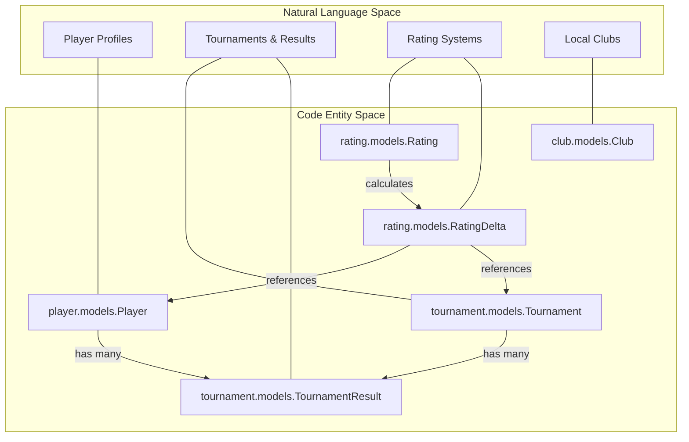
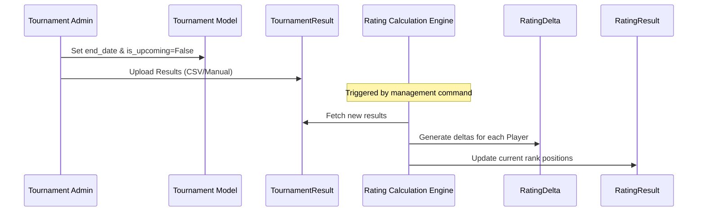

# Core Architecture

Relevant source files

The following files were used as context for generating this wiki page:

- [server/club/urls.py](server/club/urls.py)
- [server/rating/mixins.py](server/rating/mixins.py)
- [server/tournament/admin.py](server/tournament/admin.py)
- [server/tournament/urls.py](server/tournament/urls.py)
- [server/website/urls.py](server/website/urls.py)
- [server/website/views.py](server/website/views.py)

This page provides a high-level overview of the Mahjong Portal's system design. The portal is built as a modular Django application that integrates player management, tournament organization, and complex rating calculations with external platforms like Tenhou, Mahjong Soul, and the Pantheon tournament system.

## System Overview

The Mahjong Portal is organized into several primary Django apps, each handling a specific domain of the Riichi Mahjong ecosystem. The architecture is designed to handle both historical data (archived tournament results) and real-time operations (online tournament automation).

### Code-to-System Mapping
The following diagram illustrates how core system concepts map to specific Django applications and their primary models.

**Sources:** [player/models.py](), [tournament/models.py:8-16](), [rating/models.py](), [club/models.py]()

---

## Major Domain Subsystems

### 1. Player Data Model & Profile System
The `player` app is the central registry for all mahjong players. It tracks geographic data via `City` and `Country` models and serves as the anchor for external identities (Tenhou nicknames, Mahjong Soul IDs, and EMA IDs). 

*   **Key Entities:** `Player`, `PlayerTitle`, `PlayerQuotaEvent`.
*   **Geographic Integration:** Players are associated with a `City` [website/views.py:160-161](), which allows for regional filtering of rankings and club affiliations.
*   **For details, see [Player Data Model & Profile System](#2.1).**

**Sources:** [player/models.py](), [website/views.py:160-186]()

### 2. Tournament System
The `tournament` app manages the lifecycle of both physical and online competitions. It handles registration, result ingestion (often via CSV upload), and data export for international bodies like the EMA.

*   **Key Entities:** `Tournament`, `TournamentResult`, `TournamentRegistration`.
*   **Registration Flow:** Supports standard registration [tournament/urls.py:18]() and specialized Pantheon-linked registration [tournament/urls.py:20-23]().
*   **Result Management:** Results are stored in `TournamentResult` [tournament/admin.py:106-115](), linking players to their finishing positions and scores.
*   **For details, see [Tournament System](#2.2).**

**Sources:** [tournament/models.py:8-16](), [tournament/urls.py:1-26](), [tournament/admin.py:25-43]()

### 3. Rating Calculation Engine
The `rating` app implements various mahjong-specific ranking algorithms. Unlike simple Elo systems, these calculations often account for tournament age, session counts, and specific coefficients.

*   **Key Entities:** `Rating`, `RatingResult`, `RatingDelta`.
*   **Calculations:** Includes Riichi Ranking (RR), European Mahjong Association (EMA), and Competitive Riichi (CRR) [website/views.py:43-51]().
*   **For details, see [Rating Calculation Engine](#2.3).**

**Sources:** [rating/models.py](), [rating/mixins.py:48-57](), [website/views.py:42-51]()

---

## URL Routing & Application Entry Points

The portal uses a hierarchical routing structure. The root `website` app handles general pages, while domain-specific logic is delegated to sub-apps.

| Path Prefix | App / Responsibility | Primary Views |
| :--- | :--- | :--- |
| `/` | `website` | Home [website/views.py:42](), Search [website/views.py:148](), City pages [website/views.py:160]() |
| `/tournament/` | `tournament` | List [tournament/urls.py:16](), Details [tournament/urls.py:24](), Registration [tournament/urls.py:18]() |
| `/club/` | `club` | Club List [club/urls.py:8](), Club Details [club/urls.py:9]() |
| `/api/` | Various | `players_api` [website/views.py:189](), `finished_tournaments_api` [website/views.py:219]() |

**Sources:** [website/urls.py:22-41](), [tournament/urls.py:14-26](), [club/urls.py:7-11]()

---

## Data Flow: Result to Rating
This diagram shows how a tournament result moves through the system to influence a player's rating.

**Sources:** [tournament/admin.py:106-117](), [rating/mixins.py:44-57](), [website/views.py:42-51]()