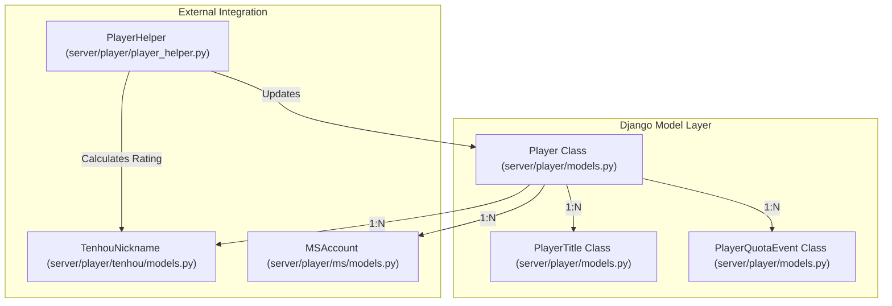
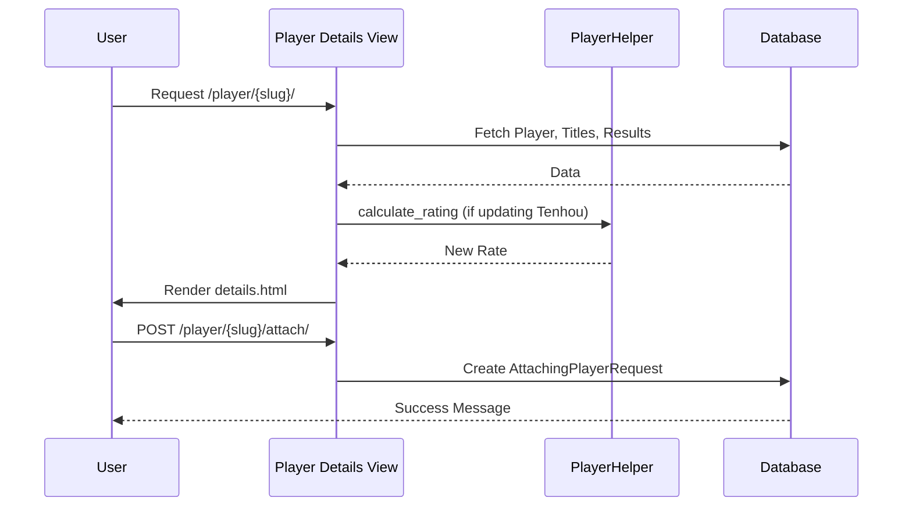

# Player Data Model & Profile System

Relevant source files

The following files were used as context for generating this wiki page:

- [server/account/views.py](server/account/views.py)
- [server/mahjong_portal/templatetags/player_helper.py](server/mahjong_portal/templatetags/player_helper.py)
- [server/online/parser.py](server/online/parser.py)
- [server/player/admin.py](server/player/admin.py)
- [server/player/management/commands/__init__.py](server/player/management/commands/__init__.py)
- [server/player/management/commands/update_players_from_pantheon.py](server/player/management/commands/update_players_from_pantheon.py)
- [server/player/migrations/0007_playertitle.py](server/player/migrations/0007_playertitle.py)
- [server/player/migrations/0008_auto_20191218_1440.py](server/player/migrations/0008_auto_20191218_1440.py)
- [server/player/migrations/0011_auto_20200222_1112.py](server/player/migrations/0011_auto_20200222_1112.py)
- [server/player/migrations/0013_playertitle_url.py](server/player/migrations/0013_playertitle_url.py)
- [server/player/models.py](server/player/models.py)
- [server/player/player_helper.py](server/player/player_helper.py)
- [server/player/tenhou/tenhou_helper.py](server/player/tenhou/tenhou_helper.py)
- [server/player/translation.py](server/player/translation.py)
- [server/settings/admin.py](server/settings/admin.py)
- [server/settings/models.py](server/settings/models.py)
- [server/static/css/style.css](server/static/css/style.css)
- [server/templates/account/settings.html](server/templates/account/settings.html)
- [server/templates/player/_deltas_table.html](server/templates/player/_deltas_table.html)
- [server/templates/player/_player_header.html](server/templates/player/_player_header.html)
- [server/templates/player/_verified_player.html](server/templates/player/_verified_player.html)
- [server/templates/player/details.html](server/templates/player/details.html)
- [server/templates/player/tournaments.html](server/templates/player/tournaments.html)
- [server/templates/tournament/_tournament_top_header.html](server/templates/tournament/_tournament_top_header.html)
- [server/templates/tournament/_tournaments_table.html](server/templates/tournament/_tournaments_table.html)
- [server/templates/website/erc_2019.html](server/templates/website/erc_2019.html)
- [server/tournament/translation.py](server/tournament/translation.py)

This page provides a technical deep dive into the player-centric components of the Mahjong Portal. It covers the core `Player` model, the title and qualification systems, geographic data, and the profile views that aggregate data from tournaments and external platforms (Tenhou, Mahjong Soul).

## Core Player Model

The `Player` class is the central entity for all personal data, tournament results, and rating calculations. It inherits from `BaseModel` and includes fields for identification, demographic information, and privacy controls.

### Implementation Details
- **Identification**: Uses `pantheon_id` for synchronization with the external Pantheon system and `ema_id` for European Mahjong Association tracking [server/player/models.py:31-32]().
- **Privacy Flags**: 
    - `is_hide`: If true, the player's name is replaced with "Substitution player" in public views [server/player/models.py:45-48]().
    - `is_exclude_from_rating`: Prevents the player from appearing in rating lists [server/player/models.py:27-27]().
    - `is_hide_tenhou_activity` / `is_hide_ms_activity`: Toggles visibility of external platform statistics [server/player/models.py:28-29]().
- **Geographic Data**: Linked via foreign keys to `Country` and `City` models [server/player/models.py:21-22]().

### Data Flow: Code Entity Space
The following diagram maps the logical concepts of a player to their specific implementation in the codebase.

Sources: [server/player/models.py:11-165](), [server/player/player_helper.py:20-104]()

## Profile System & Sub-systems

### Player Titles
The `PlayerTitle` model allows administrators to assign custom badges or labels to players (e.g., "Champion"). These include styling options like `background_color` and `text_color` [server/player/models.py:87-94]().

### Geographic Sub-system
Players are associated with `Country` and `City` models defined in the `settings` app [server/settings/models.py](). This data is used to generate city-specific pages and filter tournament participants [server/templates/player/details.html:115-121]().

### Qualification System (EMA & WRC)
The `PlayerQuotaEvent` model tracks player eligibility and status for major international tournaments like the European Riichi Championship (ERMC) and World Riichi Championship (WRC) [server/player/models.py:103-131]().
- **State Tracking**: Uses a color-coded state system (e.g., `GREEN` for "definitely going", `GRAY` for "not going") [server/player/models.py:115-126]().
- **Visual Mapping**: The `get_color()` method maps these states to hex codes for frontend rendering [server/player/models.py:147-164]().

### Verification & Account Attachment
Users can request to "attach" their website account to a `Player` profile.
- **Request Workflow**: Handled via `request_player_and_user_connection` which creates an `AttachingPlayerRequest` [server/account/views.py:129-137]().
- **Verification Status**: A player is considered `is_verified` if an attachment request has been processed [server/player/models.py:77-78]().

## Synchronization with Pantheon

The `PlayerHelper` class manages the complex logic of updating player data from the Pantheon feed. This includes "smart matching" names and resolving conflicts with Tenhou nicknames.

### Update Pipeline
1. **Feed Ingestion**: `update_players_from_pantheon` management command polls `PantheonInfoUpdateLog` [server/player/management/commands/update_players_from_pantheon.py:15-38]().
2. **Logic Execution**: `PlayerHelper.update_player_from_pantheon_feed` parses the feed, updates demographic data, and links the player to a `User` if applicable [server/player/player_helper.py:104-160]().
3. **Tenhou Resolution**: If a `tenhou_id` is present in the feed, the system checks for existing accounts and updates or creates `TenhouNickname` records [server/player/player_helper.py:77-101]().

Sources: [server/player/player_helper.py:104-160](), [server/player/management/commands/update_players_from_pantheon.py:1-38]()

## Frontend Components

### Player Profile View
The profile view (`details.html`) is a modular template that aggregates:
- **Ratings**: Current scores and places across different rating types [server/templates/player/details.html:18-69]().
- **Tournaments**: A list of recent tournament results including base rank and place [server/templates/player/details.html:71-127]().
- **External Stats**: Summaries for Tenhou and Mahjong Soul activity [server/templates/player/details.html:129-142]().

### Template Helpers
- **`player_helper`**: Provides tags like `place_medal` (renders 🥇/🥈/🥉 icons) and `ermc_color` (returns hex codes for qualification status) [server/mahjong_portal/templatetags/player_helper.py]().
- **`meta_tags_helper`**: Dynamically generates OpenGraph and description tags for SEO [server/templates/player/details.html:2]().

### UI/UX Flow: Profile Interaction

Sources: [server/templates/player/details.html:1-150](), [server/account/views.py:47-105](), [server/player/player_helper.py:50-74]()

## Admin Interface

The player administration is customized to handle related data efficiently:
- **`PlayerAdmin`**: Includes an inline for `TenhouNickname` and uses `prepopulated_fields` to generate slugs from English names [server/player/admin.py:21-29]().
- **`PlayerQuotaEventAdmin`**: Provides filters for tournament type and participant state to manage international event registration [server/player/admin.py:49-54]().

Sources: [server/player/admin.py:1-59]()