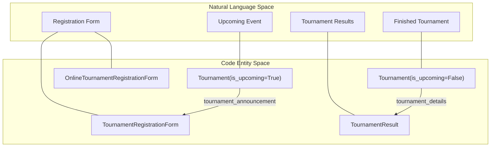

# Tournament System

Relevant source files

The following files were used as context for generating this wiki page:

- [server/club/urls.py](server/club/urls.py)
- [server/locale/ru/LC_MESSAGES/django.mo](server/locale/ru/LC_MESSAGES/django.mo)
- [server/locale/ru/LC_MESSAGES/django.po](server/locale/ru/LC_MESSAGES/django.po)
- [server/mahjong_portal/templatetags/meta_tags_helper.py](server/mahjong_portal/templatetags/meta_tags_helper.py)
- [server/mahjong_portal/templatetags/russian_words_morph.py](server/mahjong_portal/templatetags/russian_words_morph.py)
- [server/online/migrations/0027_tournamentnotification_lang.py](server/online/migrations/0027_tournamentnotification_lang.py)
- [server/templates/club/list.html](server/templates/club/list.html)
- [server/templates/rating/_results_table.html](server/templates/rating/_results_table.html)
- [server/templates/rating/rating_tournaments.html](server/templates/rating/rating_tournaments.html)
- [server/templates/tournament/_current_tournaments_table.html](server/templates/tournament/_current_tournaments_table.html)
- [server/templates/tournament/announcement.html](server/templates/tournament/announcement.html)
- [server/templates/tournament/details.html](server/templates/tournament/details.html)
- [server/templates/tournament/list.html](server/templates/tournament/list.html)
- [server/templates/website/city.html](server/templates/website/city.html)
- [server/templates/website/home.html](server/templates/website/home.html)
- [server/templates/website/search.html](server/templates/website/search.html)
- [server/tournament/forms.py](server/tournament/forms.py)
- [server/tournament/migrations/0045_onlinetournamentconfig_tournament_online_config.py](server/tournament/migrations/0045_onlinetournamentconfig_tournament_online_config.py)
- [server/tournament/migrations/0046_alter_tournament_online_config.py](server/tournament/migrations/0046_alter_tournament_online_config.py)
- [server/tournament/migrations/0047_tournament_is_command.py](server/tournament/migrations/0047_tournament_is_command.py)
- [server/tournament/models.py](server/tournament/models.py)
- [server/tournament/online_tournament_config.py](server/tournament/online_tournament_config.py)
- [server/tournament/urls.py](server/tournament/urls.py)
- [server/tournament/views.py](server/tournament/views.py)

The tournament system is a central domain of the Mahjong Portal, responsible for managing the lifecycle of mahjong competitions from announcement and registration to result publication. It supports various tournament types, including EMA-sanctioned events, local Riichi/MCR tournaments, and automated online tournaments.

## System Overview

The system is built around the `Tournament` model, which acts as the primary entity for both upcoming events and historical results. Depending on the `is_upcoming` flag, the portal dynamically routes users to either an announcement/registration page or a detailed results view.

### Code-to-Entity Mapping

The following diagram illustrates how the natural language concepts of the tournament lifecycle map to specific classes and views within the codebase.

**Tournament Entity Map**

**Sources:**
- [server/tournament/models.py:54-140]()
- [server/tournament/views.py:83-143]()
- [server/tournament/forms.py:14-40]()

## Tournament Models & Registration

Tournament registration is highly polymorphic, adapting to the platform (Offline, Tenhou, or Mahjong Soul) and the authentication method (Portal-native or Pantheon OAuth).

- **Tournament Model**: Stores metadata such as dates, rulesets (Riichi/MCR), and scoring types (EMA, RR, CRR) [server/tournament/models.py:54-132]().
- **Registration Workflows**: 
    - **Offline**: Uses `TournamentRegistration` for collecting names and contact info [server/tournament/models.py:270-287]().
    - **Online**: Uses `OnlineTournamentRegistration` for Tenhou events and `MsOnlineTournamentRegistration` for Mahjong Soul [server/tournament/models.py:289-328]().
    - **Pantheon**: Supports registration via Pantheon accounts, requiring valid platform IDs (e.g., Tenhou nicknames) before allowing application [server/tournament/views.py:135-143]().

For a deep dive into registration logic and model inheritance, see [Tournament Models & Registration](#2.2.1).

**Sources:**
- [server/tournament/models.py:54-328]()
- [server/tournament/forms.py:1-107]()

## Tournament Administration & Results

The administrative interface allows organizers to manage participants and ingest final scores.

- **Moderation**: Admins can approve, highlight, or remove registrations. Highlighting is often used to indicate players who have paid or confirmed their attendance [server/tournament/views.py:144-177]().
- **Result Ingestion**: Results are stored in the `TournamentResult` model, linking players to their final rank and scores [server/tournament/models.py:228-251]().
- **Automated Ranking**: The system handles tie-breaking and place assignment based on uploaded CSV or EMA-formatted files.

For details on the administration dashboard and result upload pipelines, see [Tournament Admin & Result Upload](#2.2.2).

**Sources:**
- [server/tournament/models.py:228-251]()
- [server/tournament/views.py:88-110]()

## Navigation and Routing

Tournament views are organized by year and type. The system provides specialized lists for EMA-sanctioned tournaments and general Riichi events.

| Route Name | Purpose | File Pointer |
| :--- | :--- | :--- |
| `tournament_list` | Yearly archive of all tournaments | [server/tournament/urls.py:16-16]() |
| `tournament_ema_list` | Filtered view for EMA/Championship events | [server/tournament/urls.py:17-17]() |
| `tournament_announcement` | Registration and info for upcoming events | [server/tournament/urls.py:25-25]() |
| `tournament_details` | Standings and stats for finished events | [server/tournament/urls.py:24-24]() |

**Sources:**
- [server/tournament/urls.py:1-26]()
- [server/tournament/views.py:33-80]()

## Online Tournament Automation

For tournaments marked with `tournament_games_type = ONLINE_GAMES`, the portal integrates with the `online` app to automate game creation and log fetching. This involves a specialized `OnlineTournamentConfig` that stores parameters for confirmation phases and platform-specific settings [server/tournament/models.py:22-52]().

For technical details on how these games are launched on Tenhou or Mahjong Soul, see [Online Tournament Automation](#3).

**Sources:**
- [server/tournament/models.py:22-52]()
- [server/tournament/models.py:107-107]()