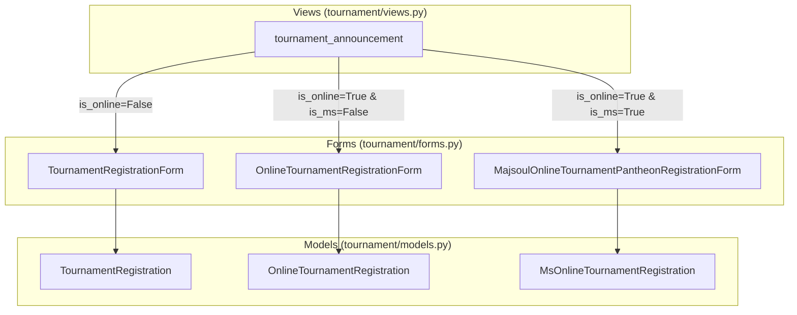
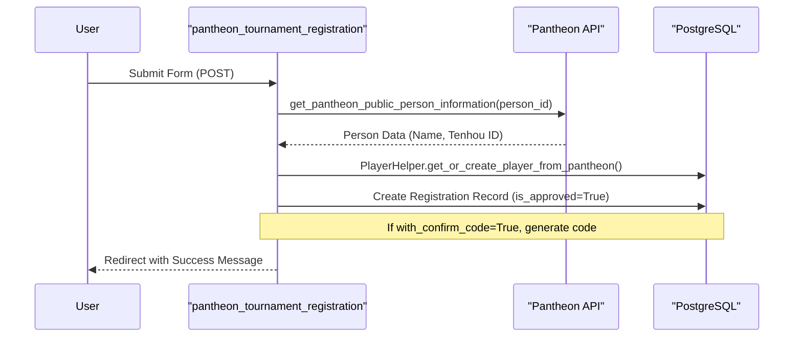

# Tournament Models & Registration

Relevant source files

The following files were used as context for generating this wiki page:

- [server/club/migrations/0001_initial.py](server/club/migrations/0001_initial.py)
- [server/locale/ru/LC_MESSAGES/django.mo](server/locale/ru/LC_MESSAGES/django.mo)
- [server/locale/ru/LC_MESSAGES/django.po](server/locale/ru/LC_MESSAGES/django.po)
- [server/player/migrations/0001_initial.py](server/player/migrations/0001_initial.py)
- [server/rating/migrations/0001_initial.py](server/rating/migrations/0001_initial.py)
- [server/settings/migrations/0001_initial.py](server/settings/migrations/0001_initial.py)
- [server/templates/tournament/announcement.html](server/templates/tournament/announcement.html)
- [server/templates/tournament/application.html](server/templates/tournament/application.html)
- [server/tournament/forms.py](server/tournament/forms.py)
- [server/tournament/migrations/0001_initial.py](server/tournament/migrations/0001_initial.py)
- [server/tournament/migrations/0002_auto_20180113_0437.py](server/tournament/migrations/0002_auto_20180113_0437.py)
- [server/tournament/migrations/0007_auto_20180118_1424.py](server/tournament/migrations/0007_auto_20180118_1424.py)
- [server/tournament/migrations/0017_tournamentapplication_number_of_games.py](server/tournament/migrations/0017_tournamentapplication_number_of_games.py)
- [server/tournament/migrations/0049_tournamentapplication_user.py](server/tournament/migrations/0049_tournamentapplication_user.py)
- [server/tournament/migrations/0050_rename_user_tournamentapplication_tournament_admin_user.py](server/tournament/migrations/0050_rename_user_tournamentapplication_tournament_admin_user.py)
- [server/tournament/migrations/0053_tournament_is_pre_registration.py](server/tournament/migrations/0053_tournament_is_pre_registration.py)
- [server/tournament/migrations/0056_tournament_with_confirm_code.py](server/tournament/migrations/0056_tournament_with_confirm_code.py)
- [server/tournament/models.py](server/tournament/models.py)
- [server/tournament/views.py](server/tournament/views.py)

This section provides a deep dive into the tournament domain models and the registration workflows. The system supports various tournament types (offline, online, team-based) and integrates with the Pantheon platform for authentication and player data synchronization.

## Core Tournament Models

The `Tournament` model is the central entity for all competitions. It handles both historical data (results) and future events (announcements/registration).

### Tournament Model
Defined in `tournament/models.py`, the `Tournament` class includes metadata about the event, its rating status, and registration configuration [server/tournament/models.py:54-131]().

| Field | Description |
| :--- | :--- |
| `tournament_type` | Categorizes the event: `RR`, `CRR`, `EMA`, `FOREIGN_EMA`, `OTHER`, `ONLINE`, or `CHAMPIONSHIP` [server/tournament/models.py:106](). |
| `tournament_games_type` | Distinguishes between `offline` and `online` gameplay [server/tournament/models.py:107](). |
| `is_upcoming` | Boolean flag. If `True`, the URL routes to the announcement page instead of the details/results page [server/tournament/models.py:137-140](). |
| `is_pantheon_registration` | If `True`, players must authenticate via Pantheon to register [server/tournament/models.py:113](). |
| `registrations_pre_moderation` | Requires admin approval for registrants before they appear in the public list [server/tournament/models.py:117](). |
| `with_confirm_code` | Generates a unique code for players to use during online tournament check-ins [server/tournament/models.py:121](). |

### Registration Polymorphism
The portal uses different models to handle registration based on the tournament platform:

1.  **`TournamentRegistration`**: Standard model for offline tournaments. Captures names, contact info, and city [server/tournament/models.py:236-258]().
2.  **`OnlineTournamentRegistration`**: Extends registration for Tenhou-based events, adding a `tenhou_nickname` field [server/tournament/models.py:261-285]().
3.  **`MsOnlineTournamentRegistration`**: Specifically for Mahjong Soul events, capturing `ms_friend_id` and `ms_nickname` [server/tournament/models.py:288-316]().

### Data Flow: Code Entity Space
The following diagram maps the relationship between models and the forms used in the `tournament_announcement` view.

**Registration Model-Form Mapping**

Sources: [server/tournament/models.py:236-316](), [server/tournament/forms.py:14-106](), [server/tournament/views.py:127-143]()

---

## Registration Workflows

### Standard Registration
For tournaments where `is_pantheon_registration` is `False`, the `tournament_registration` view processes POST data. It creates a registration record and, if a matching `Player` exists in the database, associates it automatically [server/tournament/views.py:254-307]().

### Pantheon Registration Flow
When `is_pantheon_registration` is `True`, the portal leverages the Pantheon API to ensure data integrity.

1.  **Authentication**: The user must be logged in via Pantheon [server/templates/tournament/announcement.html:65-68]().
2.  **Data Fetching**: The view `pantheon_tournament_registration` calls `get_pantheon_public_person_information` to retrieve the user's verified details from Pantheon [server/tournament/views.py:321-331]().
3.  **Player Sync**: The `PlayerHelper.get_or_create_player_from_pantheon` utility ensures the local `Player` record matches the Pantheon `person_id` [server/tournament/views.py:353-356]().
4.  **Confirmation Codes**: If the tournament has `with_confirm_code` enabled, a random code is generated using `get_random_confirm_code()` and saved to the registration record [server/tournament/views.py:365-368]().

**Pantheon Registration Sequence**

Sources: [server/tournament/views.py:310-410](), [server/player/player_helper.py:14-15](), [server/utils/general.py:30]()

---

## Tournament Views

### Tournament List
The `tournament_list` view filters events by year and type. It separates tournaments into three categories for the template:
*   `current_tournaments`: Ongoing events [server/tournament/views.py:64]().
*   `upcoming_tournaments`: Future events [server/tournament/views.py:65]().
*   `tournaments`: Past events for the selected year [server/tournament/views.py:66]().

### Announcement vs. Details
The portal uses a dual-view system based on the `is_upcoming` flag:
*   **Announcement (`tournament_announcement`)**: Focuses on registration forms, participant lists, and event descriptions [server/tournament/views.py:127-210]().
*   **Details (`tournament_details`)**: Displays the final standings and results using the `TournamentResult` model [server/tournament/views.py:83-124]().

### Pre-moderation and Highlighting
*   **Pre-moderation**: If `registrations_pre_moderation` is enabled, registrations are created with `is_approved=False`. They only appear in the public participant list once an admin approves them [server/tournament/views.py:148-173]().
*   **Highlighting**: The `is_highlighted` flag is often used to indicate players who have completed payment or final confirmation [server/templates/tournament/announcement.html:127]().

Sources: [server/tournament/views.py:33-124](), [server/tournament/models.py:117-121](), [server/templates/tournament/announcement.html:18-37]()