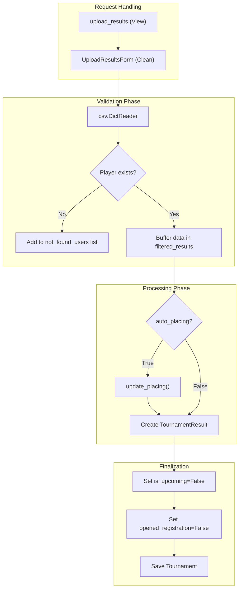
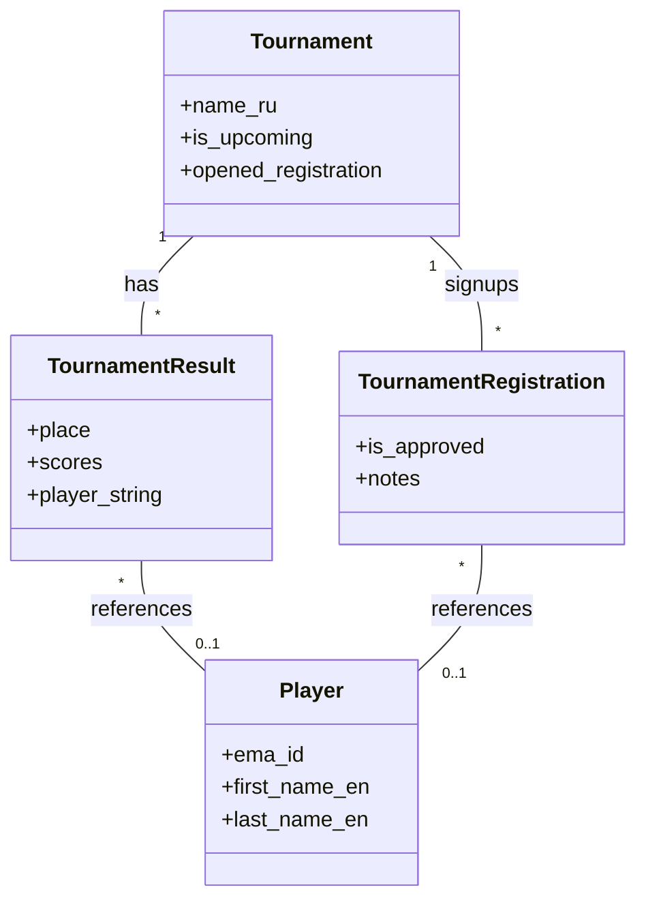

# Tournament Admin & Result Upload

Relevant source files

The following files were used as context for generating this wiki page:

- [server/account/migrations/0004_user_is_ema_players_manager.py](server/account/migrations/0004_user_is_ema_players_manager.py)
- [server/account/migrations/0005_django_abstract_user_last_name.py](server/account/migrations/0005_django_abstract_user_last_name.py)
- [server/player/mahjong_soul/tests.py](server/player/mahjong_soul/tests.py)
- [server/rating/mixins.py](server/rating/mixins.py)
- [server/rating/utils.py](server/rating/utils.py)
- [server/system/decorators.py](server/system/decorators.py)
- [server/system/ema_players_admin/__init__.py](server/system/ema_players_admin/__init__.py)
- [server/system/ema_players_admin/apps.py](server/system/ema_players_admin/apps.py)
- [server/system/ema_players_admin/forms.py](server/system/ema_players_admin/forms.py)
- [server/system/ema_players_admin/migrations/__init__.py](server/system/ema_players_admin/migrations/__init__.py)
- [server/system/ema_players_admin/urls.py](server/system/ema_players_admin/urls.py)
- [server/system/ema_players_admin/views.py](server/system/ema_players_admin/views.py)
- [server/system/tournament_admin/forms.py](server/system/tournament_admin/forms.py)
- [server/system/tournament_admin/tests.py](server/system/tournament_admin/tests.py)
- [server/system/tournament_admin/urls.py](server/system/tournament_admin/urls.py)
- [server/system/tournament_admin/views.py](server/system/tournament_admin/views.py)
- [server/system/urls.py](server/system/urls.py)
- [server/system/views.py](server/system/views.py)
- [server/templates/tournament_admin/managed_tournaments.html](server/templates/tournament_admin/managed_tournaments.html)
- [server/templates/tournament_admin/tournament_edit.html](server/templates/tournament_admin/tournament_edit.html)
- [server/templates/tournament_admin/tournament_manage.html](server/templates/tournament_admin/tournament_manage.html)
- [server/templates/tournament_admin/tournament_registration_notes_edit.html](server/templates/tournament_admin/tournament_registration_notes_edit.html)
- [server/templates/transliterate.html](server/templates/transliterate.html)
- [server/tournament/admin.py](server/tournament/admin.py)
- [server/tournament/migrations/0003_tournamentregistration_is_approved.py](server/tournament/migrations/0003_tournamentregistration_is_approved.py)
- [server/website/urls.py](server/website/urls.py)
- [server/website/views.py](server/website/views.py)

The `tournament_admin` subsystem provides the administrative interface for managing tournament lifecycles, from registration moderation to final result ingestion. It is designed to handle both standard offline tournaments and online tournaments (Tenhou/Mahjong Soul), offering tools for participant management and a CSV-based pipeline for uploading and validating tournament results.

## Tournament Management Interface

The administrative interface is split between two primary views based on user permissions:
1.  **New Tournaments**: A list of upcoming public tournaments accessible only by superusers [server/system/tournament_admin/views.py:41-43]().
2.  **Managed Tournaments**: A list of tournaments specifically assigned to a `User` who has the `is_tournament_manager` flag [server/system/tournament_admin/views.py:180-182]().

### Access Control
Access to specific tournament management actions is protected by the `tournament_manager_auth_required` decorator [server/system/decorators.py:11-39](). This decorator ensures that:
*   The user is authenticated.
*   The tournament exists.
*   The user is either a superuser or the designated manager for that specific tournament ID [server/system/decorators.py:26-35]().

### Administrative Controls
The `tournament_manage` view [server/system/tournament_admin/views.py:187-210]() and its associated template [server/templates/tournament_admin/tournament_manage.html]() provide several toggle controls:
*   **Registration Status**: Toggle `opened_registration` to allow or block new signups [server/templates/tournament_admin/tournament_manage.html:55-65]().
*   **Moderation Mode**: Switch between pre-moderation (requires manual approval) and post-moderation [server/templates/tournament_admin/tournament_manage.html:66-76]().
*   **Visibility**: Toggle `is_hidden` to remove the tournament from public lists [server/templates/tournament_admin/tournament_manage.html:94-99]().
*   **Notes Visibility**: Toggle `share_notes` to make participant notes public or private [server/templates/tournament_admin/tournament_manage.html:81-93]().

### Registration Moderation
Administrators can moderate `TournamentRegistration`, `OnlineTournamentRegistration`, or `MsOnlineTournamentRegistration` objects through the following actions:
*   **Approve**: Sets `is_approved=True` [server/system/tournament_admin/urls.py:37-40]().
*   **Remove**: Deletes the registration record [server/system/tournament_admin/urls.py:27-30]().
*   **Highlight**: Toggles `is_highlighted` for visual emphasis in the participant list [server/system/tournament_admin/urls.py:32-35]().
*   **Edit Notes**: Update administrative or public notes for a player [server/system/tournament_admin/urls.py:45-49]().

**Sources:** [server/system/tournament_admin/views.py](), [server/system/tournament_admin/urls.py](), [server/system/decorators.py](), [server/templates/tournament_admin/tournament_manage.html]().

## Result Upload Pipeline

The `upload_results` view handles the transition of a tournament from "Upcoming" to "Finished" by processing a CSV file containing final scores and ranks [server/system/tournament_admin/views.py:48-175]().

### CSV Format and Parsing
The system supports two primary formats controlled by the `ema` boolean in `UploadResultsForm` [server/system/tournament_admin/forms.py:13-17]():

| Field | Description | EMA Format | Standard Format |
| :--- | :--- | :--- | :--- |
| `place` | Final ranking | Required | Required |
| `name` | Player name | N/A | Split into First/Last |
| `first_name` | Player first name | Required | N/A |
| `last_name` | Player last name | Required | N/A |
| `scores` | Total tournament points | Required | Required |
| `ema` | EMA ID for lookup | Optional | Optional |
| `games` | Number of games played | Optional | Optional |

### Data Flow: CSV to TournamentResult
The following diagram illustrates the transformation logic within `upload_results` [server/system/tournament_admin/views.py:56-163]().

**Diagram: Result Ingestion Pipeline**

### Auto-Placing Logic
If the `auto_placing` flag is enabled, the system ignores the `place` column in the CSV and recalculates ranks using the `update_placing` utility [server/system/tournament_admin/views.py:29-37](). It sorts players primarily by games played (descending) and secondarily by scores (descending) [server/system/tournament_admin/views.py:31]().

### Player Matching Logic
The system attempts to link results to existing `Player` records:
1.  **EMA Mode**: Looks up by `ema_id`. If missing, matches by `first_name_en` and `last_name_en` [server/system/tournament_admin/views.py:104-108]().
2.  **Standard Mode**: Matches by `first_name_ru` and `last_name_ru` [server/system/tournament_admin/views.py:110]().
3.  **No Match**: If `load_player` is false in the CSV, the system stores the name as a raw string in `TournamentResult.player_string` instead of a foreign key [server/system/tournament_admin/views.py:147-156]().

**Sources:** [server/system/tournament_admin/views.py](), [server/system/tournament_admin/forms.py](), [server/tournament/models.py]().

## Data Models

### TournamentResult
This model stores the finalized outcome for a single player in a tournament.

*   **`player`**: ForeignKey to `Player`. Optional if the player is not in the database [server/tournament/models.py]().
*   **`player_string`**: Stores the name of the player if no `player` link exists [server/tournament/models.py]().
*   **`tournament`**: ForeignKey to the `Tournament` [server/tournament/models.py]().
*   **`place`**: Integer rank [server/tournament/models.py]().
*   **`scores`**: Decimal/Float score achieved [server/tournament/models.py]().

### Tournament (Admin Fields)
Relevant fields updated during the admin lifecycle:
*   **`is_upcoming`**: Set to `False` once results are uploaded [server/system/tournament_admin/views.py:158]().
*   **`opened_registration`**: Set to `False` once results are uploaded [server/system/tournament_admin/views.py:159]().
*   **`number_of_players`**: Automatically updated to match the CSV row count [server/system/tournament_admin/views.py:160]().

**Sources:** [server/tournament/models.py](), [server/tournament/admin.py]().

## EMA Integration

The system includes specific support for European Mahjong Association (EMA) standards:
1.  **Export to EMA**: A specialized view `export_tournament_results` (accessible via Django Admin) generates a format suitable for EMA submission [server/tournament/admin.py:37-42]().
2.  **EMA Player Admin**: A dedicated section for managing players with EMA IDs, including an `AddPlayerForm` that performs validation against existing names and English transliterations to prevent duplicates [server/system/ema_players_admin/forms.py:10-58]().

**Diagram: Entity Association**

**Sources:** [server/tournament/admin.py](), [server/system/ema_players_admin/forms.py](), [server/tournament/models.py]().