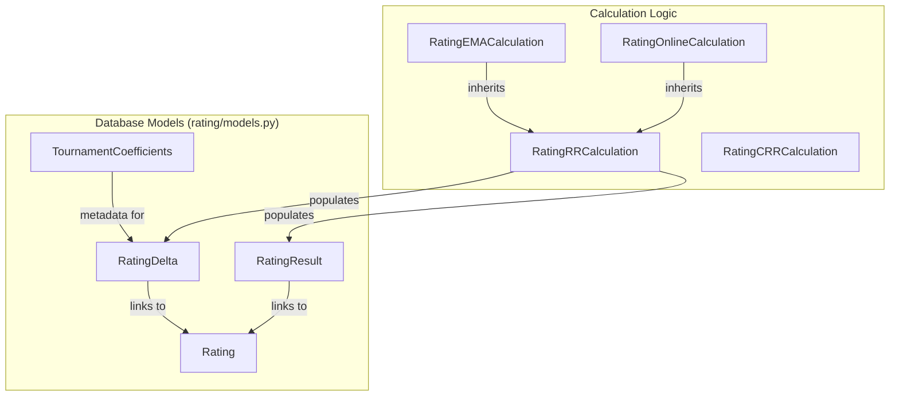
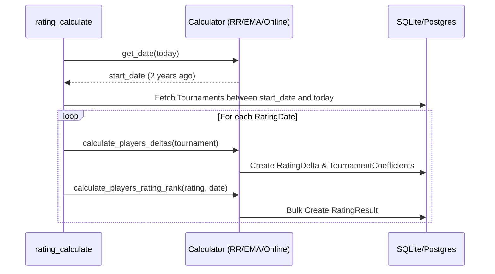

# Rating Calculation Engine

Relevant source files

The following files were used as context for generating this wiki page:

- [server/rating/calculation/ema.py](server/rating/calculation/ema.py)
- [server/rating/calculation/online.py](server/rating/calculation/online.py)
- [server/rating/calculation/rr.py](server/rating/calculation/rr.py)
- [server/rating/management/commands/rating_calculate.py](server/rating/management/commands/rating_calculate.py)
- [server/rating/management/commands/reset_tournament_dates.py](server/rating/management/commands/reset_tournament_dates.py)
- [server/rating/management/commands/validate_ema_rating.py](server/rating/management/commands/validate_ema_rating.py)
- [server/rating/migrations/0006_ratingresult_tournament_numbers.py](server/rating/migrations/0006_ratingresult_tournament_numbers.py)
- [server/rating/models.py](server/rating/models.py)
- [server/rating/urls.py](server/rating/urls.py)
- [server/rating/views.py](server/rating/views.py)
- [server/templates/rating/details.html](server/templates/rating/details.html)

The Rating Calculation Engine is a core subsystem responsible for processing tournament results and generating historical rankings for players. It supports multiple rating methodologies, ranging from the standard European Mahjong Association (EMA) formulas to internal Riichi Rankings (RR) and TrueSkill-based systems.

The engine operates as a batch processing pipeline, typically triggered by management commands, which calculates deltas for individual tournaments and aggregates them into time-stamped ranking snapshots.

## System Architecture

The system is divided into two primary categories: **Internal Ratings** (managed via standard calculation classes) and **External Ratings** (managed via TrueSkill or external data sync).

### Core Data Models
The following models represent the state of the rating engine:

*   **`Rating`**: Defines the type of rating (RR, EMA, CRR, ONLINE) [server/rating/models.py:67-80]().
*   **`RatingDelta`**: Stores a player's performance in a specific tournament relative to a specific rating and date [server/rating/models.py:92-102]().
*   **`RatingResult`**: A snapshot of a player's total score and rank on a specific date [server/rating/models.py:119-126]().
*   **`TournamentCoefficients`**: Stores calculated coefficients (size and age) for a tournament at a specific point in time [server/rating/models.py:143-150]().
*   **`RatingDate`**: Tracks the specific dates for which ratings have been calculated [server/rating/models.py:156-160]().

### Calculation Logic Mapping
This diagram maps the high-level rating types to their implementing classes and the data models they populate.

**Rating Calculation Entity Map**

**Sources:** [server/rating/models.py:11-166](), [server/rating/calculation/rr.py:19-30](), [server/rating/calculation/ema.py:15-17](), [server/rating/calculation/online.py:9-11]().

## Calculation Pipeline

The calculation is orchestrated by the `rating_calculate` management command [server/rating/management/commands/rating_calculate.py:21]().

### Pipeline Workflow
1.  **Initialization**: The command selects a `calculator` class based on the `rating_type` argument (e.g., `rr`, `ema`) [server/rating/management/commands/rating_calculate.py:37-42]().
2.  **Date Discovery**: The system identifies dates where tournament changes occurred using `find_tournament_dates_changes` [server/rating/management/commands/rating_calculate.py:81-83]().
3.  **Delta Calculation**: For every tournament ending before the target date, `calculate_players_deltas` is called to compute base ranks and store them in `RatingDelta` [server/rating/management/commands/rating_calculate.py:163-167]().
4.  **Aggregation**: The `calculate_players_rating_rank` method aggregates active deltas, applies age decay, and determines the final `RatingResult` for every player [server/rating/management/commands/rating_calculate.py:168]().

**Batch Processing Sequence**

**Sources:** [server/rating/management/commands/rating_calculate.py:153-169](), [server/rating/calculation/rr.py:59-166]().

## Rating Types

| Type | Class | Description |
| :--- | :--- | :--- |
| **RR** | `RatingRRCalculation` | Internal Riichi Ranking. Uses a two-part weighted formula (50/50) based on best tournament results [server/rating/calculation/rr.py:22-25](). |
| **EMA** | `RatingEMACalculation` | Official European Mahjong Association logic. Includes specific tournament types and EMA player ID filtering [server/rating/calculation/ema.py:16-30](). |
| **Online** | `RatingOnlineCalculation` | Calculated specifically for online platforms (Tenhou/Mahjong Soul) using a subset of required tournaments [server/rating/calculation/online.py:10-11](). |
| **TrueSkill** | N/A | Handled via `ExternalRating` models and separate management commands. |

## Detailed Documentation Links

For in-depth technical details on specific algorithms and external systems, see the child pages:

*   **[Rating Calculation Algorithms (RR, EMA, CRR, Online)](#2.3.1)**: Detailed documentation of the mathematical formulas, tournament age decay, and hardcoded coefficients [server/rating/calculation/hardcoded_coefficients.py]().
*   **[TrueSkill & External Ratings](#2.3.2)**: Documentation for the `ExternalRating` system, TrueSkill updates, and external result views [server/rating/views.py:55-116]().

**Sources:** [server/rating/management/commands/rating_calculate.py:1-151](), [server/rating/models.py:1-166](), [server/rating/views.py:1-200]().